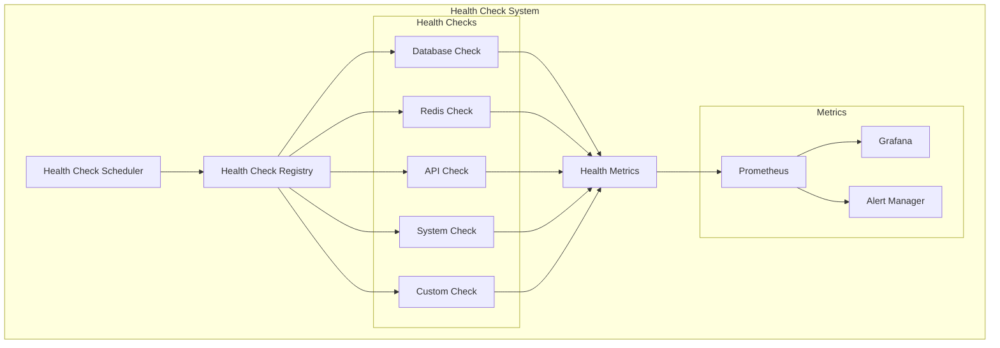
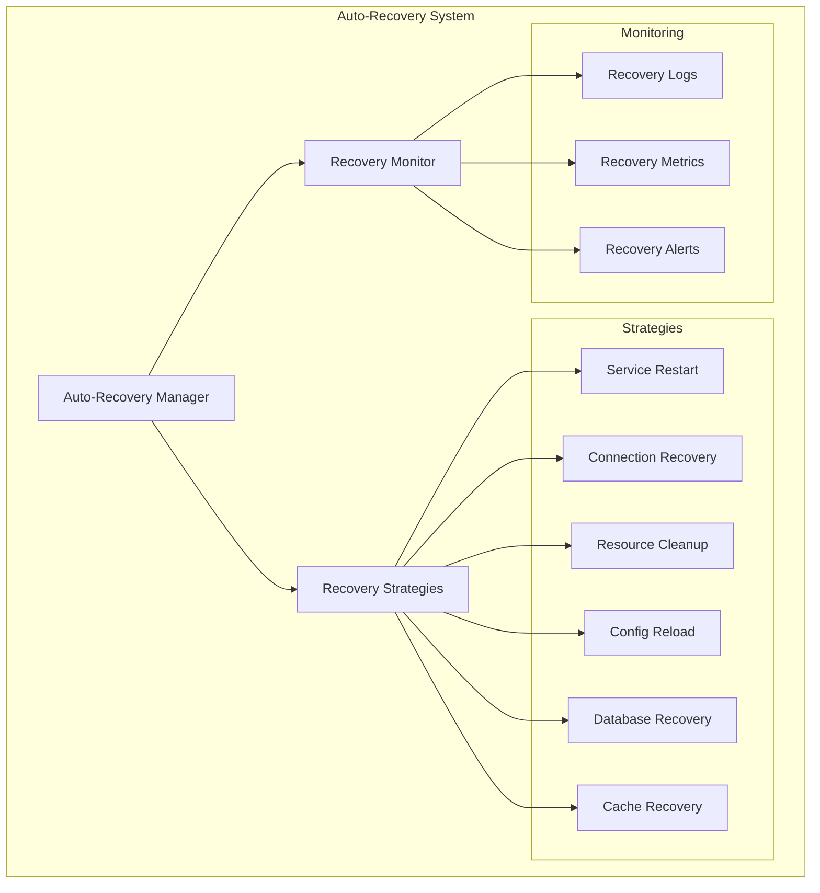
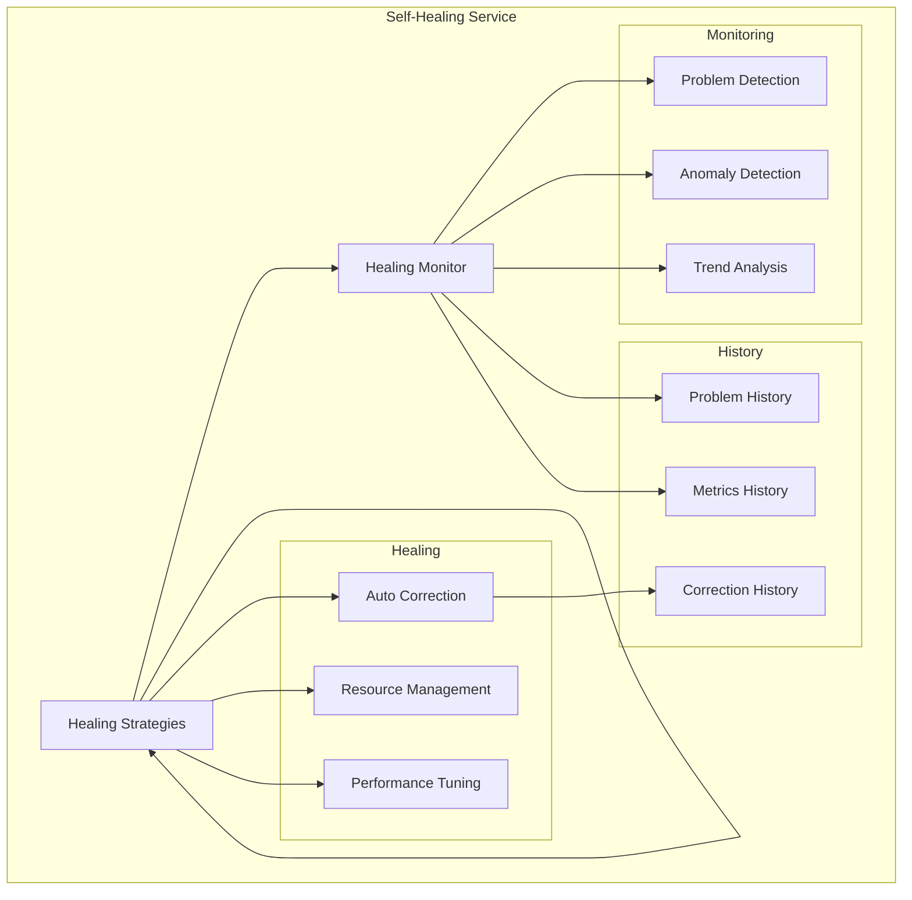

# 🚀 **GUIA DE AUTO-HEALING - OMNİ KEYWORDS FINDER**

**Tracing ID**: `AUTO_HEALING_GUIDE_001_20250127`  
**Versão**: 1.0  
**Data**: 2025-01-27  
**Status**: ✅ **ATIVO**  
**Objetivo**: Documentar sistema de auto-healing implementado  

---

## 🎯 **VISÃO GERAL**

Este guia documenta o sistema de auto-healing implementado no Omni Keywords Finder, que permite que o sistema se recupere automaticamente de falhas sem intervenção manual.

### **📊 Componentes do Auto-Healing**
- Health Check Avançado
- Auto-Recovery System
- Self-Healing Services
- Recovery Strategies
- Healing Monitor

---

## 🏥 **HEALTH CHECK AVANÇADO**

### **📐 Conceito**

Sistema de monitoramento contínuo que verifica a saúde de todos os componentes do sistema em tempo real.

### **🏗️ Arquitetura**



### **🔧 Implementação**

```python
from infrastructure.health.advanced_health_check import AdvancedHealthCheck
from infrastructure.health.health_check_registry import HealthCheckRegistry
from infrastructure.health.health_check_scheduler import HealthCheckScheduler

# Criando health checks
db_health_check = AdvancedHealthCheck(
    name="database",
    check_function=check_database_connection,
    interval=30,               # Verificar a cada 30 segundos
    timeout=10,                # Timeout de 10 segundos
    critical=True,             # Crítico para o sistema
    retry_count=3,             # Tentativas antes de falhar
    failure_threshold=2        # Falhas consecutivas para considerar unhealthy
)

redis_health_check = AdvancedHealthCheck(
    name="redis",
    check_function=check_redis_connection,
    interval=30,
    timeout=5,
    critical=True,
    retry_count=2,
    failure_threshold=3
)

api_health_check = AdvancedHealthCheck(
    name="external_api",
    check_function=check_external_api,
    interval=60,               # Verificar a cada 1 minuto
    timeout=15,
    critical=False,            # Não crítico
    retry_count=2,
    failure_threshold=5
)

# Registrando health checks
registry = HealthCheckRegistry()
registry.register(db_health_check)
registry.register(redis_health_check)
registry.register(api_health_check)

# Iniciando scheduler
scheduler = HealthCheckScheduler(registry)
scheduler.start()
```

### **📊 Funções de Health Check**

```python
def check_database_connection():
    """Verifica conexão com banco de dados."""
    try:
        # Testa conexão básica
        db.execute("SELECT 1")
        
        # Testa query mais complexa
        result = db.execute("SELECT COUNT(*) FROM users")
        
        # Verifica tempo de resposta
        start_time = time.time()
        db.execute("SELECT 1")
        response_time = time.time() - start_time
        
        if response_time > 5.0:  # Mais de 5 segundos
            return HealthStatus.DEGRADED, f"Slow response: {response_time:.2f}s"
        
        return HealthStatus.HEALTHY, "Database connection OK"
        
    except Exception as e:
        return HealthStatus.UNHEALTHY, f"Database error: {str(e)}"

def check_redis_connection():
    """Verifica conexão com Redis."""
    try:
        # Testa conexão básica
        redis.ping()
        
        # Testa operação de escrita/leitura
        test_key = f"health_check_{int(time.time())}"
        test_value = "test"
        
        redis.set(test_key, test_value, ex=60)  # Expira em 60 segundos
        retrieved_value = redis.get(test_key)
        
        if retrieved_value.decode() != test_value:
            return HealthStatus.UNHEALTHY, "Redis read/write test failed"
        
        return HealthStatus.HEALTHY, "Redis connection OK"
        
    except Exception as e:
        return HealthStatus.UNHEALTHY, f"Redis error: {str(e)}"

def check_external_api():
    """Verifica disponibilidade de API externa."""
    try:
        response = requests.get(
            'https://api.example.com/health',
            timeout=10,
            headers={'User-Agent': 'OmniKeywordsFinder/1.0'}
        )
        
        if response.status_code == 200:
            data = response.json()
            
            # Verifica campos específicos da resposta
            if 'status' in data and data['status'] == 'healthy':
                return HealthStatus.HEALTHY, "External API OK"
            else:
                return HealthStatus.DEGRADED, "External API degraded"
        else:
            return HealthStatus.UNHEALTHY, f"API returned status {response.status_code}"
            
    except requests.Timeout:
        return HealthStatus.UNHEALTHY, "External API timeout"
    except requests.ConnectionError:
        return HealthStatus.UNHEALTHY, "External API connection error"
    except Exception as e:
        return HealthStatus.UNHEALTHY, f"External API error: {str(e)}"

def check_system_resources():
    """Verifica recursos do sistema."""
    try:
        # Verifica uso de CPU
        cpu_percent = psutil.cpu_percent(interval=1)
        
        # Verifica uso de memória
        memory = psutil.virtual_memory()
        memory_percent = memory.percent
        
        # Verifica uso de disco
        disk = psutil.disk_usage('/')
        disk_percent = disk.percent
        
        # Define thresholds
        if cpu_percent > 90 or memory_percent > 90 or disk_percent > 95:
            return HealthStatus.UNHEALTHY, f"High resource usage - CPU: {cpu_percent}%, Memory: {memory_percent}%, Disk: {disk_percent}%"
        elif cpu_percent > 80 or memory_percent > 80 or disk_percent > 90:
            return HealthStatus.DEGRADED, f"Elevated resource usage - CPU: {cpu_percent}%, Memory: {memory_percent}%, Disk: {disk_percent}%"
        else:
            return HealthStatus.HEALTHY, f"Resources OK - CPU: {cpu_percent}%, Memory: {memory_percent}%, Disk: {disk_percent}%"
            
    except Exception as e:
        return HealthStatus.UNHEALTHY, f"System check error: {str(e)}"
```

### **📊 Estados de Saúde**

```python
from enum import Enum

class HealthStatus(Enum):
    HEALTHY = "healthy"           # Componente funcionando normalmente
    DEGRADED = "degraded"         # Componente funcionando com limitações
    UNHEALTHY = "unhealthy"       # Componente com falhas
    UNKNOWN = "unknown"           # Estado desconhecido
```

---

## 🔄 **AUTO-RECOVERY SYSTEM**

### **📐 Conceito**

Sistema que detecta falhas e aplica automaticamente estratégias de recuperação.

### **🏗️ Arquitetura**



### **🔧 Implementação**

```python
from infrastructure.recovery.auto_recovery import AutoRecovery
from infrastructure.recovery.recovery_strategies import RecoveryStrategies
from infrastructure.recovery.recovery_manager import RecoveryManager

# Configurando auto-recovery
auto_recovery = AutoRecovery(
    max_attempts=3,              # Máximo de tentativas de recuperação
    recovery_delay=30,           # Delay entre tentativas (segundos)
    strategies=['restart', 'reconnect', 'cleanup'],  # Estratégias a usar
    enable_notifications=True,   # Habilitar notificações
    log_recoveries=True          # Logar todas as recuperações
)

# Registrando estratégias
recovery_manager = RecoveryManager()

# Estratégia de restart de serviço
@recovery_manager.register_strategy('service_restart')
def restart_service(service_name):
    """Reinicia um serviço específico."""
    try:
        # Para o serviço
        subprocess.run(['systemctl', 'stop', service_name], check=True)
        time.sleep(5)  # Aguarda 5 segundos
        
        # Inicia o serviço
        subprocess.run(['systemctl', 'start', service_name], check=True)
        
        # Verifica se está rodando
        result = subprocess.run(['systemctl', 'is-active', service_name], 
                              capture_output=True, text=True)
        
        if result.stdout.strip() == 'active':
            return RecoveryResult.SUCCESS, f"Service {service_name} restarted successfully"
        else:
            return RecoveryResult.FAILED, f"Service {service_name} failed to start"
            
    except Exception as e:
        return RecoveryResult.FAILED, f"Service restart error: {str(e)}"

# Estratégia de recuperação de conexão
@recovery_manager.register_strategy('connection_recovery')
def recover_database_connection():
    """Recupera conexão com banco de dados."""
    try:
        # Fecha conexões existentes
        db.close_all_connections()
        
        # Aguarda um pouco
        time.sleep(2)
        
        # Tenta reconectar
        db.connect()
        
        # Testa conexão
        db.execute("SELECT 1")
        
        return RecoveryResult.SUCCESS, "Database connection recovered"
        
    except Exception as e:
        return RecoveryResult.FAILED, f"Database recovery error: {str(e)}"

# Estratégia de limpeza de recursos
@recovery_manager.register_strategy('resource_cleanup')
def cleanup_resources():
    """Limpa recursos do sistema."""
    try:
        # Limpa arquivos temporários
        temp_dir = "/tmp/omni_keywords"
        if os.path.exists(temp_dir):
            shutil.rmtree(temp_dir)
            os.makedirs(temp_dir)
        
        # Limpa cache do Redis
        redis.flushdb()
        
        # Força garbage collection
        import gc
        gc.collect()
        
        return RecoveryResult.SUCCESS, "Resources cleaned successfully"
        
    except Exception as e:
        return RecoveryResult.FAILED, f"Resource cleanup error: {str(e)}"

# Estratégia de recarregamento de configuração
@recovery_manager.register_strategy('config_reload')
def reload_configuration():
    """Recarrega configurações do sistema."""
    try:
        # Recarrega configurações
        config.reload()
        
        # Valida configurações
        config.validate()
        
        return RecoveryResult.SUCCESS, "Configuration reloaded successfully"
        
    except Exception as e:
        return RecoveryResult.FAILED, f"Configuration reload error: {str(e)}"
```

### **📊 Resultados de Recuperação**

```python
from enum import Enum

class RecoveryResult(Enum):
    SUCCESS = "success"         # Recuperação bem-sucedida
    FAILED = "failed"           # Recuperação falhou
    PARTIAL = "partial"         # Recuperação parcial
    SKIPPED = "skipped"         # Recuperação ignorada
```

---

## 🛠️ **SELF-HEALING SERVICES**

### **📐 Conceito**

Serviços que monitoram a si mesmos e aplicam correções automaticamente quando detectam problemas.

### **🏗️ Arquitetura**



### **🔧 Implementação**

```python
from infrastructure.healing.self_healing_service import SelfHealingService
from infrastructure.healing.healing_strategies import HealingStrategies
from infrastructure.healing.healing_monitor import HealingMonitor

# Configurando self-healing service
healing_service = SelfHealingService(
    service_name="omni_keywords_finder",
    enable_monitoring=True,
    enable_auto_correction=True,
    correction_delay=60,        # Delay antes de aplicar correção
    max_corrections_per_hour=5, # Máximo de correções por hora
    enable_notifications=True
)

# Monitor de problemas
healing_monitor = HealingMonitor()

@healing_monitor.register_problem_detector('high_memory_usage')
def detect_high_memory_usage():
    """Detecta uso elevado de memória."""
    memory = psutil.virtual_memory()
    
    if memory.percent > 90:
        return Problem(
            type="high_memory_usage",
            severity=ProblemSeverity.HIGH,
            description=f"Memory usage at {memory.percent}%",
            metrics={'memory_percent': memory.percent}
        )
    return None

@healing_monitor.register_problem_detector('slow_database_queries')
def detect_slow_database_queries():
    """Detecta queries lentas no banco."""
    # Monitora queries que demoram mais de 5 segundos
    slow_queries = db.get_slow_queries(threshold=5.0)
    
    if len(slow_queries) > 10:
        return Problem(
            type="slow_database_queries",
            severity=ProblemSeverity.MEDIUM,
            description=f"{len(slow_queries)} slow queries detected",
            metrics={'slow_queries_count': len(slow_queries)}
        )
    return None

# Estratégias de correção
@healing_service.register_correction_strategy('memory_cleanup')
def correct_high_memory_usage(problem):
    """Corrige uso elevado de memória."""
    try:
        # Força garbage collection
        import gc
        gc.collect()
        
        # Limpa cache do Redis
        redis.flushdb()
        
        # Reinicia workers se necessário
        if problem.metrics['memory_percent'] > 95:
            restart_workers()
        
        return CorrectionResult.SUCCESS, "Memory usage corrected"
        
    except Exception as e:
        return CorrectionResult.FAILED, f"Memory correction error: {str(e)}"

@healing_service.register_correction_strategy('database_optimization')
def correct_slow_database_queries(problem):
    """Corrige queries lentas."""
    try:
        # Analisa queries lentas
        slow_queries = db.get_slow_queries(threshold=5.0)
        
        # Otimiza queries mais problemáticas
        for query in slow_queries[:5]:  # Top 5 mais lentas
            db.optimize_query(query)
        
        # Atualiza estatísticas do banco
        db.analyze_tables()
        
        return CorrectionResult.SUCCESS, "Database queries optimized"
        
    except Exception as e:
        return CorrectionResult.FAILED, f"Database optimization error: {str(e)}"

# Iniciando self-healing
healing_service.start()
```

### **📊 Detecção de Problemas**

```python
from dataclasses import dataclass
from enum import Enum
from typing import Dict, Any

class ProblemSeverity(Enum):
    LOW = "low"
    MEDIUM = "medium"
    HIGH = "high"
    CRITICAL = "critical"

@dataclass
class Problem:
    type: str
    severity: ProblemSeverity
    description: str
    metrics: Dict[str, Any]
    timestamp: datetime = None
    
    def __post_init__(self):
        if self.timestamp is None:
            self.timestamp = datetime.now()
```

### **📊 Resultados de Correção**

```python
class CorrectionResult(Enum):
    SUCCESS = "success"         # Correção bem-sucedida
    FAILED = "failed"           # Correção falhou
    PARTIAL = "partial"         # Correção parcial
    NO_ACTION = "no_action"     # Nenhuma ação necessária
```

---

## 📊 **MONITORAMENTO E MÉTRICAS**

### **📈 Métricas de Auto-Healing**

```python
# Métricas principais
auto_healing_metrics = {
    'health_check_success_rate': 0.98,      # 98% de sucesso nos health checks
    'recovery_success_rate': 0.85,          # 85% de sucesso nas recuperações
    'self_healing_effectiveness': 0.92,     # 92% de eficácia do self-healing
    'mean_time_to_recovery': 120,           # 2 minutos para recuperação
    'problems_detected_per_hour': 2.5,      # 2.5 problemas detectados por hora
    'corrections_applied_per_hour': 2.1     # 2.1 correções aplicadas por hora
}
```

### **📊 Dashboards**

**Grafana Dashboards**:
- **Health Overview**: Status geral dos componentes
- **Recovery Metrics**: Taxa de sucesso das recuperações
- **Problem Trends**: Tendências de problemas detectados
- **Self-Healing Performance**: Performance do auto-healing

### **🚨 Alertas**

```yaml
# Prometheus Alert Rules
groups:
  - name: auto_healing_alerts
    rules:
      - alert: HealthCheckFailure
        expr: health_check_failures > 0
        for: 2m
        labels:
          severity: warning
        annotations:
          summary: "Health check failure detected"
      
      - alert: RecoveryFailure
        expr: recovery_failures > 0
        for: 5m
        labels:
          severity: critical
        annotations:
          summary: "Auto-recovery failure detected"
      
      - alert: SelfHealingIneffective
        expr: self_healing_effectiveness < 0.8
        for: 10m
        labels:
          severity: warning
        annotations:
          summary: "Self-healing effectiveness below threshold"
```

---

## 🧪 **TESTES DE AUTO-HEALING**

### **📐 Testes de Health Check**

```python
def test_health_check_detection():
    """Testa detecção de problemas via health check."""
    # Simula falha no banco
    with patch('database.execute') as mock_execute:
        mock_execute.side_effect = Exception("Database connection failed")
        
        # Executa health check
        result = check_database_connection()
        
        # Verifica se detectou o problema
        assert result[0] == HealthStatus.UNHEALTHY
        assert "Database error" in result[1]

def test_health_check_recovery():
    """Testa recuperação após health check."""
    # Simula falha seguida de recuperação
    with patch('database.execute') as mock_execute:
        mock_execute.side_effect = [Exception("Failed"), None]
        
        # Primeira verificação deve falhar
        result1 = check_database_connection()
        assert result1[0] == HealthStatus.UNHEALTHY
        
        # Segunda verificação deve passar
        result2 = check_database_connection()
        assert result2[0] == HealthStatus.HEALTHY
```

### **📐 Testes de Auto-Recovery**

```python
def test_auto_recovery_strategy():
    """Testa estratégia de auto-recovery."""
    # Simula problema que requer restart
    problem = Problem(
        type="service_unresponsive",
        severity=ProblemSeverity.HIGH,
        description="Service not responding",
        metrics={}
    )
    
    # Executa estratégia de recovery
    result = restart_service("test_service")
    
    # Verifica resultado
    assert result[0] in [RecoveryResult.SUCCESS, RecoveryResult.FAILED]

def test_recovery_retry_logic():
    """Testa lógica de retry do auto-recovery."""
    recovery = AutoRecovery(max_attempts=3, recovery_delay=1)
    
    # Simula falha nas primeiras tentativas
    attempt_count = 0
    
    def failing_recovery():
        nonlocal attempt_count
        attempt_count += 1
        if attempt_count < 3:
            raise Exception("Recovery failed")
        return RecoveryResult.SUCCESS
    
    # Executa recovery
    result = recovery.execute(failing_recovery)
    
    # Verifica se tentou 3 vezes
    assert attempt_count == 3
    assert result == RecoveryResult.SUCCESS
```

### **📐 Testes de Self-Healing**

```python
def test_self_healing_problem_detection():
    """Testa detecção de problemas pelo self-healing."""
    # Simula uso elevado de memória
    with patch('psutil.virtual_memory') as mock_memory:
        mock_memory.return_value.percent = 95
        
        # Executa detector
        problem = detect_high_memory_usage()
        
        # Verifica se detectou o problema
        assert problem is not None
        assert problem.type == "high_memory_usage"
        assert problem.severity == ProblemSeverity.HIGH

def test_self_healing_correction():
    """Testa correção automática pelo self-healing."""
    # Simula problema de memória
    problem = Problem(
        type="high_memory_usage",
        severity=ProblemSeverity.HIGH,
        description="High memory usage",
        metrics={'memory_percent': 95}
    )
    
    # Executa correção
    result = correct_high_memory_usage(problem)
    
    # Verifica resultado
    assert result[0] in [CorrectionResult.SUCCESS, CorrectionResult.FAILED]
```

---

## 📚 **REFERÊNCIAS**

### **📖 Livros**

- **Site Reliability Engineering**: Google
- **The Phoenix Project**: Gene Kim
- **Building Microservices**: Sam Newman

### **🔗 Artigos**

- [Self-Healing Systems](https://en.wikipedia.org/wiki/Self-healing)
- [Health Check Pattern](https://microservices.io/patterns/observability/health-check.html)
- [Circuit Breaker Pattern](https://martinfowler.com/bliki/CircuitBreaker.html)

### **🛠️ Ferramentas**

- **Prometheus**: Métricas e alertas
- **Grafana**: Dashboards
- **Jaeger**: Distributed tracing
- **Kubernetes**: Health checks nativos

---

## 📞 **SUPORTE**

### **👥 Equipe**

- **SRE Team**: sre@omni-keywords.com
- **DevOps Team**: devops@omni-keywords.com
- **Engineering**: eng@omni-keywords.com

### **📋 Processo de Suporte**

1. **Monitoramento**: Detectar problemas via health checks
2. **Análise**: Investigar causa raiz
3. **Recovery**: Aplicar estratégias de recuperação
4. **Validação**: Verificar se problema foi resolvido
5. **Documentação**: Registrar incidente e lições aprendidas

---

**📅 Última Atualização**: 2025-01-27  
**📝 Próxima Revisão**: 2025-02-27  
**🔗 Versão**: 1.0.0 