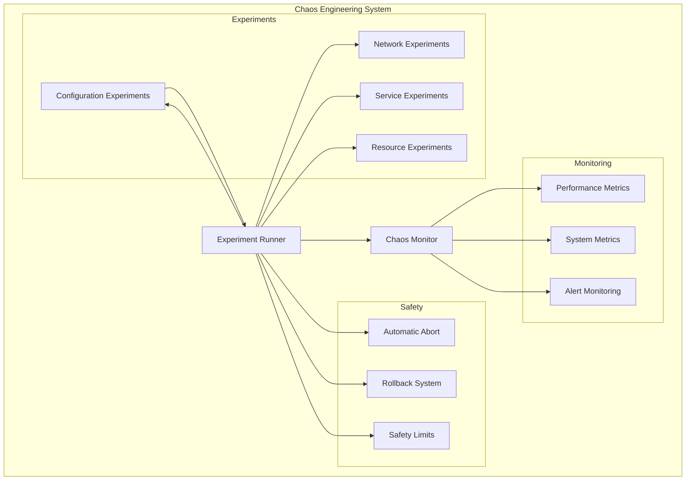

# 🧪 **GUIA DE CHAOS ENGINEERING - OMNİ KEYWORDS FINDER**

**Tracing ID**: `CHAOS_ENGINEERING_GUIDE_001_20250127`  
**Versão**: 1.0  
**Data**: 2025-01-27  
**Status**: ✅ **ATIVO**  
**Objetivo**: Documentar experimentos de chaos engineering implementados  

---

## 🎯 **VISÃO GERAL**

Este guia documenta os experimentos de Chaos Engineering implementados no Omni Keywords Finder para testar a resiliência do sistema e identificar pontos de falha antes que afetem os usuários.

### **📊 Princípios do Chaos Engineering**
1. **Estabelecer um estado estável**: Definir o comportamento normal do sistema
2. **Hipótese**: Formular hipóteses sobre como o sistema se comportará durante caos
3. **Introduzir variáveis**: Simular eventos reais de falha
4. **Tentar refutar a hipótese**: Verificar se o sistema mantém o estado estável

---

## 🧪 **CHAOS EXPERIMENTS**

### **📐 Conceito**

Experimentos controlados que introduzem falhas no sistema para testar sua resiliência e capacidade de recuperação.

### **🏗️ Arquitetura**



### **🔧 Implementação**

```python
from infrastructure.chaos.chaos_experiments import ChaosExperiments
from infrastructure.chaos.experiment_runner import ExperimentRunner
from infrastructure.chaos.chaos_monitoring import ChaosMonitoring

# Configurando chaos experiments
chaos_experiments = ChaosExperiments(
    enabled=True,
    schedule='0 2 * * *',        # 2 AM daily
    duration=300,                # 5 minutes
    blast_radius=0.1,            # 10% of traffic
    safety_threshold=0.8,        # Abort if success rate < 80%
    enable_rollback=True,        # Enable automatic rollback
    notification_channels=['slack', 'email']
)

# Runner de experimentos
experiment_runner = ExperimentRunner(
    max_concurrent_experiments=1,
    safety_timeout=600,          # 10 minutes max
    enable_metrics_collection=True
)

# Monitor de chaos
chaos_monitor = ChaosMonitoring(
    metrics_interval=30,         # Collect metrics every 30 seconds
    alert_threshold=0.7,         # Alert if success rate < 70%
    enable_dashboard=True
)
```

---

## 🌐 **NETWORK CHAOS EXPERIMENTS**

### **📐 Network Latency Injection**

**Objetivo**: Simular latência de rede para testar timeouts e circuit breakers.

```python
@chaos_experiments.register_experiment('network_latency')
def inject_network_latency():
    """Injeta latência de rede controlada."""
    try:
        # Configuração do experimento
        config = {
            'target_services': ['api', 'database', 'redis'],
            'latency_ms': 500,           # 500ms de latência
            'jitter_ms': 100,            # Variação de ±100ms
            'duration_seconds': 300,     # 5 minutos
            'probability': 0.3           # 30% das requisições
        }
        
        # Aplica latência usando tc (traffic control)
        for service in config['target_services']:
            cmd = f"""
            tc qdisc add dev eth0 root netem delay {config['latency_ms']}ms {config['jitter_ms']}ms distribution normal
            """
            subprocess.run(cmd, shell=True, check=True)
        
        # Monitora impacto
        start_time = time.time()
        while time.time() - start_time < config['duration_seconds']:
            # Coleta métricas
            metrics = collect_performance_metrics()
            
            # Verifica se deve abortar
            if metrics['success_rate'] < 0.8:
                abort_experiment("Success rate below threshold")
                break
            
            time.sleep(30)
        
        # Remove latência
        subprocess.run("tc qdisc del dev eth0 root", shell=True)
        
        return ExperimentResult.SUCCESS, "Network latency experiment completed"
        
    except Exception as e:
        return ExperimentResult.FAILED, f"Network latency experiment failed: {str(e)}"
```

### **📐 Network Packet Loss**

**Objetivo**: Simular perda de pacotes para testar retry mechanisms.

```python
@chaos_experiments.register_experiment('packet_loss')
def inject_packet_loss():
    """Injeta perda de pacotes controlada."""
    try:
        config = {
            'target_services': ['api', 'database'],
            'loss_percent': 5,           # 5% de perda de pacotes
            'duration_seconds': 180,     # 3 minutos
            'correlation_percent': 25    # 25% de correlação
        }
        
        # Aplica perda de pacotes
        cmd = f"""
        tc qdisc add dev eth0 root netem loss {config['loss_percent']}% {config['correlation_percent']}%
        """
        subprocess.run(cmd, shell=True, check=True)
        
        # Monitora impacto
        monitor_packet_loss_impact(config['duration_seconds'])
        
        # Remove perda de pacotes
        subprocess.run("tc qdisc del dev eth0 root", shell=True)
        
        return ExperimentResult.SUCCESS, "Packet loss experiment completed"
        
    except Exception as e:
        return ExperimentResult.FAILED, f"Packet loss experiment failed: {str(e)}"
```

### **📐 Network Partition**

**Objetivo**: Simular partição de rede entre serviços.

```python
@chaos_experiments.register_experiment('network_partition')
def create_network_partition():
    """Cria partição de rede entre serviços."""
    try:
        config = {
            'partitioned_services': ['api', 'database'],
            'duration_seconds': 120,     # 2 minutos
            'partition_type': 'one_way'  # one_way ou two_way
        }
        
        # Cria partição usando iptables
        if config['partition_type'] == 'one_way':
            # API não consegue acessar database
            cmd = f"""
            iptables -A OUTPUT -d {database_ip} -j DROP
            """
        else:
            # Partição bidirecional
            cmd = f"""
            iptables -A OUTPUT -d {database_ip} -j DROP
            iptables -A INPUT -s {database_ip} -j DROP
            """
        
        subprocess.run(cmd, shell=True, check=True)
        
        # Monitora impacto
        monitor_network_partition_impact(config['duration_seconds'])
        
        # Remove partição
        subprocess.run("iptables -F", shell=True)
        
        return ExperimentResult.SUCCESS, "Network partition experiment completed"
        
    except Exception as e:
        return ExperimentResult.FAILED, f"Network partition experiment failed: {str(e)}"
```

---

## 🔧 **SERVICE CHAOS EXPERIMENTS**

### **📐 Service Failure Injection**

**Objetivo**: Simular falhas em serviços específicos.

```python
@chaos_experiments.register_experiment('service_failure')
def inject_service_failure():
    """Injeta falhas em serviços específicos."""
    try:
        config = {
            'target_service': 'payment_service',
            'failure_type': 'exception',  # exception, timeout, crash
            'failure_rate': 0.2,          # 20% de falhas
            'duration_seconds': 240,      # 4 minutos
            'exception_type': 'ConnectionError'
        }
        
        # Aplica falha usando monkey patching
        original_method = payment_service.process_payment
        
        def failing_method(*args, **kwargs):
            if random.random() < config['failure_rate']:
                if config['failure_type'] == 'exception':
                    raise ConnectionError("Simulated connection failure")
                elif config['failure_type'] == 'timeout':
                    time.sleep(30)  # Simula timeout
                elif config['failure_type'] == 'crash':
                    os._exit(1)  # Simula crash
            return original_method(*args, **kwargs)
        
        payment_service.process_payment = failing_method
        
        # Monitora impacto
        monitor_service_failure_impact(config['duration_seconds'])
        
        # Restaura método original
        payment_service.process_payment = original_method
        
        return ExperimentResult.SUCCESS, "Service failure experiment completed"
        
    except Exception as e:
        return ExperimentResult.FAILED, f"Service failure experiment failed: {str(e)}"
```

### **📐 Service Restart**

**Objetivo**: Simular restart de serviços para testar recuperação.

```python
@chaos_experiments.register_experiment('service_restart')
def restart_service():
    """Reinicia serviços para testar recuperação."""
    try:
        config = {
            'target_services': ['api', 'worker', 'scheduler'],
            'restart_interval': 60,      # Restart a cada 60 segundos
            'total_restarts': 3,         # 3 restarts por serviço
            'graceful_shutdown': True    # Shutdown graceful
        }
        
        for service in config['target_services']:
            for i in range(config['total_restarts']):
                # Para o serviço
                if config['graceful_shutdown']:
                    subprocess.run(['systemctl', 'stop', service], check=True)
                else:
                    subprocess.run(['pkill', '-f', service], check=True)
                
                # Aguarda um pouco
                time.sleep(5)
                
                # Inicia o serviço
                subprocess.run(['systemctl', 'start', service], check=True)
                
                # Aguarda serviço ficar pronto
                wait_for_service_ready(service, timeout=60)
                
                # Aguarda intervalo
                time.sleep(config['restart_interval'])
        
        return ExperimentResult.SUCCESS, "Service restart experiment completed"
        
    except Exception as e:
        return ExperimentResult.FAILED, f"Service restart experiment failed: {str(e)}"
```

---

## 💾 **RESOURCE CHAOS EXPERIMENTS**

### **📐 CPU Exhaustion**

**Objetivo**: Simular esgotamento de CPU para testar throttling.

```python
@chaos_experiments.register_experiment('cpu_exhaustion')
def exhaust_cpu():
    """Esgota CPU para testar throttling."""
    try:
        config = {
            'cpu_load_percent': 90,      # 90% de carga de CPU
            'duration_seconds': 180,     # 3 minutos
            'cores_affected': 'all'      # all ou specific cores
        }
        
        # Inicia processo que consome CPU
        stress_cmd = f"stress --cpu {config['cpu_load_percent']} --timeout {config['duration_seconds']}"
        stress_process = subprocess.Popen(stress_cmd, shell=True)
        
        # Monitora impacto
        monitor_cpu_exhaustion_impact(config['duration_seconds'])
        
        # Para processo de stress
        stress_process.terminate()
        stress_process.wait()
        
        return ExperimentResult.SUCCESS, "CPU exhaustion experiment completed"
        
    except Exception as e:
        return ExperimentResult.FAILED, f"CPU exhaustion experiment failed: {str(e)}"
```

### **📐 Memory Exhaustion**

**Objetivo**: Simular esgotamento de memória para testar OOM handling.

```python
@chaos_experiments.register_experiment('memory_exhaustion')
def exhaust_memory():
    """Esgota memória para testar OOM handling."""
    try:
        config = {
            'memory_load_percent': 85,   # 85% de uso de memória
            'duration_seconds': 120,     # 2 minutos
            'ram_mb': 1024              # 1GB de RAM
        }
        
        # Inicia processo que consome memória
        stress_cmd = f"stress --vm {config['memory_load_percent']} --vm-bytes {config['ram_mb']}M --timeout {config['duration_seconds']}"
        stress_process = subprocess.Popen(stress_cmd, shell=True)
        
        # Monitora impacto
        monitor_memory_exhaustion_impact(config['duration_seconds'])
        
        # Para processo de stress
        stress_process.terminate()
        stress_process.wait()
        
        return ExperimentResult.SUCCESS, "Memory exhaustion experiment completed"
        
    except Exception as e:
        return ExperimentResult.FAILED, f"Memory exhaustion experiment failed: {str(e)}"
```

### **📐 Disk Space Exhaustion**

**Objetivo**: Simular esgotamento de disco para testar storage handling.

```python
@chaos_experiments.register_experiment('disk_exhaustion')
def exhaust_disk_space():
    """Esgota espaço em disco para testar storage handling."""
    try:
        config = {
            'target_directory': '/tmp/chaos',
            'fill_percent': 95,          # Preenche até 95%
            'duration_seconds': 90,      # 1.5 minutos
            'file_size_mb': 100         # 100MB por arquivo
        }
        
        # Cria diretório se não existir
        os.makedirs(config['target_directory'], exist_ok=True)
        
        # Preenche disco
        files_created = []
        while get_disk_usage(config['target_directory']) < config['fill_percent']:
            filename = f"{config['target_directory']}/chaos_file_{len(files_created)}.dat"
            create_large_file(filename, config['file_size_mb'])
            files_created.append(filename)
        
        # Monitora impacto
        monitor_disk_exhaustion_impact(config['duration_seconds'])
        
        # Limpa arquivos
        for file in files_created:
            os.remove(file)
        
        return ExperimentResult.SUCCESS, "Disk exhaustion experiment completed"
        
    except Exception as e:
        return ExperimentResult.FAILED, f"Disk exhaustion experiment failed: {str(e)}"
```

---

## ⚙️ **CONFIGURATION CHAOS EXPERIMENTS**

### **📐 Configuration Change**

**Objetivo**: Simular mudanças de configuração para testar hot reload.

```python
@chaos_experiments.register_experiment('config_change')
def inject_configuration_change():
    """Injeta mudanças de configuração."""
    try:
        config = {
            'target_config': 'database_pool_size',
            'original_value': 10,
            'new_value': 2,              # Reduz pool para 2 conexões
            'duration_seconds': 180,     # 3 minutos
            'revert_after': True         # Reverte após experimento
        }
        
        # Backup configuração original
        original_config = get_config_value(config['target_config'])
        
        # Aplica mudança
        set_config_value(config['target_config'], config['new_value'])
        
        # Notifica serviços para recarregar configuração
        notify_config_reload()
        
        # Monitora impacto
        monitor_config_change_impact(config['duration_seconds'])
        
        # Reverte mudança se necessário
        if config['revert_after']:
            set_config_value(config['target_config'], original_config)
            notify_config_reload()
        
        return ExperimentResult.SUCCESS, "Configuration change experiment completed"
        
    except Exception as e:
        return ExperimentResult.FAILED, f"Configuration change experiment failed: {str(e)}"
```

### **📐 Environment Variable Change**

**Objetivo**: Simular mudanças em variáveis de ambiente.

```python
@chaos_experiments.register_experiment('env_var_change')
def inject_environment_variable_change():
    """Injeta mudanças em variáveis de ambiente."""
    try:
        config = {
            'target_var': 'DATABASE_URL',
            'original_value': os.environ.get('DATABASE_URL'),
            'new_value': 'postgresql://invalid:5432/test',  # URL inválida
            'duration_seconds': 120,     # 2 minutos
            'revert_after': True
        }
        
        # Aplica mudança
        os.environ[config['target_var']] = config['new_value']
        
        # Reinicia serviços que dependem da variável
        restart_dependent_services()
        
        # Monitora impacto
        monitor_env_var_change_impact(config['duration_seconds'])
        
        # Reverte mudança
        if config['revert_after'] and config['original_value']:
            os.environ[config['target_var']] = config['original_value']
        else:
            del os.environ[config['target_var']]
        
        restart_dependent_services()
        
        return ExperimentResult.SUCCESS, "Environment variable change experiment completed"
        
    except Exception as e:
        return ExperimentResult.FAILED, f"Environment variable change experiment failed: {str(e)}"
```

---

## 📊 **MONITORING AND METRICS**

### **📈 Métricas de Chaos Engineering**

```python
# Métricas principais
chaos_engineering_metrics = {
    'experiments_run': 45,               # Total de experimentos executados
    'experiments_successful': 42,        # Experimentos bem-sucedidos
    'experiments_failed': 3,             # Experimentos que falharam
    'mean_time_to_detection': 45,        # 45 segundos para detectar problemas
    'mean_time_to_recovery': 180,        # 3 minutos para recuperação
    'blast_radius_impact': 0.05,         # 5% de impacto no blast radius
    'safety_aborts': 2                   # 2 abortos por segurança
}
```

### **📊 Dashboards**

**Grafana Dashboards**:
- **Chaos Engineering Overview**: Visão geral dos experimentos
- **Experiment Results**: Resultados detalhados de cada experimento
- **System Resilience**: Métricas de resiliência do sistema
- **Safety Metrics**: Métricas de segurança dos experimentos

### **🚨 Alertas**

```yaml
# Prometheus Alert Rules
groups:
  - name: chaos_engineering_alerts
    rules:
      - alert: ExperimentFailure
        expr: chaos_experiment_failures > 0
        for: 1m
        labels:
          severity: warning
        annotations:
          summary: "Chaos experiment failure detected"
      
      - alert: SafetyAbort
        expr: chaos_safety_aborts > 0
        for: 1m
        labels:
          severity: critical
        annotations:
          summary: "Chaos experiment aborted for safety"
      
      - alert: HighBlastRadius
        expr: chaos_blast_radius_impact > 0.2
        for: 2m
        labels:
          severity: warning
        annotations:
          summary: "High blast radius impact detected"
```

---

## 🛡️ **SAFETY MECHANISMS**

### **📐 Automatic Abort**

```python
def automatic_abort_check(experiment_id, metrics):
    """Verifica se deve abortar experimento automaticamente."""
    abort_conditions = {
        'success_rate_below': 0.8,       # Taxa de sucesso < 80%
        'error_rate_above': 0.2,         # Taxa de erro > 20%
        'response_time_above': 5000,     # Tempo de resposta > 5s
        'cpu_usage_above': 95,           # Uso de CPU > 95%
        'memory_usage_above': 95,        # Uso de memória > 95%
        'disk_usage_above': 98           # Uso de disco > 98%
    }
    
    for condition, threshold in abort_conditions.items():
        if metrics.get(condition, 0) > threshold:
            abort_experiment(experiment_id, f"Safety threshold exceeded: {condition}")
            return True
    
    return False
```

### **📐 Rollback System**

```python
def automatic_rollback(experiment_id):
    """Executa rollback automático do experimento."""
    try:
        # Obtém configuração do experimento
        experiment_config = get_experiment_config(experiment_id)
        
        # Executa rollback baseado no tipo de experimento
        if experiment_config['type'] == 'network':
            rollback_network_changes()
        elif experiment_config['type'] == 'service':
            rollback_service_changes()
        elif experiment_config['type'] == 'resource':
            rollback_resource_changes()
        elif experiment_config['type'] == 'configuration':
            rollback_configuration_changes()
        
        # Notifica rollback
        notify_rollback(experiment_id, "Automatic rollback executed")
        
        return True
        
    except Exception as e:
        logger.error(f"Rollback failed for experiment {experiment_id}: {str(e)}")
        return False
```

### **📐 Safety Limits**

```python
class SafetyLimits:
    """Limites de segurança para experimentos de chaos."""
    
    def __init__(self):
        self.max_experiment_duration = 600  # 10 minutos
        self.max_blast_radius = 0.3         # 30% do tráfego
        self.min_success_rate = 0.8         # 80% de sucesso
        self.max_concurrent_experiments = 1  # 1 experimento por vez
        self.safety_timeout = 300           # 5 minutos de timeout
        
    def validate_experiment(self, experiment_config):
        """Valida configuração do experimento contra limites de segurança."""
        violations = []
        
        if experiment_config['duration'] > self.max_experiment_duration:
            violations.append(f"Duration exceeds limit: {experiment_config['duration']}s")
        
        if experiment_config['blast_radius'] > self.max_blast_radius:
            violations.append(f"Blast radius exceeds limit: {experiment_config['blast_radius']}")
        
        if len(violations) > 0:
            raise SafetyViolationError(f"Safety violations: {', '.join(violations)}")
        
        return True
```

---

## 🧪 **TESTING CHAOS EXPERIMENTS**

### **📐 Testes de Experimentos**

```python
def test_network_latency_experiment():
    """Testa experimento de latência de rede."""
    # Configura experimento
    experiment_config = {
        'target_services': ['api'],
        'latency_ms': 100,
        'duration_seconds': 30,
        'probability': 0.5
    }
    
    # Executa experimento
    result = inject_network_latency(experiment_config)
    
    # Verifica resultado
    assert result[0] == ExperimentResult.SUCCESS
    
    # Verifica se latência foi aplicada
    latency_metrics = get_latency_metrics()
    assert latency_metrics['average_latency'] > 50  # Deve ter aumentado

def test_service_failure_experiment():
    """Testa experimento de falha de serviço."""
    # Configura experimento
    experiment_config = {
        'target_service': 'test_service',
        'failure_type': 'exception',
        'failure_rate': 0.3,
        'duration_seconds': 60
    }
    
    # Executa experimento
    result = inject_service_failure(experiment_config)
    
    # Verifica resultado
    assert result[0] == ExperimentResult.SUCCESS
    
    # Verifica se falhas foram injetadas
    failure_metrics = get_failure_metrics()
    assert failure_metrics['failure_rate'] > 0.2  # Deve ter falhas

def test_safety_abort():
    """Testa aborto automático por segurança."""
    # Configura experimento que viola limites
    experiment_config = {
        'blast_radius': 0.5,  # 50% - viola limite de 30%
        'duration_seconds': 120
    }
    
    # Tenta executar experimento
    with pytest.raises(SafetyViolationError):
        safety_limits.validate_experiment(experiment_config)
```

### **📐 Testes de Monitoramento**

```python
def test_automatic_abort_check():
    """Testa verificação de aborto automático."""
    # Simula métricas que violam limites
    metrics = {
        'success_rate': 0.7,      # Abaixo do limite de 0.8
        'error_rate': 0.3,        # Acima do limite de 0.2
        'response_time': 6000     # Acima do limite de 5000ms
    }
    
    # Verifica se detecta violação
    should_abort = automatic_abort_check('test_experiment', metrics)
    assert should_abort == True

def test_rollback_system():
    """Testa sistema de rollback."""
    # Simula experimento que precisa de rollback
    experiment_id = 'test_experiment'
    
    # Executa rollback
    rollback_success = automatic_rollback(experiment_id)
    
    # Verifica se rollback foi executado
    assert rollback_success == True
    
    # Verifica se mudanças foram revertidas
    config_restored = verify_configuration_restored()
    assert config_restored == True
```

---

## 📚 **REFERÊNCIAS**

### **📖 Livros**

- **Chaos Engineering**: Casey Rosenthal
- **Site Reliability Engineering**: Google
- **The Practice of Cloud System Administration**: Thomas A. Limoncelli

### **🔗 Artigos**

- [Chaos Engineering](https://en.wikipedia.org/wiki/Chaos_engineering)
- [Netflix Chaos Monkey](https://netflix.github.io/chaosmonkey/)
- [Gremlin Chaos Engineering](https://www.gremlin.com/)

### **🛠️ Ferramentas**

- **Chaos Monkey**: Netflix
- **Gremlin**: Chaos engineering platform
- **Litmus**: Kubernetes chaos engineering
- **Pumba**: Docker chaos engineering

---

## 📞 **SUPORTE**

### **👥 Equipe**

- **SRE Team**: sre@omni-keywords.com
- **DevOps Team**: devops@omni-keywords.com
- **Chaos Engineering**: chaos@omni-keywords.com

### **📋 Processo de Suporte**

1. **Planejamento**: Definir hipóteses e experimentos
2. **Execução**: Executar experimentos de forma controlada
3. **Monitoramento**: Coletar métricas e observações
4. **Análise**: Analisar resultados e identificar melhorias
5. **Documentação**: Registrar aprendizados e ações

---

**📅 Última Atualização**: 2025-01-27  
**📝 Próxima Revisão**: 2025-02-27  
**🔗 Versão**: 1.0.0 