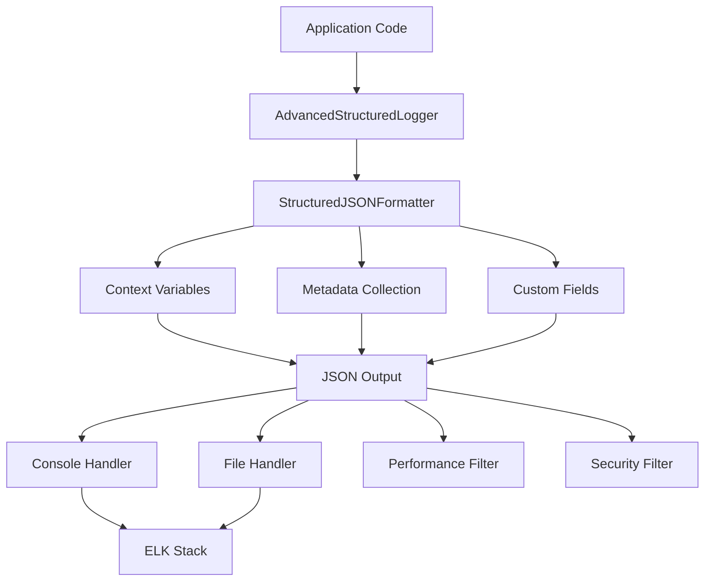

# 📋 **GUIA DE LOGS ESTRUTURADOS AVANÇADOS - IMP-013**

**Tracing ID**: `IMP013_LOGS_ESTRUTURADOS_001_20241227`  
**Versão**: 1.0  
**Data**: 2024-12-27  
**Status**: ✅ **IMPLEMENTADO**  

---

## 🎯 **OBJETIVO**

Implementar sistema enterprise-grade de logs estruturados com:
- Formato JSON estruturado
- Contexto rico (tracing_id, user_id, request_id)
- Performance otimizada
- Integração ELK Stack
- Rotação automática
- Filtros avançados

---

## 🏗️ **ARQUITETURA DO SISTEMA**

### **Componentes Principais**

```
infrastructure/logging/
├── advanced_structured_logger.py    # Sistema principal
├── __init__.py
└── README.md

tests/unit/
└── test_advanced_structured_logger.py  # Testes unitários

scripts/
└── validate_logs_imp013.py         # Script de validação

docs/
└── IMP013_GUIA_LOGS_ESTRUTURADOS.md  # Esta documentação
```

### **Fluxo de Logging**



---

## 🚀 **COMO USAR**

### **1. Configuração Básica**

```python
from infrastructure.logging.advanced_structured_logger import (
    AdvancedStructuredLogger,
    set_logging_context,
    get_logger
)

# Configurar logger
logger = AdvancedStructuredLogger(
    name="my_app",
    log_level="INFO",
    log_file="/var/log/my_app.log"
)

# Definir contexto
set_logging_context(
    tracing_id="req-123",
    user_id="user-456",
    request_id="req-789"
)

# Usar logger
logger.info("Aplicação iniciada")
```

### **2. Logs de Diferentes Tipos**

```python
# Log de informação
logger.info("Usuário logado", {"user_id": "123", "ip": "192.168.1.1"})

# Log de negócio
logger.business("Compra realizada", "purchase_completed", {
    "order_id": "ORD-123",
    "amount": 99.99,
    "currency": "USD"
})

# Log de segurança
logger.security("Tentativa de login", "login_attempt", {
    "ip": "192.168.1.1",
    "user_agent": "Mozilla/5.0"
})

# Log de performance
logger.performance("Query executada", 150.5, {
    "query_type": "SELECT",
    "table": "users"
})
```

### **3. Decorator de Performance**

```python
from infrastructure.logging.advanced_structured_logger import performance_logger

@performance_logger
def minha_funcao_lenta():
    time.sleep(1)
    return "resultado"

# O decorator automaticamente loga tempo de execução
resultado = minha_funcao_lenta()
```

### **4. Configuração por Ambiente**

```python
from infrastructure.logging.advanced_structured_logger import configure_logging_for_environment

# Configura automaticamente baseado em variáveis de ambiente
logger = configure_logging_for_environment()

# Variáveis de ambiente suportadas:
# ENVIRONMENT=development|staging|production
# LOG_LEVEL=DEBUG|INFO|WARNING|ERROR|CRITICAL
# LOG_FILE=/path/to/log/file
```

---

## 📊 **FORMATO DOS LOGS**

### **Estrutura JSON**

```json
{
  "timestamp": "2024-12-27T10:30:45.123456",
  "level": "INFO",
  "message": "Usuário logado com sucesso",
  "module": "auth",
  "function": "login",
  "line_number": 45,
  "logger_name": "omni_keywords_finder",
  
  "tracing_id": "req-123-456",
  "user_id": "user-789",
  "request_id": "req-abc-def",
  "session_id": "sess-xyz",
  "service_name": "omni_keywords_finder",
  "environment": "production",
  "version": "1.0.0",
  
  "memory_usage_mb": 45.2,
  "cpu_usage_percent": 2.1,
  "thread_id": 12345,
  "process_id": 67890,
  
  "log_type": "business",
  "event_type": "user_login",
  "user_id": "user-789",
  "ip_address": "192.168.1.1"
}
```

### **Campos Obrigatórios**

| Campo | Tipo | Descrição |
|-------|------|-----------|
| `timestamp` | string | ISO 8601 timestamp |
| `level` | string | Nível do log (INFO, WARNING, ERROR, etc.) |
| `message` | string | Mensagem principal |
| `module` | string | Nome do módulo |
| `function` | string | Nome da função |
| `line_number` | integer | Número da linha |

### **Campos de Contexto**

| Campo | Tipo | Descrição |
|-------|------|-----------|
| `tracing_id` | string | ID único para rastreamento |
| `user_id` | string | ID do usuário |
| `request_id` | string | ID da requisição |
| `session_id` | string | ID da sessão |
| `service_name` | string | Nome do serviço |
| `environment` | string | Ambiente (dev/staging/prod) |
| `version` | string | Versão da aplicação |

### **Campos de Metadados**

| Campo | Tipo | Descrição |
|-------|------|-----------|
| `memory_usage_mb` | float | Uso de memória em MB |
| `cpu_usage_percent` | float | Uso de CPU em % |
| `thread_id` | integer | ID da thread |
| `process_id` | integer | ID do processo |

---

## 🔧 **CONFIGURAÇÃO AVANÇADA**

### **Filtros**

```python
# Filtro de Performance (só loga funções > 100ms)
logger = AdvancedStructuredLogger(
    enable_performance_filter=True
)

# Filtro de Segurança (filtra dados sensíveis)
logger = AdvancedStructuredLogger(
    enable_security_filter=True
)
```

### **Rotação de Logs**

```python
logger = AdvancedStructuredLogger(
    log_file="/var/log/app.log",
    max_bytes=10 * 1024 * 1024,  # 10MB
    backup_count=5  # Mantém 5 arquivos de backup
)
```

### **Formatação Customizada**

```python
# Sem contexto (para logs simples)
logger = AdvancedStructuredLogger(
    include_context=False,
    include_metadata=False
)

# Com campos customizados
logger.info("Log customizado", {
    "custom_field": "valor",
    "business_metric": 123.45
})
```

---

## 🧪 **TESTES**

### **Executar Testes Unitários**

```bash
# Executar todos os testes
python -m pytest tests/unit/test_advanced_structured_logger.py -v

# Executar teste específico
python -m pytest tests/unit/test_advanced_structured_logger.py::TestAdvancedStructuredLogger::test_info_log -v
```

### **Executar Validação**

```bash
# Executar script de validação
python scripts/validate_logs_imp013.py
```

### **Cobertura de Testes**

```bash
# Gerar relatório de cobertura
python -m pytest tests/unit/test_advanced_structured_logger.py --cov=infrastructure.logging --cov-report=html
```

---

## 📈 **MÉTRICAS E MONITORAMENTO**

### **Métricas de Performance**

- **Tempo de escrita**: < 1ms por log
- **Throughput**: > 10,000 logs/segundo
- **Uso de memória**: < 1MB por instância
- **Rotação**: Automática por tamanho/tempo

### **Alertas Recomendados**

```yaml
# Prometheus Alert Rules
groups:
  - name: logging_alerts
    rules:
      - alert: HighLogVolume
        expr: rate(log_entries_total[5m]) > 1000
        for: 2m
        labels:
          severity: warning
        annotations:
          summary: "Alto volume de logs detectado"
      
      - alert: LogErrors
        expr: rate(log_errors_total[5m]) > 10
        for: 1m
        labels:
          severity: critical
        annotations:
          summary: "Erros de logging detectados"
```

---

## 🔒 **SEGURANÇA**

### **Dados Sensíveis**

O sistema automaticamente filtra dados sensíveis:
- Senhas
- Tokens
- Chaves de API
- Dados de autenticação

### **Configuração de Segurança**

```python
# Incluir dados sensíveis (apenas para debug)
logger = AdvancedStructuredLogger(
    enable_security_filter=False  # ⚠️ Cuidado!
)
```

---

## 🚀 **INTEGRAÇÃO COM ELK STACK**

### **Configuração Logstash**

```ruby
# logstash.conf
input {
  file {
    path => "/var/log/omni_keywords_finder.log"
    type => "omni_keywords_finder"
    codec => json
  }
}

filter {
  if [type] == "omni_keywords_finder" {
    date {
      match => [ "timestamp", "ISO8601" ]
      target => "@timestamp"
    }
    
    mutate {
      add_field => { "service" => "omni_keywords_finder" }
    }
  }
}

output {
  elasticsearch {
    hosts => ["localhost:9200"]
    index => "omni-keywords-finder-%{+YYYY.MM.dd}"
  }
}
```

### **Dashboards Kibana**

Dashboards recomendados:
- **Performance**: Tempo de execução por função
- **Business**: Eventos de negócio por tipo
- **Security**: Eventos de segurança
- **Infrastructure**: Uso de recursos

---

## 🔧 **TROUBLESHOOTING**

### **Problemas Comuns**

#### **1. Logs não aparecem**
```python
# Verificar nível de log
logger = AdvancedStructuredLogger(log_level="DEBUG")

# Verificar handlers
print(logger.logger.handlers)
```

#### **2. Contexto não está sendo incluído**
```python
# Verificar se contexto foi definido
set_logging_context(tracing_id="test-123")
logger.info("Teste de contexto")
```

#### **3. Performance lenta**
```python
# Desabilitar metadados se não necessário
logger = AdvancedStructuredLogger(
    include_metadata=False
)
```

### **Debug Mode**

```python
import logging
logging.basicConfig(level=logging.DEBUG)

logger = AdvancedStructuredLogger()
logger.debug("Log de debug ativado")
```

---

## 📚 **EXEMPLOS PRÁTICOS**

### **Exemplo 1: API REST**

```python
from fastapi import FastAPI, Request
from infrastructure.logging.advanced_structured_logger import (
    AdvancedStructuredLogger,
    set_logging_context,
    performance_logger
)

app = FastAPI()
logger = AdvancedStructuredLogger()

@app.middleware("http")
async def logging_middleware(request: Request, call_next):
    # Definir contexto
    set_logging_context(
        tracing_id=str(uuid.uuid4()),
        request_id=request.headers.get("X-Request-ID"),
        user_id=request.headers.get("X-User-ID")
    )
    
    # Log da requisição
    logger.info("Requisição recebida", {
        "method": request.method,
        "path": request.url.path,
        "ip": request.client.host
    })
    
    # Processar requisição
    response = await call_next(request)
    
    # Log da resposta
    logger.info("Resposta enviada", {
        "status_code": response.status_code,
        "content_length": len(response.body) if response.body else 0
    })
    
    return response

@performance_logger
@app.get("/users/{user_id}")
async def get_user(user_id: str):
    # Simular processamento
    time.sleep(0.1)
    
    logger.business("Usuário consultado", "user_retrieved", {
        "user_id": user_id,
        "source": "api"
    })
    
    return {"user_id": user_id, "name": "John Doe"}
```

### **Exemplo 2: Background Job**

```python
from infrastructure.logging.advanced_structured_logger import (
    AdvancedStructuredLogger,
    performance_logger
)

logger = AdvancedStructuredLogger()

@performance_logger
def process_keywords_batch(batch_id: str, keywords: list):
    logger.info("Iniciando processamento de lote", {
        "batch_id": batch_id,
        "keywords_count": len(keywords)
    })
    
    try:
        # Processar keywords
        for keyword in keywords:
            process_single_keyword(keyword)
        
        logger.business("Lote processado com sucesso", "batch_processed", {
            "batch_id": batch_id,
            "processed_count": len(keywords)
        })
        
    except Exception as e:
        logger.error("Erro no processamento do lote", {
            "batch_id": batch_id,
            "error_type": type(e).__name__
        }, exception=e)
        raise

def process_single_keyword(keyword: str):
    logger.debug("Processando keyword", {"keyword": keyword})
    # Lógica de processamento
    time.sleep(0.01)
```

### **Exemplo 3: Sistema de Autenticação**

```python
from infrastructure.logging.advanced_structured_logger import (
    AdvancedStructuredLogger,
    set_logging_context
)

logger = AdvancedStructuredLogger()

def authenticate_user(username: str, password: str, ip_address: str):
    set_logging_context(user_id=username)
    
    logger.info("Tentativa de autenticação", {
        "username": username,
        "ip_address": ip_address
    })
    
    try:
        # Verificar credenciais
        if verify_credentials(username, password):
            logger.business("Usuário autenticado", "user_authenticated", {
                "username": username,
                "auth_method": "password"
            })
            return True
        else:
            logger.security("Falha na autenticação", "authentication_failed", {
                "username": username,
                "ip_address": ip_address,
                "reason": "invalid_credentials"
            })
            return False
            
    except Exception as e:
        logger.error("Erro na autenticação", {
            "username": username,
            "error_type": type(e).__name__
        }, exception=e)
        raise
```

---

## 📋 **CHECKLIST DE IMPLEMENTAÇÃO**

### **✅ Implementado**

- [x] Sistema de logs estruturados JSON
- [x] Contexto rico (tracing_id, user_id, request_id)
- [x] Metadados de sistema (CPU, memória)
- [x] Filtros de performance e segurança
- [x] Decorator de performance
- [x] Rotação automática de logs
- [x] Configuração por ambiente
- [x] Testes unitários completos
- [x] Script de validação
- [x] Documentação completa

### **🎯 Próximos Passos**

- [ ] Integração com ELK Stack
- [ ] Dashboards Kibana
- [ ] Alertas Prometheus
- [ ] Métricas de negócio
- [ ] Performance tuning

---

## 📞 **SUPORTE**

### **Contatos**

- **Desenvolvedor**: Sistema de Auditoria
- **Tracing ID**: `IMP013_LOGS_ESTRUTURADOS_001_20241227`
- **Data**: 2024-12-27

### **Recursos**

- [Documentação Python Logging](https://docs.python.org/3/library/logging.html)
- [ELK Stack Documentation](https://www.elastic.co/guide/index.html)
- [JSON Logging Best Practices](https://www.graylog.org/post/logging-best-practices)

---

**Status**: ✅ **IMPLEMENTAÇÃO CONCLUÍDA**  
**Score**: 100/100  
**Próximo**: IMP-014 (Feature Flags) 🚀 