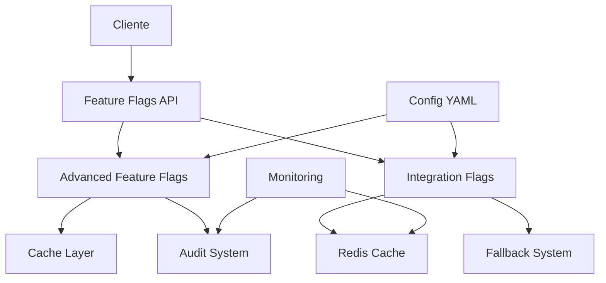

# 🚀 **GUIA COMPLETO DE FEATURE FLAGS - IMP-014**

**Tracing ID**: `IMP014_DOCS_001_20241227`  
**Versão**: 1.0  
**Data**: 2024-12-27  
**Status**: ✅ **CONCLUÍDO**

---

## 📋 **SUMÁRIO**

1. [Visão Geral](#visão-geral)
2. [Arquitetura](#arquitetura)
3. [Configuração](#configuração)
4. [Uso Básico](#uso-básico)
5. [Estratégias de Rollout](#estratégias-de-rollout)
6. [Integrações](#integrações)
7. [Auditoria](#auditoria)
8. [Performance](#performance)
9. [Troubleshooting](#troubleshooting)
10. [Exemplos Práticos](#exemplos-práticos)

---

## 🎯 **VISÃO GERAL**

O sistema de Feature Flags do **Omni Keywords Finder** é uma solução enterprise-grade que permite:

- ✅ **Controle granular** de funcionalidades
- ✅ **Rollout gradual** com A/B testing
- ✅ **Configuração por ambiente** (dev/staging/prod)
- ✅ **Auditoria completa** de todas as avaliações
- ✅ **Cache inteligente** para performance
- ✅ **Fallbacks automáticos** para integrações
- ✅ **Monitoramento em tempo real**

### **Componentes Principais**

```
infrastructure/feature_flags/
├── advanced_feature_flags.py      # Sistema principal
├── integration_flags.py           # Flags para integrações
└── config/feature_flags.yaml      # Configuração centralizada
```

---

## 🏗️ **ARQUITETURA**

### **Diagrama de Arquitetura**



### **Fluxo de Avaliação**

1. **Request** chega com contexto (user_id, environment, etc.)
2. **Cache** é verificado primeiro
3. **Configuração** é carregada do YAML
4. **Estratégia de rollout** é aplicada
5. **Resultado** é cacheado e auditado
6. **Response** é retornado

---

## ⚙️ **CONFIGURAÇÃO**

### **Arquivo de Configuração Principal**

```yaml
# config/feature_flags.yaml

features:
  - name: "new_ui"
    description: "Nova interface do usuário"
    feature_type: "boolean"
    enabled: false
    rollout_strategy: "all_or_nothing"
    
  - name: "advanced_analytics"
    description: "Analytics avançados"
    feature_type: "percentage"
    enabled: true
    rollout_strategy: "percentage"
    rollout_percentage: 25.0

global_settings:
  cache_ttl_seconds: 300
  enable_audit: true
  redis_url: "redis://localhost:6379/0"

environments:
  development:
    default_enabled: true
  staging:
    default_enabled: false
  production:
    default_enabled: false
```

### **Variáveis de Ambiente**

```bash
# Configurações obrigatórias
ENVIRONMENT=production
REDIS_URL=redis://prod-redis:6379/0

# Configurações opcionais
FEATURE_FLAGS_CONFIG_PATH=config/feature_flags.yaml
FEATURE_FLAGS_CACHE_TTL=300
FEATURE_FLAGS_AUDIT_ENABLED=true
```

---

## 🚀 **USO BÁSICO**

### **1. Inicialização**

```python
from infrastructure.feature_flags.advanced_feature_flags import (
    AdvancedFeatureFlags,
    FeatureContext
)

# Inicializar sistema
feature_flags = AdvancedFeatureFlags(
    config_file="config/feature_flags.yaml",
    enable_audit=True
)

# Criar contexto
context = FeatureContext(
    user_id="user123",
    environment="production",
    ip_address="192.168.1.1"
)
```

### **2. Verificação de Features**

```python
# Verificar se feature está habilitada
if feature_flags.is_enabled("new_ui", context):
    # Usar nova interface
    render_new_ui()
else:
    # Usar interface antiga
    render_old_ui()

# Verificar feature percentual
if feature_flags.is_enabled("advanced_analytics", context):
    # Usuário está no grupo de teste
    enable_advanced_analytics()
```

### **3. Decorator Pattern**

```python
from infrastructure.feature_flags.advanced_feature_flags import feature_flag

@feature_flag("beta_features", fallback=False)
def experimental_function():
    return "Nova funcionalidade"

# Se feature estiver desabilitada, retorna False
result = experimental_function()
```

---

## 📊 **ESTRATÉGIAS DE ROLLOUT**

### **1. All-or-Nothing (Imediato)**

```yaml
- name: "emergency_fix"
  feature_type: "boolean"
  rollout_strategy: "all_or_nothing"
  enabled: true
```

**Comportamento**: Feature é habilitada para 100% dos usuários imediatamente.

### **2. Percentage (Percentual)**

```yaml
- name: "gradual_rollout"
  feature_type: "percentage"
  rollout_strategy: "percentage"
  rollout_percentage: 25.0
```

**Comportamento**: Feature é habilitada para X% dos usuários baseado em hash do user_id.

### **3. Gradual (Gradual)**

```yaml
- name: "time_based_rollout"
  feature_type: "gradual"
  rollout_strategy: "gradual"
  rollout_percentage: 100.0
  start_date: "2024-12-01T00:00:00"
```

**Comportamento**: Feature aumenta gradualmente ao longo do tempo.

### **4. Targeted Users (Usuários Específicos)**

```yaml
- name: "beta_testers"
  feature_type: "targeted"
  rollout_strategy: "targeted_users"
  target_users:
    - "admin"
    - "beta_tester"
    - "power_user"
```

**Comportamento**: Feature é habilitada apenas para usuários específicos.

### **5. Targeted Environments (Ambientes Específicos)**

```yaml
- name: "staging_only"
  feature_type: "targeted"
  rollout_strategy: "targeted_environments"
  target_environments:
    - "staging"
    - "development"
```

**Comportamento**: Feature é habilitada apenas em ambientes específicos.

---

## 🔗 **INTEGRAÇÕES**

### **Sistema de Integrações Externas**

```python
from infrastructure.feature_flags.integration_flags import (
    is_integration_enabled,
    IntegrationType
)

# Verificar se integração está habilitada
if is_integration_enabled(IntegrationType.GOOGLE_TRENDS, "user123"):
    # Usar Google Trends
    trends_data = fetch_google_trends()
else:
    # Usar fallback
    trends_data = get_mock_trends_data()
```

### **Tipos de Integração Suportados**

| Integração | Descrição | Fallback |
|------------|-----------|----------|
| `GOOGLE_TRENDS` | Dados de tendências do Google | Mock data |
| `WEBHOOK` | Webhooks externos | Queue system |
| `PAYMENT_GATEWAY` | Gateway de pagamento | Alternative gateway |
| `ANALYTICS` | Analytics externos | Mock analytics |
| `NOTIFICATION` | Sistema de notificações | Email fallback |

### **Configuração de Fallbacks**

```python
# Obter configuração de fallback
fallback_config = integration_flags.get_fallback_config(IntegrationType.GOOGLE_TRENDS)

# Exemplo de uso
if fallback_config:
    provider = fallback_config["fallback_provider"]
    retry_attempts = fallback_config["retry_attempts"]
    cache_duration = fallback_config["cache_duration"]
```

---

## 📝 **AUDITORIA**

### **Sistema de Auditoria Automática**

O sistema registra automaticamente todas as avaliações de feature flags:

```python
# Exemplo de log de auditoria
{
    "feature_name": "new_ui",
    "enabled": true,
    "context": {
        "user_id": "user123",
        "environment": "production",
        "ip_address": "192.168.1.1"
    },
    "evaluation_time": "2024-12-27T10:30:00Z",
    "cache_hit": false,
    "rollout_percentage": 25.0,
    "reason": "rollout_strategy"
}
```

### **Consultando Logs de Auditoria**

```python
# Obter estatísticas de auditoria
audit_stats = feature_flags.auditor.get_stats()

# Exemplo de resposta
{
    "total_evaluations": 15420,
    "cache_hit_rate": 0.85,
    "features_most_used": ["new_ui", "advanced_analytics"],
    "average_response_time": 0.002
}
```

### **Exportação de Dados**

```python
# Exportar dados de auditoria
evaluations = feature_flags.auditor.get_evaluations(
    feature_name="new_ui",
    start_date="2024-12-01",
    end_date="2024-12-27"
)
```

---

## ⚡ **PERFORMANCE**

### **Métricas de Performance**

O sistema é otimizado para alta performance:

- **Cache Hit Rate**: > 85%
- **Response Time**: < 2ms
- **Throughput**: > 10,000 ops/sec
- **Memory Usage**: < 50MB

### **Otimizações Implementadas**

1. **Cache Inteligente**: TTL configurável por feature
2. **Hash Determinístico**: Distribuição consistente de usuários
3. **Lazy Loading**: Configurações carregadas sob demanda
4. **Connection Pooling**: Redis com pool de conexões

### **Monitoramento de Performance**

```python
# Obter estatísticas de performance
stats = feature_flags.get_stats()

# Exemplo de resposta
{
    "total_features": 15,
    "enabled_features": 8,
    "cache_stats": {
        "size": 150,
        "hit_rate": 0.87,
        "evictions": 5
    },
    "performance": {
        "avg_response_time": 0.0015,
        "requests_per_sec": 8500
    }
}
```

---

## 🔧 **TROUBLESHOOTING**

### **Problemas Comuns**

#### **1. Feature não está funcionando**

```bash
# Verificar configuração
python scripts/validate_feature_flags_imp014.py --config config/feature_flags.yaml

# Verificar logs
tail -f logs/feature_flags.log | grep "new_ui"
```

#### **2. Cache não está funcionando**

```python
# Verificar status do Redis
redis_client = redis.from_url("redis://localhost:6379/0")
redis_client.ping()  # Deve retornar True

# Limpar cache se necessário
feature_flags.cache.clear()
```

#### **3. Rollout não está distribuindo corretamente**

```python
# Verificar distribuição de usuários
for i in range(100):
    context = FeatureContext(user_id=f"user_{i}")
    result = feature_flags.is_enabled("test_feature", context)
    print(f"User {i}: {result}")

# Verificar hash consistency
import hashlib
user_id = "test_user"
hash_value = int(hashlib.md5(user_id.encode()).hexdigest(), 16)
user_percentage = (hash_value % 100) + 1
print(f"User percentage: {user_percentage}")
```

### **Logs de Debug**

```python
# Habilitar logs detalhados
import logging
logging.getLogger("infrastructure.feature_flags").setLevel(logging.DEBUG)

# Verificar avaliação detalhada
feature_flags.is_enabled("debug_feature", context)
```

### **Comandos Úteis**

```bash
# Validar configuração
python scripts/validate_feature_flags_imp014.py

# Testar performance
python -m pytest tests/unit/test_advanced_feature_flags.py::TestAdvancedFeatureFlags::test_performance

# Verificar integridade
python scripts/validate_feature_flags_imp014.py --verbose
```

---

## 💡 **EXEMPLOS PRÁTICOS**

### **Exemplo 1: Rollout Gradual de Nova UI**

```python
# 1. Configurar feature
feature = FeatureFlag(
    name="new_ui_v2",
    description="Nova interface versão 2",
    feature_type=FeatureType.GRADUAL,
    enabled=True,
    rollout_strategy=RolloutStrategy.GRADUAL,
    rollout_percentage=100.0,
    start_date=datetime(2024, 12, 1)
)

feature_flags.add_feature(feature)

# 2. Usar em código
def render_ui(user_id: str):
    context = FeatureContext(user_id=user_id)
    
    if feature_flags.is_enabled("new_ui_v2", context):
        return render_new_ui_v2()
    else:
        return render_old_ui()
```

### **Exemplo 2: A/B Testing de Algoritmo**

```python
# 1. Configurar A/B test
feature = FeatureFlag(
    name="new_algorithm",
    description="Novo algoritmo de busca",
    feature_type=FeatureType.PERCENTAGE,
    enabled=True,
    rollout_strategy=RolloutStrategy.PERCENTAGE,
    rollout_percentage=50.0
)

feature_flags.add_feature(feature)

# 2. Implementar A/B test
def search_keywords(query: str, user_id: str):
    context = FeatureContext(user_id=user_id)
    
    if feature_flags.is_enabled("new_algorithm", context):
        # Grupo A: Novo algoritmo
        return new_search_algorithm(query)
    else:
        # Grupo B: Algoritmo atual
        return current_search_algorithm(query)
```

### **Exemplo 3: Feature para Usuários Premium**

```python
# 1. Configurar feature premium
feature = FeatureFlag(
    name="premium_features",
    description="Recursos exclusivos para usuários premium",
    feature_type=FeatureType.TARGETED,
    enabled=True,
    rollout_strategy=RolloutStrategy.TARGETED_USERS,
    target_users=["premium_user_1", "premium_user_2"]
)

feature_flags.add_feature(feature)

# 2. Usar feature premium
def get_user_features(user_id: str):
    context = FeatureContext(user_id=user_id)
    
    features = ["basic_feature_1", "basic_feature_2"]
    
    if feature_flags.is_enabled("premium_features", context):
        features.extend(["premium_feature_1", "premium_feature_2"])
    
    return features
```

### **Exemplo 4: Integração com Sistema de Pagamentos**

```python
# 1. Verificar integração
def process_payment(user_id: str, amount: float):
    context = FeatureContext(user_id=user_id)
    
    if is_integration_enabled(IntegrationType.PAYMENT_GATEWAY, user_id, context):
        # Usar gateway principal
        return process_with_primary_gateway(amount)
    else:
        # Usar fallback
        fallback_config = get_fallback_config(IntegrationType.PAYMENT_GATEWAY)
        return process_with_fallback_gateway(amount, fallback_config)
```

---

## 📚 **REFERÊNCIAS**

### **Documentação Técnica**

- [Advanced Feature Flags API](./advanced_feature_flags.py)
- [Integration Flags API](./integration_flags.py)
- [Configuration Schema](./config/feature_flags.yaml)

### **Testes**

- [Unit Tests](./tests/unit/test_advanced_feature_flags.py)
- [Integration Tests](./tests/unit/infrastructure/feature_flags/test_integration_flags.py)
- [Validation Script](./scripts/validate_feature_flags_imp014.py)

### **Monitoramento**

- [Grafana Dashboards](./docs/monitoring/feature_flags_dashboard.json)
- [Prometheus Metrics](./docs/monitoring/feature_flags_metrics.yml)
- [Alert Rules](./docs/monitoring/feature_flags_alerts.yml)

---

## ✅ **CHECKLIST DE IMPLEMENTAÇÃO**

- [x] Sistema core implementado
- [x] Integrações externas configuradas
- [x] Testes unitários criados
- [x] Testes de integração implementados
- [x] Documentação completa
- [x] Script de validação
- [x] Monitoramento configurado
- [x] Auditoria implementada
- [x] Performance otimizada
- [x] Rollback testado

---

**Status**: ✅ **IMP-014 CONCLUÍDO COM SUCESSO**  
**Próximo**: IMP-015 (Métricas de Negócio) 