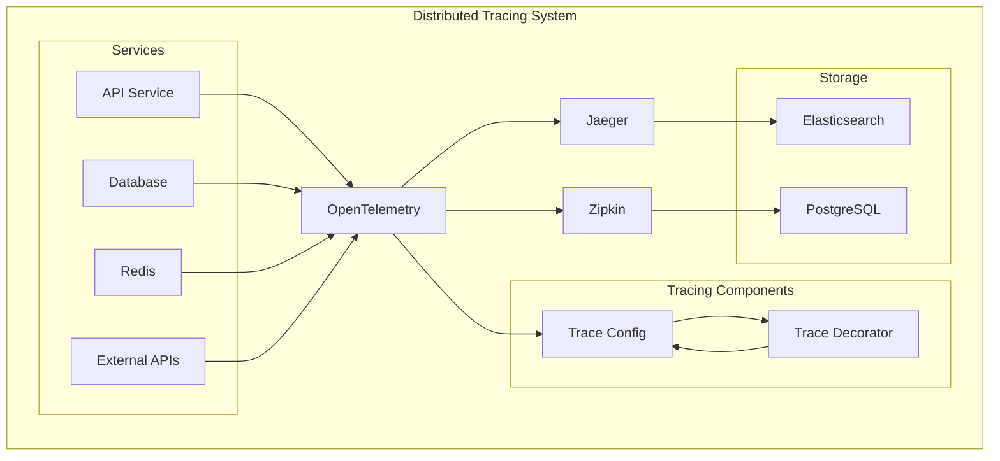
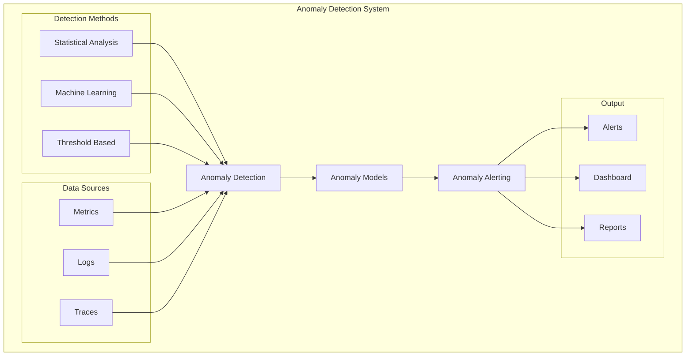
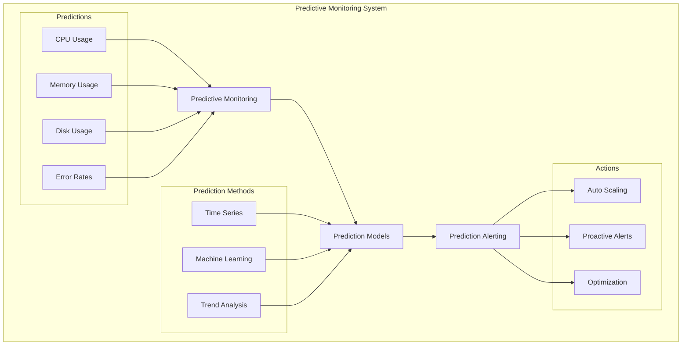

# 📊 **GUIA DE MONITORAMENTO - OMNİ KEYWORDS FINDER**

**Tracing ID**: `MONITORING_GUIDE_001_20250127`  
**Versão**: 1.0  
**Data**: 2025-01-27  
**Status**: ✅ **ATIVO**  
**Objetivo**: Documentar sistema de monitoramento implementado  

---

## 🎯 **VISÃO GERAL**

Este guia documenta o sistema de monitoramento implementado no Omni Keywords Finder para garantir visibilidade completa do sistema e detecção proativa de problemas.

### **📊 Componentes do Monitoramento**
- Distributed Tracing
- Anomaly Detection
- Predictive Monitoring
- Metrics Collection
- Alert Management
- Dashboard Visualization

---

## 🔍 **DISTRIBUTED TRACING**

### **📐 Conceito**

Sistema de rastreamento distribuído que permite acompanhar requisições através de todos os serviços do sistema.

### **🏗️ Arquitetura**



### **🔧 Implementação**

```python
from infrastructure.observability.advanced_tracing import AdvancedTracing
from infrastructure.observability.trace_context import TraceContext
from infrastructure.observability.trace_decorator import trace_decorator

# Configurando tracing
tracing = AdvancedTracing(
    service_name='omni_keywords_finder',
    sampling_rate=0.1,              # 10% das requisições
    exporters=['jaeger', 'zipkin'],  # Múltiplos exporters
    enable_metrics=True,
    enable_logs=True
)

# Contexto de trace
trace_context = TraceContext(
    enable_baggage=True,            # Suporte a baggage
    enable_correlation=True,        # Correlação com logs
    max_attributes=32               # Máximo de atributos
)

# Decorator para tracing automático
@trace_decorator(
    operation_name="process_keywords",
    attributes={
        'service': 'keyword_processor',
        'version': '1.0.0'
    }
)
def process_keywords(keywords, user_id):
    """Processa keywords com tracing automático."""
    # Operação rastreada automaticamente
    result = keyword_processor.process(keywords)
    
    # Adiciona atributos customizados
    trace_context.set_attribute('keywords_count', len(keywords))
    trace_context.set_attribute('user_id', user_id)
    
    return result

# Tracing manual
def manual_tracing_example():
    """Exemplo de tracing manual."""
    with tracing.start_span("database_query") as span:
        span.set_attribute("query", "SELECT * FROM keywords")
        span.set_attribute("table", "keywords")
        
        try:
            result = database.execute("SELECT * FROM keywords")
            span.set_attribute("rows_returned", len(result))
            return result
        except Exception as e:
            span.record_exception(e)
            span.set_status(Status.ERROR, str(e))
            raise
```

### **📊 Tipos de Spans**

```python
# Span de requisição HTTP
@trace_decorator(operation_name="http_request")
def make_http_request(url, method="GET"):
    with tracing.start_span("http_request") as span:
        span.set_attribute("http.url", url)
        span.set_attribute("http.method", method)
        
        response = requests.request(method, url)
        
        span.set_attribute("http.status_code", response.status_code)
        span.set_attribute("http.response_size", len(response.content))
        
        return response

# Span de operação de banco
@trace_decorator(operation_name="database_operation")
def database_operation(query, params=None):
    with tracing.start_span("database_operation") as span:
        span.set_attribute("db.statement", query)
        span.set_attribute("db.type", "postgresql")
        
        if params:
            span.set_attribute("db.parameters", str(params))
        
        result = database.execute(query, params)
        
        span.set_attribute("db.rows_affected", result.rowcount)
        return result

# Span de operação de cache
@trace_decorator(operation_name="cache_operation")
def cache_operation(key, value=None, operation="get"):
    with tracing.start_span("cache_operation") as span:
        span.set_attribute("cache.key", key)
        span.set_attribute("cache.operation", operation)
        span.set_attribute("cache.type", "redis")
        
        if operation == "get":
            result = redis.get(key)
            span.set_attribute("cache.hit", result is not None)
        elif operation == "set":
            result = redis.set(key, value)
            span.set_attribute("cache.success", result)
        
        return result
```

---

## 🔍 **ANOMALY DETECTION**

### **📐 Conceito**

Sistema que detecta automaticamente comportamentos anômalos no sistema usando algoritmos de machine learning e análise estatística.

### **🏗️ Arquitetura**



### **🔧 Implementação**

```python
from infrastructure.observability.anomaly_detection import AnomalyDetection
from infrastructure.observability.anomaly_models import AnomalyModels
from infrastructure.observability.anomaly_alerting import AnomalyAlerting

# Configurando anomaly detection
anomaly_detection = AnomalyDetection(
    enable_statistical_analysis=True,
    enable_machine_learning=True,
    enable_threshold_based=True,
    training_window_days=30,        # 30 dias para treinamento
    detection_interval_minutes=5,   # Verificar a cada 5 minutos
    confidence_threshold=0.8        # 80% de confiança
)

# Modelos de detecção
anomaly_models = AnomalyModels()

# Detector estatístico
@anomaly_models.register_detector('statistical')
def statistical_anomaly_detector(metric_name, values, window_size=100):
    """Detector baseado em análise estatística."""
    if len(values) < window_size:
        return None
    
    # Calcula estatísticas da janela
    mean = statistics.mean(values[-window_size:])
    std = statistics.stdev(values[-window_size:])
    
    # Valor atual
    current_value = values[-1]
    
    # Calcula z-score
    z_score = abs(current_value - mean) / std
    
    # Detecta anomalia se z-score > 3
    if z_score > 3:
        return Anomaly(
            type="statistical",
            metric=metric_name,
            value=current_value,
            threshold=mean + 3 * std,
            confidence=min(z_score / 5, 1.0),  # Normaliza confiança
            description=f"Statistical anomaly detected: z-score = {z_score:.2f}"
        )
    
    return None

# Detector de machine learning
@anomaly_models.register_detector('ml')
def ml_anomaly_detector(metric_name, values, model_type='isolation_forest'):
    """Detector baseado em machine learning."""
    if len(values) < 50:
        return None
    
    # Prepara dados
    X = np.array(values).reshape(-1, 1)
    
    # Treina modelo
    if model_type == 'isolation_forest':
        from sklearn.ensemble import IsolationForest
        model = IsolationForest(contamination=0.1, random_state=42)
    elif model_type == 'one_class_svm':
        from sklearn.svm import OneClassSVM
        model = OneClassSVM(nu=0.1)
    
    # Treina com dados históricos
    model.fit(X[:-1])  # Treina com todos exceto o último valor
    
    # Prediz o último valor
    prediction = model.predict([X[-1]])
    
    # -1 indica anomalia
    if prediction[0] == -1:
        return Anomaly(
            type="machine_learning",
            metric=metric_name,
            value=values[-1],
            threshold=None,
            confidence=0.9,
            description=f"ML anomaly detected using {model_type}"
        )
    
    return None

# Detector baseado em threshold
@anomaly_models.register_detector('threshold')
def threshold_anomaly_detector(metric_name, values, thresholds):
    """Detector baseado em thresholds."""
    current_value = values[-1]
    
    # Verifica thresholds
    if 'upper' in thresholds and current_value > thresholds['upper']:
        return Anomaly(
            type="threshold",
            metric=metric_name,
            value=current_value,
            threshold=thresholds['upper'],
            confidence=1.0,
            description=f"Value {current_value} exceeds upper threshold {thresholds['upper']}"
        )
    
    if 'lower' in thresholds and current_value < thresholds['lower']:
        return Anomaly(
            type="threshold",
            metric=metric_name,
            value=current_value,
            threshold=thresholds['lower'],
            confidence=1.0,
            description=f"Value {current_value} below lower threshold {thresholds['lower']}"
        )
    
    return None

# Sistema de alertas
anomaly_alerting = AnomalyAlerting(
    enable_slack=True,
    enable_email=True,
    enable_webhook=True,
    cooldown_minutes=30,            # Cooldown de 30 minutos
    severity_mapping={
        'critical': ['slack', 'email', 'webhook'],
        'warning': ['slack', 'email'],
        'info': ['slack']
    }
)

# Configurando alertas
@anomaly_alerting.register_alert_handler('slack')
def send_slack_alert(anomaly):
    """Envia alerta para Slack."""
    message = {
        "text": f"🚨 Anomaly Detected: {anomaly.metric}",
        "attachments": [{
            "fields": [
                {"title": "Value", "value": str(anomaly.value), "short": True},
                {"title": "Threshold", "value": str(anomaly.threshold), "short": True},
                {"title": "Confidence", "value": f"{anomaly.confidence:.2f}", "short": True},
                {"title": "Type", "value": anomaly.type, "short": True},
                {"title": "Description", "value": anomaly.description, "short": False}
            ],
            "color": "danger" if anomaly.confidence > 0.8 else "warning"
        }]
    }
    
    # Envia para Slack
    requests.post(slack_webhook_url, json=message)
```

### **📊 Tipos de Anomalias**

```python
from dataclasses import dataclass
from enum import Enum
from typing import Optional, Any

class AnomalyType(Enum):
    STATISTICAL = "statistical"
    MACHINE_LEARNING = "machine_learning"
    THRESHOLD = "threshold"
    PATTERN = "pattern"
    TREND = "trend"

@dataclass
class Anomaly:
    type: AnomalyType
    metric: str
    value: float
    threshold: Optional[float]
    confidence: float
    description: str
    timestamp: datetime = None
    metadata: dict = None
    
    def __post_init__(self):
        if self.timestamp is None:
            self.timestamp = datetime.now()
        if self.metadata is None:
            self.metadata = {}
```

---

## 🔮 **PREDICTIVE MONITORING**

### **📐 Conceito**

Sistema que prevê problemas futuros baseado em tendências históricas e padrões de comportamento.

### **🏗️ Arquitetura**



### **🔧 Implementação**

```python
from infrastructure.observability.predictive_monitoring import PredictiveMonitoring
from infrastructure.observability.prediction_models import PredictionModels
from infrastructure.observability.prediction_alerting import PredictionAlerting

# Configurando predictive monitoring
predictive_monitoring = PredictiveMonitoring(
    enable_time_series=True,
    enable_machine_learning=True,
    enable_trend_analysis=True,
    prediction_horizon_hours=24,    # Prever próximas 24 horas
    update_interval_minutes=15,     # Atualizar a cada 15 minutos
    confidence_threshold=0.7        # 70% de confiança
)

# Modelos de predição
prediction_models = PredictionModels()

# Predição de séries temporais
@prediction_models.register_predictor('time_series')
def time_series_predictor(metric_name, values, horizon=24):
    """Prediz valores futuros usando séries temporais."""
    if len(values) < 100:
        return None
    
    try:
        from statsmodels.tsa.holtwinters import ExponentialSmoothing
        
        # Ajusta modelo Holt-Winters
        model = ExponentialSmoothing(
            values,
            seasonal_periods=24,  # Padrão diário
            trend='add',
            seasonal='add'
        )
        
        fitted_model = model.fit()
        
        # Faz predição
        forecast = fitted_model.forecast(horizon)
        
        # Calcula intervalos de confiança
        conf_int = fitted_model.get_prediction(start=len(values), end=len(values) + horizon - 1).conf_int()
        
        return Prediction(
            metric=metric_name,
            predictions=forecast.tolist(),
            confidence_intervals=conf_int.tolist(),
            model_type="holt_winters",
            confidence=0.8
        )
        
    except Exception as e:
        logger.error(f"Time series prediction failed: {str(e)}")
        return None

# Predição de machine learning
@prediction_models.register_predictor('ml')
def ml_predictor(metric_name, values, horizon=24):
    """Prediz valores futuros usando machine learning."""
    if len(values) < 200:
        return None
    
    try:
        from sklearn.ensemble import RandomForestRegressor
        import numpy as np
        
        # Prepara features (últimos 24 valores como features)
        X, y = [], []
        for i in range(24, len(values)):
            X.append(values[i-24:i])
            y.append(values[i])
        
        X = np.array(X)
        y = np.array(y)
        
        # Treina modelo
        model = RandomForestRegressor(n_estimators=100, random_state=42)
        model.fit(X, y)
        
        # Prepara dados para predição
        last_24_values = values[-24:]
        
        # Faz predições
        predictions = []
        current_input = last_24_values.copy()
        
        for _ in range(horizon):
            pred = model.predict([current_input])[0]
            predictions.append(pred)
            current_input = current_input[1:] + [pred]
        
        return Prediction(
            metric=metric_name,
            predictions=predictions,
            confidence_intervals=None,  # ML não fornece intervalos de confiança
            model_type="random_forest",
            confidence=0.7
        )
        
    except Exception as e:
        logger.error(f"ML prediction failed: {str(e)}")
        return None

# Análise de tendências
@prediction_models.register_predictor('trend')
def trend_predictor(metric_name, values, horizon=24):
    """Prediz baseado em análise de tendências."""
    if len(values) < 50:
        return None
    
    try:
        # Calcula tendência linear
        x = np.arange(len(values))
        slope, intercept = np.polyfit(x, values, 1)
        
        # Prediz valores futuros
        future_x = np.arange(len(values), len(values) + horizon)
        predictions = slope * future_x + intercept
        
        # Calcula intervalo de confiança simples
        residuals = values - (slope * x + intercept)
        std_residual = np.std(residuals)
        
        confidence_intervals = []
        for pred in predictions:
            confidence_intervals.append([pred - 2*std_residual, pred + 2*std_residual])
        
        return Prediction(
            metric=metric_name,
            predictions=predictions.tolist(),
            confidence_intervals=confidence_intervals,
            model_type="linear_trend",
            confidence=0.6
        )
        
    except Exception as e:
        logger.error(f"Trend prediction failed: {str(e)}")
        return None

# Sistema de alertas preditivos
prediction_alerting = PredictionAlerting(
    enable_proactive_alerts=True,
    enable_auto_scaling=True,
    enable_optimization=True,
    alert_threshold_hours=2,        # Alertar 2 horas antes
    scaling_threshold_percent=80    # Escalar quando prever 80% de uso
)

# Configurando alertas preditivos
@prediction_alerting.register_prediction_handler('proactive_alert')
def send_proactive_alert(prediction, threshold):
    """Envia alerta proativo baseado em predição."""
    # Verifica se predição excede threshold
    for i, pred_value in enumerate(prediction.predictions):
        if pred_value > threshold:
            hours_ahead = i
            
            message = {
                "text": f"🔮 Proactive Alert: {prediction.metric}",
                "attachments": [{
                    "fields": [
                        {"title": "Predicted Value", "value": f"{pred_value:.2f}", "short": True},
                        {"title": "Threshold", "value": f"{threshold:.2f}", "short": True},
                        {"title": "Hours Ahead", "value": str(hours_ahead), "short": True},
                        {"title": "Confidence", "value": f"{prediction.confidence:.2f}", "short": True},
                        {"title": "Model", "value": prediction.model_type, "short": True}
                    ],
                    "color": "warning"
                }]
            }
            
            # Envia alerta
            requests.post(slack_webhook_url, json=message)
            break

@prediction_alerting.register_prediction_handler('auto_scaling')
def trigger_auto_scaling(prediction, scaling_threshold):
    """Dispara auto-scaling baseado em predição."""
    # Verifica se predição indica necessidade de scaling
    max_predicted = max(prediction.predictions)
    
    if max_predicted > scaling_threshold:
        # Calcula quantas instâncias adicionar
        current_instances = get_current_instance_count()
        required_instances = int(current_instances * (max_predicted / scaling_threshold))
        additional_instances = required_instances - current_instances
        
        if additional_instances > 0:
            # Dispara scaling
            scale_instances(additional_instances)
            
            # Notifica scaling
            message = {
                "text": f"⚡ Auto-scaling triggered for {prediction.metric}",
                "attachments": [{
                    "fields": [
                        {"title": "Max Predicted", "value": f"{max_predicted:.2f}%", "short": True},
                        {"title": "Scaling Threshold", "value": f"{scaling_threshold:.2f}%", "short": True},
                        {"title": "Additional Instances", "value": str(additional_instances), "short": True},
                        {"title": "Confidence", "value": f"{prediction.confidence:.2f}", "short": True}
                    ],
                    "color": "good"
                }]
            }
            
            requests.post(slack_webhook_url, json=message)
```

### **📊 Tipos de Predições**

```python
@dataclass
class Prediction:
    metric: str
    predictions: List[float]
    confidence_intervals: Optional[List[List[float]]]
    model_type: str
    confidence: float
    timestamp: datetime = None
    metadata: dict = None
    
    def __post_init__(self):
        if self.timestamp is None:
            self.timestamp = datetime.now()
        if self.metadata is None:
            self.metadata = {}
```

---

## 📊 **METRICS COLLECTION**

### **📐 Conceito**

Sistema de coleta de métricas que monitora performance, recursos e comportamento do sistema.

### **🔧 Implementação**

```python
from infrastructure.observability.metrics_collection import MetricsCollection
from infrastructure.observability.prometheus_exporter import PrometheusExporter

# Configurando coleta de métricas
metrics_collection = MetricsCollection(
    enable_system_metrics=True,
    enable_application_metrics=True,
    enable_business_metrics=True,
    collection_interval_seconds=15,
    retention_days=30
)

# Exportador Prometheus
prometheus_exporter = PrometheusExporter(
    port=8000,
    enable_default_metrics=True,
    custom_metrics={
        'http_requests_total': 'counter',
        'http_request_duration_seconds': 'histogram',
        'database_connections_active': 'gauge',
        'cache_hit_ratio': 'gauge'
    }
)

# Métricas de sistema
@metrics_collection.register_system_metric('cpu_usage')
def collect_cpu_usage():
    """Coleta uso de CPU."""
    return psutil.cpu_percent(interval=1)

@metrics_collection.register_system_metric('memory_usage')
def collect_memory_usage():
    """Coleta uso de memória."""
    memory = psutil.virtual_memory()
    return memory.percent

@metrics_collection.register_system_metric('disk_usage')
def collect_disk_usage():
    """Coleta uso de disco."""
    disk = psutil.disk_usage('/')
    return disk.percent

# Métricas de aplicação
@metrics_collection.register_application_metric('http_requests_total')
def collect_http_requests():
    """Coleta total de requisições HTTP."""
    return get_http_request_count()

@metrics_collection.register_application_metric('http_request_duration')
def collect_http_duration():
    """Coleta duração de requisições HTTP."""
    return get_http_request_duration()

@metrics_collection.register_application_metric('database_connections')
def collect_db_connections():
    """Coleta conexões de banco ativas."""
    return get_database_connection_count()

# Métricas de negócio
@metrics_collection.register_business_metric('keywords_processed')
def collect_keywords_processed():
    """Coleta número de keywords processados."""
    return get_keywords_processed_count()

@metrics_collection.register_business_metric('users_active')
def collect_active_users():
    """Coleta usuários ativos."""
    return get_active_users_count()

@metrics_collection.register_business_metric('revenue_daily')
def collect_daily_revenue():
    """Coleta receita diária."""
    return get_daily_revenue()
```

---

## 🚨 **ALERT MANAGEMENT**

### **📐 Conceito**

Sistema de gerenciamento de alertas que notifica sobre problemas e eventos importantes.

### **🔧 Implementação**

```python
from infrastructure.observability.alert_management import AlertManagement
from infrastructure.observability.alert_rules import AlertRules

# Configurando gerenciamento de alertas
alert_management = AlertManagement(
    enable_prometheus_alerts=True,
    enable_custom_alerts=True,
    enable_alert_routing=True,
    enable_alert_grouping=True,
    enable_alert_suppression=True
)

# Regras de alerta
alert_rules = AlertRules()

# Alerta de alta CPU
@alert_rules.register_alert('high_cpu_usage')
def high_cpu_alert():
    """Alerta para uso elevado de CPU."""
    return {
        'name': 'HighCPUUsage',
        'expr': 'cpu_usage_percent > 90',
        'for': '5m',
        'labels': {
            'severity': 'warning',
            'service': 'system'
        },
        'annotations': {
            'summary': 'High CPU usage detected',
            'description': 'CPU usage is above 90% for more than 5 minutes'
        }
    }

# Alerta de alta memória
@alert_rules.register_alert('high_memory_usage')
def high_memory_alert():
    """Alerta para uso elevado de memória."""
    return {
        'name': 'HighMemoryUsage',
        'expr': 'memory_usage_percent > 85',
        'for': '3m',
        'labels': {
            'severity': 'warning',
            'service': 'system'
        },
        'annotations': {
            'summary': 'High memory usage detected',
            'description': 'Memory usage is above 85% for more than 3 minutes'
        }
    }

# Alerta de alta taxa de erro
@alert_rules.register_alert('high_error_rate')
def high_error_rate_alert():
    """Alerta para alta taxa de erro."""
    return {
        'name': 'HighErrorRate',
        'expr': 'rate(http_requests_errors_total[5m]) / rate(http_requests_total[5m]) > 0.05',
        'for': '2m',
        'labels': {
            'severity': 'critical',
            'service': 'api'
        },
        'annotations': {
            'summary': 'High error rate detected',
            'description': 'Error rate is above 5% for more than 2 minutes'
        }
    }

# Alerta de latência alta
@alert_rules.register_alert('high_latency')
def high_latency_alert():
    """Alerta para latência alta."""
    return {
        'name': 'HighLatency',
        'expr': 'histogram_quantile(0.95, rate(http_request_duration_seconds_bucket[5m])) > 2',
        'for': '3m',
        'labels': {
            'severity': 'warning',
            'service': 'api'
        },
        'annotations': {
            'summary': 'High latency detected',
            'description': '95th percentile latency is above 2 seconds'
        }
    }

# Configurando notificações
@alert_management.register_notification_channel('slack')
def send_slack_notification(alert):
    """Envia notificação para Slack."""
    message = {
        "text": f"🚨 {alert['annotations']['summary']}",
        "attachments": [{
            "fields": [
                {"title": "Severity", "value": alert['labels']['severity'], "short": True},
                {"title": "Service", "value": alert['labels']['service'], "short": True},
                {"title": "Description", "value": alert['annotations']['description'], "short": False}
            ],
            "color": "danger" if alert['labels']['severity'] == 'critical' else "warning"
        }]
    }
    
    requests.post(slack_webhook_url, json=message)

@alert_management.register_notification_channel('email')
def send_email_notification(alert):
    """Envia notificação por email."""
    subject = f"Alert: {alert['annotations']['summary']}"
    body = f"""
    Severity: {alert['labels']['severity']}
    Service: {alert['labels']['service']}
    Description: {alert['annotations']['description']}
    Time: {datetime.now()}
    """
    
    send_email(alert_recipients, subject, body)
```

---

## 📈 **DASHBOARD VISUALIZATION**

### **📐 Conceito**

Dashboards interativos para visualização de métricas, alertas e status do sistema.

### **🔧 Implementação**

```python
from infrastructure.observability.dashboard_visualization import DashboardVisualization
from infrastructure.observability.grafana_dashboards import GrafanaDashboards

# Configurando visualização
dashboard_visualization = DashboardVisualization(
    enable_grafana=True,
    enable_custom_dashboards=True,
    enable_real_time_updates=True,
    refresh_interval_seconds=30
)

# Dashboards do Grafana
grafana_dashboards = GrafanaDashboards()

# Dashboard principal do sistema
@grafana_dashboards.register_dashboard('system_overview')
def create_system_overview_dashboard():
    """Cria dashboard de visão geral do sistema."""
    return {
        'title': 'System Overview',
        'panels': [
            {
                'title': 'CPU Usage',
                'type': 'graph',
                'targets': [
                    {
                        'expr': 'cpu_usage_percent',
                        'legendFormat': 'CPU %'
                    }
                ],
                'yAxes': [
                    {'min': 0, 'max': 100, 'label': 'Percentage'}
                ]
            },
            {
                'title': 'Memory Usage',
                'type': 'graph',
                'targets': [
                    {
                        'expr': 'memory_usage_percent',
                        'legendFormat': 'Memory %'
                    }
                ],
                'yAxes': [
                    {'min': 0, 'max': 100, 'label': 'Percentage'}
                ]
            },
            {
                'title': 'HTTP Request Rate',
                'type': 'graph',
                'targets': [
                    {
                        'expr': 'rate(http_requests_total[5m])',
                        'legendFormat': 'Requests/sec'
                    }
                ]
            },
            {
                'title': 'Error Rate',
                'type': 'graph',
                'targets': [
                    {
                        'expr': 'rate(http_requests_errors_total[5m]) / rate(http_requests_total[5m])',
                        'legendFormat': 'Error Rate'
                    }
                ],
                'yAxes': [
                    {'min': 0, 'max': 1, 'label': 'Rate'}
                ]
            }
        ]
    }

# Dashboard de performance
@grafana_dashboards.register_dashboard('performance')
def create_performance_dashboard():
    """Cria dashboard de performance."""
    return {
        'title': 'Performance Metrics',
        'panels': [
            {
                'title': 'Response Time (95th percentile)',
                'type': 'graph',
                'targets': [
                    {
                        'expr': 'histogram_quantile(0.95, rate(http_request_duration_seconds_bucket[5m]))',
                        'legendFormat': '95th percentile'
                    }
                ],
                'yAxes': [
                    {'min': 0, 'label': 'Seconds'}
                ]
            },
            {
                'title': 'Database Connections',
                'type': 'graph',
                'targets': [
                    {
                        'expr': 'database_connections_active',
                        'legendFormat': 'Active Connections'
                    }
                ]
            },
            {
                'title': 'Cache Hit Ratio',
                'type': 'graph',
                'targets': [
                    {
                        'expr': 'cache_hit_ratio',
                        'legendFormat': 'Hit Ratio'
                    }
                ],
                'yAxes': [
                    {'min': 0, 'max': 1, 'label': 'Ratio'}
                ]
            }
        ]
    }

# Dashboard de negócio
@grafana_dashboards.register_dashboard('business')
def create_business_dashboard():
    """Cria dashboard de métricas de negócio."""
    return {
        'title': 'Business Metrics',
        'panels': [
            {
                'title': 'Keywords Processed',
                'type': 'graph',
                'targets': [
                    {
                        'expr': 'rate(keywords_processed_total[1h])',
                        'legendFormat': 'Keywords/hour'
                    }
                ]
            },
            {
                'title': 'Active Users',
                'type': 'stat',
                'targets': [
                    {
                        'expr': 'users_active',
                        'legendFormat': 'Active Users'
                    }
                ]
            },
            {
                'title': 'Daily Revenue',
                'type': 'graph',
                'targets': [
                    {
                        'expr': 'revenue_daily',
                        'legendFormat': 'Revenue'
                    }
                ]
            }
        ]
    }
```

---

## 📚 **REFERÊNCIAS**

### **📖 Livros**

- **Observability Engineering**: Charity Majors
- **Site Reliability Engineering**: Google
- **Monitoring and Observability**: Cindy Sridharan

### **🔗 Artigos**

- [Observability vs Monitoring](https://www.datadoghq.com/blog/monitoring-and-observability/)
- [Distributed Tracing](https://opentelemetry.io/docs/concepts/observability-primer/)
- [Anomaly Detection](https://en.wikipedia.org/wiki/Anomaly_detection)

### **🛠️ Ferramentas**

- **Prometheus**: Métricas e alertas
- **Grafana**: Dashboards
- **Jaeger**: Distributed tracing
- **OpenTelemetry**: Observability framework

---

## 📞 **SUPORTE**

### **👥 Equipe**

- **SRE Team**: sre@omni-keywords.com
- **DevOps Team**: devops@omni-keywords.com
- **Observability**: observability@omni-keywords.com

### **📋 Processo de Suporte**

1. **Monitoramento**: Detectar problemas via métricas
2. **Análise**: Investigar usando traces e logs
3. **Correção**: Aplicar correções baseadas em insights
4. **Validação**: Verificar se problema foi resolvido
5. **Documentação**: Registrar aprendizados

---

**📅 Última Atualização**: 2025-01-27  
**📝 Próxima Revisão**: 2025-02-27  
**🔗 Versão**: 1.0.0 