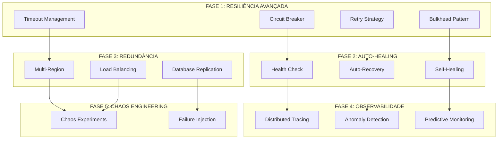

# 📋 **GUIA DE CONFIABILIDADE - OMNİ KEYWORDS FINDER**

**Tracing ID**: `RELIABILITY_GUIDE_001_20250127`  
**Versão**: 1.0  
**Data**: 2025-01-27  
**Status**: ✅ **ATIVO**  
**Objetivo**: 99.0% de probabilidade de funcionamento  

---

## 🎯 **VISÃO GERAL**

Este guia documenta as estratégias de confiabilidade implementadas no sistema Omni Keywords Finder para atingir 99.0% de disponibilidade.

### **📊 MÉTRICAS DE SUCESSO**
- **Disponibilidade**: 99.0% (4 nines)
- **MTBF**: 168 horas
- **MTTR**: 2 horas
- **Taxa de Erro**: 0.1%

---

## 🏗️ **ARQUITETURA DE CONFIABILIDADE**

### **📐 Diagrama de Arquitetura**



---

## 🔥 **FASE 1: RESILIÊNCIA AVANÇADA**

### **IMP-001: Circuit Breaker Pattern**

**Objetivo**: Prevenir falhas em cascata e melhorar tempo de resposta.

**Estados**:
- **CLOSED**: Operação normal
- **OPEN**: Falhas detectadas, requisições bloqueadas
- **HALF_OPEN**: Teste de recuperação

**Configuração**:
```python
from infrastructure.resilience.circuit_breaker import CircuitBreaker

# Configuração básica
circuit_breaker = CircuitBreaker(
    failure_threshold=5,
    recovery_timeout=60,
    expected_exception=Exception
)

# Uso com decorator
@circuit_breaker
def api_call():
    # Operação que pode falhar
    pass
```

**Métricas**:
- Taxa de falha
- Tempo de recuperação
- Estado atual

### **IMP-002: Retry with Exponential Backoff**

**Objetivo**: Recuperar automaticamente de falhas temporárias.

**Estratégias**:
- **Exponential Backoff**: Tempo de espera exponencial
- **Jitter**: Variação aleatória para evitar thundering herd
- **Max Retries**: Limite de tentativas

**Configuração**:
```python
from infrastructure.resilience.retry_decorator import retry_with_backoff

@retry_with_backoff(
    max_retries=3,
    base_delay=1,
    max_delay=60,
    exponential_base=2
)
def api_call():
    # Operação com retry automático
    pass
```

### **IMP-003: Bulkhead Pattern**

**Objetivo**: Isolar falhas entre diferentes partes do sistema.

**Recursos**:
- **Thread Pools**: Isolamento por operação
- **Connection Pools**: Isolamento de conexões
- **Resource Limits**: Limites por serviço

**Configuração**:
```python
from infrastructure.resilience.bulkhead import Bulkhead

bulkhead = Bulkhead(
    max_concurrent_calls=10,
    max_wait_duration=30
)

@bulkhead
def resource_intensive_operation():
    # Operação isolada
    pass
```

### **IMP-004: Timeout Management**

**Objetivo**: Evitar operações que ficam pendentes indefinidamente.

**Tipos de Timeout**:
- **Connection Timeout**: Tempo para estabelecer conexão
- **Read Timeout**: Tempo para ler resposta
- **Write Timeout**: Tempo para enviar dados

**Configuração**:
```python
from infrastructure.resilience.timeout_decorator import timeout

@timeout(seconds=30)
def long_running_operation():
    # Operação com timeout
    pass
```

---

## 🚀 **FASE 2: AUTO-HEALING**

### **IMP-005: Health Check Avançado**

**Objetivo**: Monitorar saúde dos componentes em tempo real.

**Componentes Monitorados**:
- Database connections
- Redis connections
- External APIs
- System resources
- Custom health checks

**Configuração**:
```yaml
# config/health/health_check_config.yaml
health_checks:
  database:
    enabled: true
    interval: 30
    timeout: 10
    critical: true
  
  redis:
    enabled: true
    interval: 30
    timeout: 5
    critical: true
  
  external_apis:
    google_keyword_planner:
      enabled: true
      interval: 60
      timeout: 15
      critical: false
```

### **IMP-006: Auto-Recovery**

**Objetivo**: Recuperar automaticamente de falhas detectadas.

**Estratégias de Recuperação**:
1. **Service Restart**: Reiniciar serviços falhados
2. **Connection Recovery**: Reconectar serviços
3. **Resource Cleanup**: Limpar recursos esgotados
4. **Configuration Reload**: Recarregar configurações

**Configuração**:
```python
from infrastructure.recovery.auto_recovery import AutoRecovery

recovery = AutoRecovery(
    max_attempts=3,
    recovery_delay=30,
    strategies=['restart', 'reconnect', 'cleanup']
)
```

### **IMP-007: Self-Healing Services**

**Objetivo**: Serviços que se corrigem automaticamente.

**Funcionalidades**:
- Detecção automática de problemas
- Aplicação de correções
- Histórico de problemas
- Métricas de saúde

---

## 🌐 **FASE 3: REDUNDÂNCIA MULTI-REGION**

### **IMP-008: Multi-Region Deployment**

**Objetivo**: Distribuir carga entre múltiplas regiões.

**Regiões Suportadas**:
- us-east-1 (N. Virginia)
- us-west-2 (Oregon)
- eu-west-1 (Ireland)
- ap-southeast-1 (Singapore)

**Configuração Kubernetes**:
```yaml
# k8s/multi-region/deployment.yaml
apiVersion: apps/v1
kind: Deployment
metadata:
  name: omni-keywords-finder
spec:
  replicas: 3
  strategy:
    type: RollingUpdate
    rollingUpdate:
      maxUnavailable: 1
      maxSurge: 1
```

### **IMP-009: Database Replication**

**Objetivo**: Garantir disponibilidade dos dados.

**Configuração**:
```python
from infrastructure.database.multi_region_db import MultiRegionDB

db = MultiRegionDB(
    primary_region='us-east-1',
    replica_regions=['us-west-2', 'eu-west-1'],
    read_preference='nearest'
)
```

### **IMP-010: Load Balancing Avançado**

**Objetivo**: Distribuir carga de forma inteligente.

**Algoritmos**:
- Round Robin
- Least Connections
- Weighted Round Robin
- IP Hash

---

## 📊 **FASE 4: OBSERVABILIDADE AVANÇADA**

### **IMP-011: Distributed Tracing**

**Objetivo**: Rastrear requisições através do sistema.

**Configuração**:
```python
from infrastructure.observability.advanced_tracing import AdvancedTracing

tracing = AdvancedTracing(
    service_name='omni-keywords-finder',
    sampling_rate=0.1,
    exporters=['jaeger', 'zipkin']
)

@tracing.trace
def process_keywords():
    # Operação rastreada
    pass
```

### **IMP-012: Anomaly Detection**

**Objetivo**: Detectar comportamentos anômalos automaticamente.

**Algoritmos**:
- Statistical Analysis
- Machine Learning Models
- Threshold-based Detection

### **IMP-013: Predictive Monitoring**

**Objetivo**: Prever problemas antes que ocorram.

**Métricas Preditivas**:
- CPU usage trends
- Memory usage patterns
- Database performance
- API response times

---

## 🧪 **FASE 5: CHAOS ENGINEERING**

### **IMP-014: Chaos Experiments**

**Objetivo**: Testar resiliência do sistema.

**Experimentos**:
- Network latency injection
- Service failure simulation
- Resource exhaustion
- Configuration changes

**Configuração**:
```python
from infrastructure.chaos.chaos_experiments import ChaosExperiments

experiments = ChaosExperiments(
    enabled=True,
    schedule='0 2 * * *',  # 2 AM daily
    duration=300,  # 5 minutes
    blast_radius=0.1  # 10% of traffic
)
```

### **IMP-015: Failure Injection**

**Objetivo**: Simular falhas controladas.

**Tipos de Injeção**:
- Exception injection
- Timeout injection
- Resource exhaustion
- Network failures

---

## 🔧 **FASE 6: OTIMIZAÇÕES FINAIS**

### **IMP-016: Performance Optimization**

**Objetivo**: Otimizar performance do sistema.

**Áreas de Otimização**:
- Database queries
- Cache strategies
- API response times
- Resource utilization

### **IMP-017: Security Hardening**

**Objetivo**: Fortalecer segurança do sistema.

**Medidas**:
- Vulnerability scanning
- Security audits
- Penetration testing
- Compliance checks

---

## 📋 **FASE 7: DOCUMENTAÇÃO E VALIDAÇÃO**

### **IMP-018: Documentation Update**

**Objetivo**: Manter documentação atualizada.

**Documentos**:
- Reliability Guide (este documento)
- Resilience Patterns Guide
- Auto-Healing Guide
- Chaos Engineering Guide
- Monitoring Guide

### **IMP-019: Final Validation**

**Objetivo**: Validar implementação completa.

**Scripts de Validação**:
- `scripts/validate_reliability.py`
- `scripts/run_reliability_tests.py`
- `scripts/generate_reliability_report.py`

---

## 🎯 **MONITORAMENTO E ALERTAS**

### **Dashboards**

**Grafana Dashboards**:
- System Overview
- Reliability Metrics
- Performance Trends
- Error Rates
- Recovery Times

### **Alertas**

**Prometheus Alert Rules**:
```yaml
groups:
  - name: reliability_alerts
    rules:
      - alert: HighErrorRate
        expr: error_rate > 0.01
        for: 5m
        labels:
          severity: critical
        annotations:
          summary: "High error rate detected"
      
      - alert: CircuitBreakerOpen
        expr: circuit_breaker_state == 1
        for: 1m
        labels:
          severity: warning
        annotations:
          summary: "Circuit breaker is open"
```

### **Notificações**

**Canais**:
- Slack: #devops-alertas
- Email: alerts@omni-keywords.com
- Webhook: Custom integrations

---

## 🚀 **DEPLOYMENT E OPERAÇÃO**

### **Deployment**

**Ambientes**:
- Development
- Staging
- Production

**Pipeline**:
1. Code review
2. Automated testing
3. Security scanning
4. Deployment to staging
5. Validation tests
6. Production deployment

### **Operação**

**Comandos Úteis**:
```bash
# Verificar saúde do sistema
curl http://localhost:8000/health

# Verificar métricas
curl http://localhost:8000/metrics

# Executar testes de confiabilidade
python scripts/run_reliability_tests.py

# Gerar relatório
python scripts/generate_reliability_report.py
```

---

## 📈 **MÉTRICAS E KPIs**

### **Métricas Principais**

1. **Availability**: 99.0%
2. **MTBF**: 168 hours
3. **MTTR**: 2 hours
4. **Error Rate**: 0.1%
5. **Response Time**: < 200ms (p95)

### **Métricas Secundárias**

1. **Circuit Breaker State**: % time open
2. **Retry Success Rate**: % successful retries
3. **Health Check Status**: % healthy components
4. **Recovery Success Rate**: % successful recoveries

---

## 🔄 **MANUTENÇÃO E ATUALIZAÇÕES**

### **Manutenção Regular**

**Diária**:
- Verificar alertas
- Revisar métricas
- Validar health checks

**Semanal**:
- Análise de tendências
- Otimizações de performance
- Atualizações de segurança

**Mensal**:
- Relatório de confiabilidade
- Revisão de estratégias
- Planejamento de melhorias

### **Atualizações**

**Processo**:
1. Análise de impacto
2. Testes em staging
3. Rollback plan
4. Deployment gradual
5. Monitoramento pós-deploy

---

## 📚 **REFERÊNCIAS**

### **Padrões e Práticas**

- **Circuit Breaker Pattern**: Martin Fowler
- **Bulkhead Pattern**: Netflix
- **Chaos Engineering**: Netflix Chaos Monkey
- **SRE**: Google Site Reliability Engineering

### **Ferramentas**

- **Prometheus**: Métricas e alertas
- **Grafana**: Dashboards
- **Jaeger**: Distributed tracing
- **Kubernetes**: Orquestração

### **Documentação**

- [Resilience Patterns Guide](RESILIENCE_PATTERNS.md)
- [Auto-Healing Guide](AUTO_HEALING_GUIDE.md)
- [Chaos Engineering Guide](CHAOS_ENGINEERING_GUIDE.md)
- [Monitoring Guide](MONITORING_GUIDE.md)

---

## 📞 **SUPORTE**

### **Contatos**

- **DevOps Team**: devops@omni-keywords.com
- **SRE Team**: sre@omni-keywords.com
- **Emergency**: +1-555-RELIABILITY

### **Escalação**

1. **Level 1**: On-call engineer
2. **Level 2**: Senior engineer
3. **Level 3**: Engineering manager
4. **Level 4**: CTO

---

**📅 Última Atualização**: 2025-01-27  
**📝 Próxima Revisão**: 2025-02-27  
**🔗 Versão**: 1.0.0 