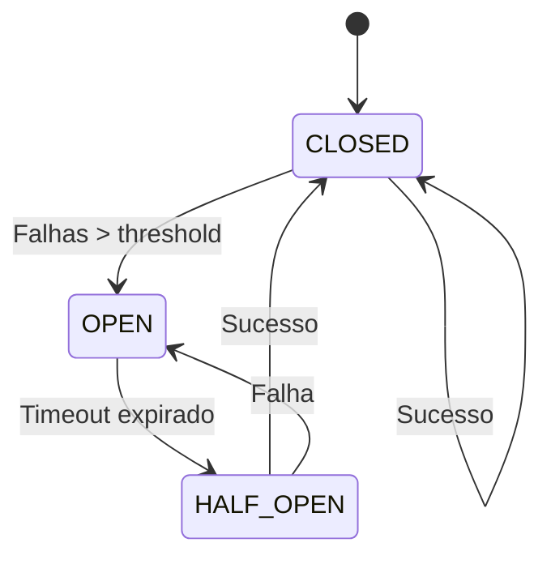
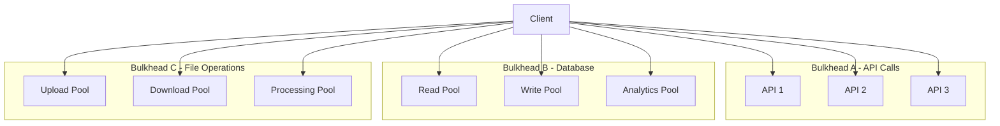

# 🔥 **GUIA DE PADRÕES DE RESILIÊNCIA - OMNİ KEYWORDS FINDER**

**Tracing ID**: `RESILIENCE_PATTERNS_001_20250127`  
**Versão**: 1.0  
**Data**: 2025-01-27  
**Status**: ✅ **ATIVO**  
**Objetivo**: Documentar padrões de resiliência implementados  

---

## 🎯 **VISÃO GERAL**

Este guia documenta os padrões de resiliência implementados no sistema Omni Keywords Finder para garantir alta disponibilidade e tolerância a falhas.

### **📊 Padrões Implementados**
- Circuit Breaker Pattern
- Retry with Exponential Backoff
- Bulkhead Pattern
- Timeout Management
- Health Check Pattern
- Fallback Pattern

---

## 🔌 **CIRCUIT BREAKER PATTERN**

### **📐 Conceito**

O Circuit Breaker é um padrão que previne falhas em cascata, monitorando o número de falhas e "abrindo" o circuito quando o threshold é atingido.

### **🏗️ Estados do Circuit Breaker**



### **🔧 Implementação**

```python
from infrastructure.resilience.circuit_breaker import CircuitBreaker

# Configuração básica
circuit_breaker = CircuitBreaker(
    failure_threshold=5,        # Número de falhas antes de abrir
    recovery_timeout=60,        # Tempo para tentar recuperar (segundos)
    expected_exception=Exception # Exceções que contam como falha
)

# Uso com decorator
@circuit_breaker
def api_call():
    # Operação que pode falhar
    response = requests.get('https://api.example.com/data')
    response.raise_for_status()
    return response.json()

# Uso direto
try:
    result = circuit_breaker.call(api_call)
except CircuitBreakerOpenError:
    # Circuito aberto - usar fallback
    result = fallback_function()
```

### **📊 Métricas**

```python
# Métricas disponíveis
metrics = {
    'failure_count': circuit_breaker.failure_count,
    'success_count': circuit_breaker.success_count,
    'state': circuit_breaker.state,
    'last_failure_time': circuit_breaker.last_failure_time,
    'failure_rate': circuit_breaker.failure_rate
}
```

### **🎯 Casos de Uso**

1. **APIs Externas**: Google Keyword Planner, YouTube API
2. **Database Operations**: Queries complexas
3. **Payment Gateways**: Stripe, PayPal
4. **File Operations**: Upload/Download

---

## 🔄 **RETRY WITH EXPONENTIAL BACKOFF**

### **📐 Conceito**

Padrão que implementa tentativas automáticas com tempo de espera exponencial para recuperar de falhas temporárias.

### **📈 Estratégias de Backoff**


### **🔧 Implementação**

```python
from infrastructure.resilience.retry_decorator import retry_with_backoff

@retry_with_backoff(
    max_retries=3,           # Máximo de tentativas
    base_delay=1,            # Delay inicial (segundos)
    max_delay=60,            # Delay máximo (segundos)
    exponential_base=2,      # Base exponencial
    jitter=True              # Adicionar variação aleatória
)
def api_call():
    response = requests.get('https://api.example.com/data')
    response.raise_for_status()
    return response.json()

# Configuração avançada
@retry_with_backoff(
    max_retries=5,
    base_delay=0.5,
    max_delay=30,
    exponential_base=2,
    jitter=True,
    retry_exceptions=(requests.RequestException,),
    backoff_exceptions=(requests.ConnectionError,)
)
def critical_api_call():
    # Operação crítica com retry específico
    pass
```

### **📊 Estratégias Disponíveis**

1. **Exponential Backoff**: `delay = base_delay * (exponential_base ^ attempt)`
2. **Linear Backoff**: `delay = base_delay * attempt`
3. **Fixed Backoff**: `delay = base_delay`
4. **Fibonacci Backoff**: `delay = fibonacci(attempt)`

### **🎯 Casos de Uso**

1. **Network Requests**: APIs externas
2. **Database Connections**: Reconexão automática
3. **File Operations**: Tentativas de leitura/escrita
4. **Service Discovery**: Descoberta de serviços

---

## 🚪 **BULKHEAD PATTERN**

### **📐 Conceito**

O Bulkhead Pattern isola recursos e falhas entre diferentes partes do sistema, prevenindo que uma falha se propague.

### **🏗️ Arquitetura**



### **🔧 Implementação**

```python
from infrastructure.resilience.bulkhead import Bulkhead

# Bulkhead para operações de API
api_bulkhead = Bulkhead(
    max_concurrent_calls=10,    # Máximo de chamadas simultâneas
    max_wait_duration=30,       # Tempo máximo de espera (segundos)
    name="api_operations"       # Nome para identificação
)

# Bulkhead para operações de banco
db_bulkhead = Bulkhead(
    max_concurrent_calls=5,
    max_wait_duration=60,
    name="database_operations"
)

@api_bulkhead
def call_external_api():
    # Operação isolada em seu próprio bulkhead
    pass

@db_bulkhead
def database_operation():
    # Operação de banco isolada
    pass
```

### **📊 Monitoramento**

```python
# Métricas do bulkhead
metrics = {
    'active_calls': bulkhead.active_calls,
    'max_concurrent_calls': bulkhead.max_concurrent_calls,
    'available_capacity': bulkhead.available_capacity,
    'rejected_calls': bulkhead.rejected_calls,
    'wait_time': bulkhead.average_wait_time
}
```

### **🎯 Casos de Uso**

1. **Microservices**: Isolamento entre serviços
2. **Database Operations**: Separação de leitura/escrita
3. **External APIs**: Isolamento por provedor
4. **File Processing**: Separação por tipo de operação

---

## ⏱️ **TIMEOUT MANAGEMENT**

### **📐 Conceito**

Gerenciamento de timeouts para evitar operações que ficam pendentes indefinidamente.

### **🔧 Implementação**

```python
from infrastructure.resilience.timeout_decorator import timeout
from infrastructure.resilience.timeout_manager import TimeoutManager

# Timeout simples
@timeout(seconds=30)
def long_running_operation():
    # Operação com timeout de 30 segundos
    pass

# Timeout com contexto
timeout_manager = TimeoutManager()

with timeout_manager.timeout(seconds=60):
    # Operação com timeout de 60 segundos
    result = complex_operation()

# Timeout assíncrono
@timeout(seconds=30, async_timeout=True)
async def async_operation():
    # Operação assíncrona com timeout
    pass
```

### **📊 Tipos de Timeout**

1. **Connection Timeout**: Tempo para estabelecer conexão
2. **Read Timeout**: Tempo para ler resposta
3. **Write Timeout**: Tempo para enviar dados
4. **Total Timeout**: Tempo total da operação

### **🎯 Configuração por Operação**

```python
# Configurações específicas
timeout_config = {
    'api_calls': 30,           # 30 segundos para APIs
    'database_queries': 10,    # 10 segundos para queries
    'file_operations': 120,    # 2 minutos para arquivos
    'batch_processing': 300    # 5 minutos para processamento
}
```

---

## 🏥 **HEALTH CHECK PATTERN**

### **📐 Conceito**

Monitoramento contínuo da saúde dos componentes do sistema.

### **🔧 Implementação**

```python
from infrastructure.health.advanced_health_check import AdvancedHealthCheck

# Health check para database
db_health_check = AdvancedHealthCheck(
    name="database",
    check_function=check_database_connection,
    interval=30,               # Verificar a cada 30 segundos
    timeout=10,                # Timeout de 10 segundos
    critical=True              # Crítico para o sistema
)

# Health check para API externa
api_health_check = AdvancedHealthCheck(
    name="external_api",
    check_function=check_api_availability,
    interval=60,               # Verificar a cada 1 minuto
    timeout=15,                # Timeout de 15 segundos
    critical=False             # Não crítico
)

# Registrando health checks
health_registry = HealthCheckRegistry()
health_registry.register(db_health_check)
health_registry.register(api_health_check)
```

### **📊 Tipos de Health Check**

1. **Liveness Check**: Verifica se o serviço está vivo
2. **Readiness Check**: Verifica se o serviço está pronto
3. **Startup Check**: Verifica se o serviço inicializou corretamente
4. **Custom Check**: Verificações específicas do negócio

### **🎯 Exemplos de Health Checks**

```python
def check_database_connection():
    """Verifica conexão com banco de dados."""
    try:
        db.execute("SELECT 1")
        return HealthStatus.HEALTHY
    except Exception as e:
        return HealthStatus.UNHEALTHY, str(e)

def check_redis_connection():
    """Verifica conexão com Redis."""
    try:
        redis.ping()
        return HealthStatus.HEALTHY
    except Exception as e:
        return HealthStatus.UNHEALTHY, str(e)

def check_external_api():
    """Verifica disponibilidade de API externa."""
    try:
        response = requests.get('https://api.example.com/health', timeout=5)
        if response.status_code == 200:
            return HealthStatus.HEALTHY
        else:
            return HealthStatus.UNHEALTHY, f"Status: {response.status_code}"
    except Exception as e:
        return HealthStatus.UNHEALTHY, str(e)
```

---

## 🛡️ **FALLBACK PATTERN**

### **📐 Conceito**

Estratégia de fallback para quando o serviço principal falha.

### **🔧 Implementação**

```python
from infrastructure.resilience.fallback import FallbackStrategy

# Fallback simples
@FallbackStrategy(fallback_function=cache_fallback)
def get_data_from_api():
    # Tenta API principal
    return api_client.get_data()

def cache_fallback():
    # Fallback para cache
    return cache.get('data')

# Fallback com múltiplas opções
@FallbackStrategy(
    fallbacks=[
        cache_fallback,
        database_fallback,
        static_fallback
    ]
)
def get_user_data(user_id):
    # Tenta múltiplas fontes
    return user_service.get_user(user_id)
```

### **📊 Estratégias de Fallback**

1. **Cache Fallback**: Retorna dados do cache
2. **Database Fallback**: Retorna dados do banco
3. **Static Fallback**: Retorna dados estáticos
4. **Default Fallback**: Retorna valores padrão

---

## 🔧 **INTEGRAÇÃO DOS PADRÕES**

### **📐 Exemplo Completo**

```python
from infrastructure.resilience import (
    CircuitBreaker, 
    retry_with_backoff, 
    Bulkhead, 
    timeout
)

# Configuração completa
circuit_breaker = CircuitBreaker(failure_threshold=5, recovery_timeout=60)
bulkhead = Bulkhead(max_concurrent_calls=10, max_wait_duration=30)

@circuit_breaker
@retry_with_backoff(max_retries=3, base_delay=1)
@bulkhead
@timeout(seconds=30)
def robust_api_call():
    """Chamada de API com todos os padrões de resiliência."""
    response = requests.get('https://api.example.com/data')
    response.raise_for_status()
    return response.json()
```

### **📊 Monitoramento Integrado**

```python
# Métricas combinadas
metrics = {
    'circuit_breaker': {
        'state': circuit_breaker.state,
        'failure_rate': circuit_breaker.failure_rate
    },
    'bulkhead': {
        'active_calls': bulkhead.active_calls,
        'available_capacity': bulkhead.available_capacity
    },
    'retry': {
        'total_attempts': retry_metrics.total_attempts,
        'successful_retries': retry_metrics.successful_retries
    }
}
```

---

## 📈 **MÉTRICAS E ALERTAS**

### **📊 Métricas Principais**

1. **Circuit Breaker**:
   - Estado atual (CLOSED/OPEN/HALF_OPEN)
   - Taxa de falha
   - Tempo de recuperação

2. **Retry Strategy**:
   - Número total de tentativas
   - Taxa de sucesso
   - Tempo médio de retry

3. **Bulkhead**:
   - Chamadas ativas
   - Capacidade disponível
   - Chamadas rejeitadas

4. **Timeout**:
   - Timeouts ocorridos
   - Tempo médio de operação
   - Operações pendentes

### **🚨 Alertas**

```yaml
# Prometheus Alert Rules
groups:
  - name: resilience_alerts
    rules:
      - alert: CircuitBreakerOpen
        expr: circuit_breaker_state == 1
        for: 1m
        labels:
          severity: warning
        annotations:
          summary: "Circuit breaker is open"
      
      - alert: HighRetryRate
        expr: retry_rate > 0.1
        for: 5m
        labels:
          severity: warning
        annotations:
          summary: "High retry rate detected"
      
      - alert: BulkheadFull
        expr: bulkhead_available_capacity == 0
        for: 2m
        labels:
          severity: warning
        annotations:
          summary: "Bulkhead is at full capacity"
```

---

## 🧪 **TESTES DE RESILIÊNCIA**

### **📐 Testes de Circuit Breaker**

```python
def test_circuit_breaker_opens_on_failures():
    """Testa se o circuit breaker abre após falhas."""
    cb = CircuitBreaker(failure_threshold=3)
    
    # Simula falhas
    for _ in range(3):
        with pytest.raises(Exception):
            cb.call(failing_function)
    
    # Verifica se o circuito está aberto
    assert cb.state == CircuitState.OPEN

def test_circuit_breaker_recovers():
    """Testa se o circuit breaker se recupera."""
    cb = CircuitBreaker(failure_threshold=2, recovery_timeout=1)
    
    # Abre o circuito
    for _ in range(2):
        with pytest.raises(Exception):
            cb.call(failing_function)
    
    # Aguarda recuperação
    time.sleep(1.1)
    
    # Verifica se está em half-open
    assert cb.state == CircuitState.HALF_OPEN
```

### **📐 Testes de Retry**

```python
def test_retry_with_backoff():
    """Testa retry com backoff exponencial."""
    call_count = 0
    
    def failing_function():
        nonlocal call_count
        call_count += 1
        if call_count < 3:
            raise Exception("Temporary failure")
        return "success"
    
    result = retry_with_backoff(max_retries=3)(failing_function)()
    
    assert result == "success"
    assert call_count == 3
```

### **📐 Testes de Bulkhead**

```python
def test_bulkhead_limits_concurrency():
    """Testa se o bulkhead limita concorrência."""
    bulkhead = Bulkhead(max_concurrent_calls=2)
    active_calls = 0
    
    def slow_function():
        nonlocal active_calls
        active_calls += 1
        time.sleep(1)
        active_calls -= 1
    
    # Inicia 3 chamadas simultâneas
    threads = []
    for _ in range(3):
        thread = threading.Thread(target=lambda: bulkhead.call(slow_function))
        threads.append(thread)
        thread.start()
    
    # Verifica se apenas 2 estão ativas
    time.sleep(0.1)
    assert active_calls <= 2
```

---

## 📚 **REFERÊNCIAS**

### **📖 Livros**

- **Release It!**: Michael Nygard
- **Building Microservices**: Sam Newman
- **Site Reliability Engineering**: Google

### **🔗 Artigos**

- [Circuit Breaker Pattern](https://martinfowler.com/bliki/CircuitBreaker.html)
- [Bulkhead Pattern](https://netflix.github.io/concurrency-limits/)
- [Retry Pattern](https://docs.microsoft.com/en-us/azure/architecture/patterns/retry)

### **🛠️ Ferramentas**

- **Hystrix**: Netflix Circuit Breaker
- **Resilience4j**: Java resilience library
- **Polly**: .NET resilience library

---

## 📞 **SUPORTE**

### **👥 Equipe**

- **DevOps**: devops@omni-keywords.com
- **SRE**: sre@omni-keywords.com
- **Engineering**: eng@omni-keywords.com

### **📋 Processo de Suporte**

1. **Identificação**: Detectar problema via alertas
2. **Análise**: Investigar métricas e logs
3. **Correção**: Aplicar correção ou ajuste
4. **Validação**: Verificar se problema foi resolvido
5. **Documentação**: Registrar incidente e lições aprendidas

---

**📅 Última Atualização**: 2025-01-27  
**📝 Próxima Revisão**: 2025-02-27  
**🔗 Versão**: 1.0.0 