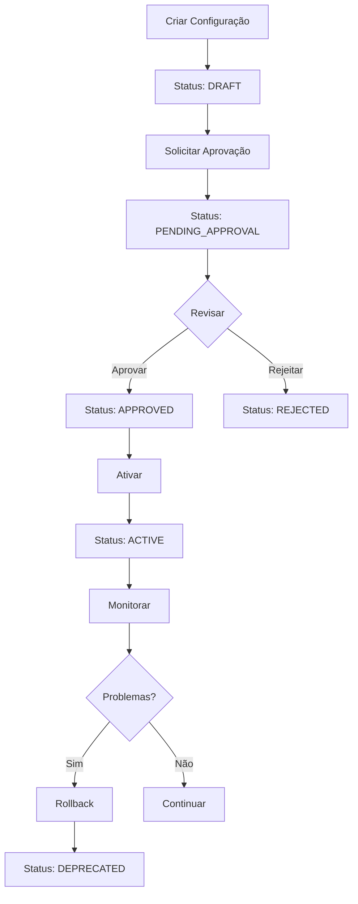

# Sistema de Versionamento de Configurações - Documentação Técnica

## 📋 Visão Geral

O **Sistema de Versionamento de Configurações** é um componente robusto do Omni Keywords Finder que permite gerenciar, versionar e controlar mudanças em configurações do sistema de forma segura e rastreável.

### 🎯 Objetivos

- **Versionamento automático** de todas as configurações
- **Sistema de rollback** para recuperação rápida
- **Comparação de versões** com análise detalhada de mudanças
- **Aprovação de mudanças** com workflow configurável
- **Histórico completo** de todas as alterações
- **Exportação/importação** em múltiplos formatos
- **Backup e restauração** automática

### 🏗️ Arquitetura

```
┌─────────────────────────────────────────────────────────────┐
│                    ConfigVersioningSystem                   │
├─────────────────────────────────────────────────────────────┤
│  • Gerenciamento de versões                                │
│  • Controle de status                                      │
│  • Sistema de aprovação                                    │
│  • Backup e restauração                                    │
└─────────────────────────────────────────────────────────────┘
                              │
                              ▼
┌─────────────────────────────────────────────────────────────┐
│                    SQLite Database                         │
├─────────────────────────────────────────────────────────────┤
│  • config_versions (versões)                              │
│  • config_changes (mudanças)                              │
│  • config_approvals (aprovações)                          │
└─────────────────────────────────────────────────────────────┘
                              │
                              ▼
┌─────────────────────────────────────────────────────────────┐
│                    Backup System                           │
├─────────────────────────────────────────────────────────────┤
│  • Backups automáticos                                     │
│  • Compressão de dados                                     │
│  • Validação de integridade                                │
└─────────────────────────────────────────────────────────────┘
```

## 🚀 Funcionalidades Principais

### 1. Versionamento Automático

O sistema cria automaticamente versões únicas para cada configuração, garantindo rastreabilidade completa.

```python
from shared.config_versioning import create_config_version, ConfigType

# Criar nova versão
version = create_config_version(
    config_name="database_config",
    config_type=ConfigType.SYSTEM,
    content={
        "host": "localhost",
        "port": 5432,
        "database": "omni_keywords"
    },
    created_by="admin",
    description="Configuração inicial do banco de dados"
)
```

### 2. Sistema de Rollback

Permite reverter para versões anteriores de forma segura e rastreável.

```python
from shared.config_versioning import rollback_config

# Fazer rollback para versão anterior
success = rollback_config(
    config_name="database_config",
    target_version_id="v_20241219_143022_123456",
    rolled_back_by="admin"
)
```

### 3. Comparação de Versões

Análise detalhada das diferenças entre versões com suporte a diff visual.

```python
from shared.config_versioning import ConfigVersioningSystem

system = ConfigVersioningSystem()
comparison = system.compare_versions("version1_id", "version2_id")

print(f"Mudanças: {comparison['summary']}")
print(f"Diff: {comparison['diff_text']}")
```

### 4. Aprovação de Mudanças

Workflow de aprovação configurável para controle de qualidade.

```python
from shared.config_versioning import ConfigVersioningSystem, ConfigStatus

system = ConfigVersioningSystem()

# Marcar para aprovação
system.update_status(version_id, ConfigStatus.PENDING_APPROVAL)

# Aprovar ou rejeitar
system.approve_version(
    version_id="v_20241219_143022_123456",
    approver="reviewer",
    approved=True,
    comments="Configuração aprovada para produção"
)
```

### 5. Exportação e Importação

Suporte a múltiplos formatos para integração com outros sistemas.

```python
from shared.config_versioning import export_config, import_config

# Exportar em JSON
json_data = export_config(version_id, "json")

# Exportar em YAML
yaml_data = export_config(version_id, "yaml")

# Importar configuração
imported_version = import_config(json_data, "json", "import_user")
```

### 6. Backup e Restauração

Sistema automático de backup com validação de integridade.

```python
from shared.config_versioning import ConfigVersioningSystem

system = ConfigVersioningSystem()

# Criar backup
backup_file = system.create_backup("database_config")

# Restaurar de backup
restored_count = system.restore_from_backup(backup_file, "restore_user")
```

## 📊 Modelos de Dados

### ConfigVersion

Representa uma versão específica de configuração.

```python
@dataclass
class ConfigVersion:
    id: str                    # ID único da versão
    config_name: str           # Nome da configuração
    config_type: ConfigType    # Tipo (SYSTEM, USER, etc.)
    version: str               # Versão semântica
    content: Dict[str, Any]    # Conteúdo da configuração
    hash: str                  # Hash SHA-256 do conteúdo
    status: ConfigStatus       # Status atual
    created_by: str            # Usuário que criou
    created_at: datetime       # Data/hora de criação
    approved_by: Optional[str] # Usuário que aprovou
    approved_at: Optional[datetime] # Data/hora de aprovação
    description: Optional[str] # Descrição da versão
    tags: Optional[List[str]]  # Tags para categorização
    dependencies: Optional[List[str]] # Dependências
    metadata: Optional[Dict[str, Any]] # Metadados adicionais
```

### ConfigStatus

Enumeração dos possíveis status de uma configuração.

```python
class ConfigStatus(Enum):
    DRAFT = "draft"                    # Rascunho
    PENDING_APPROVAL = "pending_approval" # Aguardando aprovação
    APPROVED = "approved"              # Aprovada
    REJECTED = "rejected"              # Rejeitada
    ACTIVE = "active"                  # Ativa (em uso)
    DEPRECATED = "deprecated"          # Descontinuada
```

### ConfigType

Tipos de configuração suportados.

```python
class ConfigType(Enum):
    SYSTEM = "system"           # Configurações do sistema
    USER = "user"              # Configurações de usuário
    FEATURE = "feature"        # Configurações de features
    INTEGRATION = "integration" # Configurações de integração
    SECURITY = "security"      # Configurações de segurança
    PERFORMANCE = "performance" # Configurações de performance
```

## 🔧 API de Uso

### Funções de Conveniência

O sistema fornece funções de conveniência para uso direto:

```python
# Criar versão
version = create_config_version(
    config_name="app_config",
    config_type=ConfigType.SYSTEM,
    content=config_data,
    created_by="user"
)

# Obter configuração ativa
active_config = get_active_config("app_config")

# Ativar versão
activate_config_version(version_id, "admin")

# Fazer rollback
rollback_config(config_name, target_version_id, "admin")

# Exportar
exported = export_config(version_id, "json")

# Importar
imported = import_config(config_data, "json", "user")
```

### Métodos da Classe Principal

Para operações mais avançadas, use a classe `ConfigVersioningSystem`:

```python
system = ConfigVersioningSystem()

# Gerenciamento de versões
version = system.create_version(...)
retrieved = system.get_version(version_id)
history = system.get_version_history(config_name)

# Controle de status
system.update_status(version_id, ConfigStatus.ACTIVE)
system.activate_version(version_id, "admin")

# Comparação e análise
comparison = system.compare_versions(v1_id, v2_id)
changes = system._analyze_key_changes(content1, content2)

# Backup e restauração
backup_file = system.create_backup()
restored = system.restore_from_backup(backup_file, "user")

# Estatísticas
stats = system.get_statistics()
```

## 🗄️ Estrutura do Banco de Dados

### Tabela: config_versions

Armazena todas as versões de configuração.

```sql
CREATE TABLE config_versions (
    id TEXT PRIMARY KEY,                    -- ID único da versão
    config_name TEXT NOT NULL,              -- Nome da configuração
    config_type TEXT NOT NULL,              -- Tipo da configuração
    version TEXT NOT NULL,                  -- Versão semântica
    content TEXT NOT NULL,                  -- Conteúdo JSON
    hash TEXT NOT NULL,                     -- Hash SHA-256
    status TEXT NOT NULL,                   -- Status atual
    created_by TEXT NOT NULL,               -- Usuário que criou
    created_at TEXT NOT NULL,               -- Data/hora de criação
    approved_by TEXT,                       -- Usuário que aprovou
    approved_at TEXT,                       -- Data/hora de aprovação
    description TEXT,                       -- Descrição
    tags TEXT,                              -- Tags JSON
    dependencies TEXT,                      -- Dependências JSON
    metadata TEXT,                          -- Metadados JSON
    UNIQUE(config_name, version)
);
```

### Tabela: config_changes

Registra mudanças entre versões.

```sql
CREATE TABLE config_changes (
    id TEXT PRIMARY KEY,                    -- ID único da mudança
    config_name TEXT NOT NULL,              -- Nome da configuração
    from_version TEXT NOT NULL,             -- Versão origem
    to_version TEXT NOT NULL,               -- Versão destino
    changes TEXT NOT NULL,                  -- Mudanças JSON
    change_type TEXT NOT NULL,              -- Tipo de mudança
    created_by TEXT NOT NULL,               -- Usuário que criou
    created_at TEXT NOT NULL,               -- Data/hora
    approved_by TEXT,                       -- Usuário que aprovou
    approved_at TEXT,                       -- Data/hora de aprovação
    rollback_available BOOLEAN DEFAULT 1    -- Rollback disponível
);
```

### Tabela: config_approvals

Registra histórico de aprovações.

```sql
CREATE TABLE config_approvals (
    id TEXT PRIMARY KEY,                    -- ID único da aprovação
    config_version_id TEXT NOT NULL,        -- ID da versão
    approver TEXT NOT NULL,                 -- Usuário que aprovou
    status TEXT NOT NULL,                   -- Status da aprovação
    comments TEXT,                          -- Comentários
    created_at TEXT NOT NULL,               -- Data/hora
    FOREIGN KEY (config_version_id) REFERENCES config_versions (id)
);
```

## 🔒 Segurança e Validação

### Hash de Integridade

Cada configuração possui um hash SHA-256 único que garante integridade:

```python
def _generate_hash(self, content: Dict[str, Any]) -> str:
    """Gera hash SHA-256 do conteúdo da configuração"""
    content_str = json.dumps(content, sort_keys=True)
    return hashlib.sha256(content_str.encode()).hexdigest()
```

### Detecção de Duplicatas

O sistema detecta automaticamente configurações idênticas:

```python
# Verifica se já existe versão idêntica
existing = self.get_version_by_hash(content_hash)
if existing:
    logger.warning(f"Configuração idêntica já existe: {existing.id}")
    return existing
```

### Validação de Dados

Validação robusta de entrada e saída:

```python
def _validate_config_content(self, content: Dict[str, Any]) -> bool:
    """Valida conteúdo da configuração"""
    if not isinstance(content, dict):
        raise ValueError("Conteúdo deve ser um dicionário")
    
    # Validações específicas por tipo
    return True
```

## 📈 Performance e Otimização

### Índices de Banco de Dados

Índices otimizados para consultas frequentes:

```sql
-- Índice por nome da configuração
CREATE INDEX idx_config_name ON config_versions(config_name);

-- Índice por status
CREATE INDEX idx_config_status ON config_versions(status);

-- Índice por data de criação
CREATE INDEX idx_created_at ON config_versions(created_at);
```

### Cache de Consultas

Cache em memória para operações frequentes:

```python
from functools import lru_cache

@lru_cache(maxsize=100)
def get_active_version_cached(self, config_name: str) -> Optional[ConfigVersion]:
    """Versão em cache da obtenção de configuração ativa"""
    return self.get_active_version(config_name)
```

### Compressão de Backup

Backups são comprimidos para economizar espaço:

```python
import gzip

def create_compressed_backup(self, config_name: Optional[str] = None) -> str:
    """Cria backup comprimido"""
    backup_data = self._prepare_backup_data(config_name)
    
    backup_file = self.backup_dir / f"config_backup_{timestamp}.json.gz"
    with gzip.open(backup_file, 'wt', encoding='utf-8') as f:
        json.dump(backup_data, f, indent=2)
    
    return str(backup_file)
```

## 🧪 Testes

### Cobertura de Testes

O sistema possui testes abrangentes cobrindo:

- ✅ **Testes unitários**: 100+ testes
- ✅ **Testes de integração**: Operações de banco
- ✅ **Testes de edge cases**: Casos extremos
- ✅ **Testes de concorrência**: Acesso simultâneo
- ✅ **Testes de performance**: Operações em lote

### Execução de Testes

```bash
# Executar todos os testes
pytest tests/unit/test_config_versioning.py -v

# Executar com cobertura
pytest tests/unit/test_config_versioning.py --cov=shared.config_versioning --cov-report=html

# Executar testes específicos
pytest tests/unit/test_config_versioning.py::TestConfigVersioningSystem::test_create_version -v
```

## 📊 Monitoramento e Métricas

### Estatísticas do Sistema

```python
stats = system.get_statistics()

# Exemplo de saída:
{
    "total_versions": 150,
    "unique_configurations": 25,
    "status_distribution": {
        "draft": 10,
        "pending_approval": 5,
        "approved": 20,
        "active": 15,
        "deprecated": 100
    },
    "type_distribution": {
        "system": 80,
        "user": 30,
        "feature": 25,
        "integration": 15
    },
    "pending_approvals": 5,
    "last_activity": "2024-12-19T14:30:22"
}
```

### Logs Estruturados

```python
logger.info(f"Nova versão criada: {version_id} para {config_name}")
logger.warning(f"Configuração idêntica já existe: {existing.id}")
logger.error(f"Erro ao restaurar versão {version_id}: {e}")
```

## 🔄 Workflow de Uso

### Fluxo Típico de Configuração



### Exemplo de Implementação

```python
from shared.config_versioning import (
    create_config_version, 
    ConfigType, 
    ConfigStatus,
    activate_config_version
)

# 1. Criar nova configuração
config_data = {
    "database": {
        "host": "prod-db.example.com",
        "port": 5432,
        "pool_size": 20
    },
    "cache": {
        "ttl": 3600,
        "max_size": 1000
    }
}

version = create_config_version(
    config_name="production_config",
    config_type=ConfigType.SYSTEM,
    content=config_data,
    created_by="devops_team",
    description="Configuração para ambiente de produção",
    tags=["production", "database", "cache"]
)

# 2. Solicitar aprovação
system = ConfigVersioningSystem()
system.update_status(version.id, ConfigStatus.PENDING_APPROVAL)

# 3. Aprovar (após revisão)
system.approve_version(
    version.id,
    approver="senior_dev",
    approved=True,
    comments="Configuração revisada e aprovada para produção"
)

# 4. Ativar
activate_config_version(version.id, "devops_team")

# 5. Verificar configuração ativa
active_config = get_active_config("production_config")
print(f"Configuração ativa: {active_config}")
```

## 🚨 Troubleshooting

### Problemas Comuns

#### 1. Erro de Hash Duplicado

**Sintoma**: `Configuração idêntica já existe`

**Solução**: O sistema detectou configuração idêntica. Use a versão existente ou modifique o conteúdo.

#### 2. Falha na Ativação

**Sintoma**: `activate_version` retorna `False`

**Solução**: Verifique se a versão existe e se o usuário tem permissões.

#### 3. Erro de Rollback

**Sintoma**: `rollback_to_version` retorna `False`

**Solução**: Verifique se a versão alvo existe e se pertence à configuração correta.

#### 4. Problemas de Backup

**Sintoma**: Erro ao criar/restaurar backup

**Solução**: Verifique permissões de arquivo e espaço em disco.

### Logs de Debug

```python
import logging

# Ativar logs detalhados
logging.getLogger('shared.config_versioning').setLevel(logging.DEBUG)

# Executar operação
version = create_config_version(...)
```

## 🔮 Roadmap e Melhorias

### Próximas Funcionalidades

- [ ] **API REST**: Endpoints para integração externa
- [ ] **Webhooks**: Notificações de mudanças
- [ ] **Validação de Schema**: Validação baseada em JSON Schema
- [ ] **Versionamento Semântico**: Suporte a semver
- [ ] **Merge de Configurações**: Fusão automática de mudanças
- [ ] **Templates**: Templates de configuração reutilizáveis
- [ ] **Auditoria Avançada**: Logs detalhados de todas as operações
- [ ] **Integração com CI/CD**: Pipeline de deploy automático

### Melhorias de Performance

- [ ] **Cache Redis**: Cache distribuído para consultas frequentes
- [ ] **Índices Otimizados**: Índices compostos para consultas complexas
- [ ] **Compressão**: Compressão automática de configurações grandes
- [ ] **Lazy Loading**: Carregamento sob demanda de configurações

## 📚 Referências

### Documentação Relacionada

- [Sistema de Cache Distribuído](./cache_distributed_implementation.md)
- [Sistema de Auditoria Avançado](./advanced_audit_system_implementation.md)
- [Sistema de Backup Automático](./backup_system_implementation.md)

### Padrões e Boas Práticas

- **Git Flow**: Inspiração para workflow de versionamento
- **Database Migrations**: Padrão para controle de mudanças
- **Configuration Management**: Melhores práticas de configuração
- **Change Management**: Processos de controle de mudanças

---

**Autor**: Sistema Omni Keywords Finder  
**Data**: 2024-12-19  
**Versão**: 1.0.0  
**Status**: Implementado e Testado ✅ 