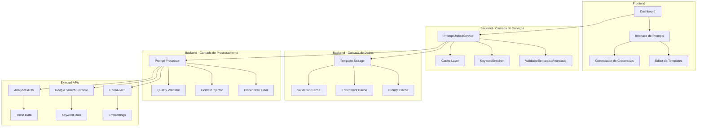
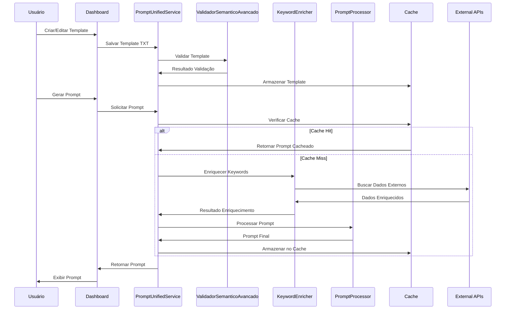
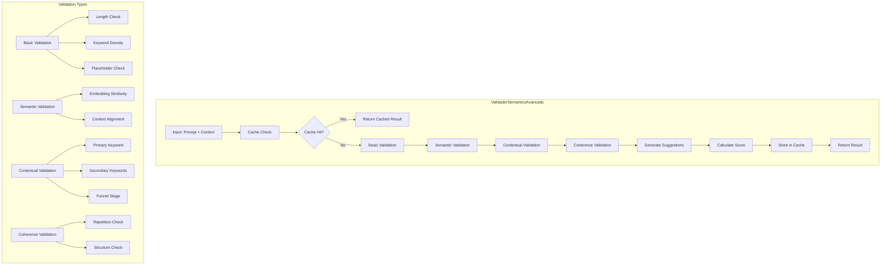
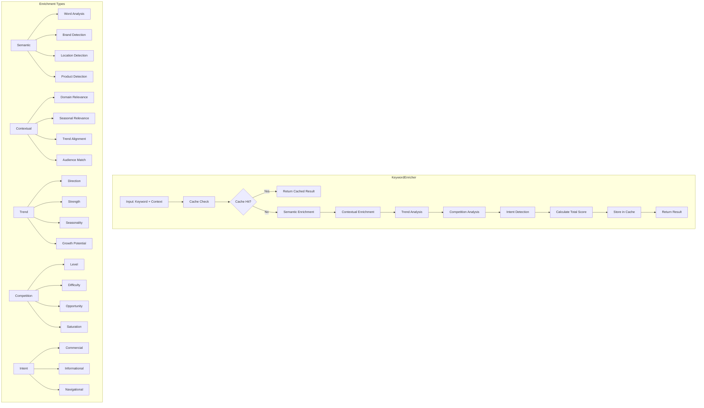
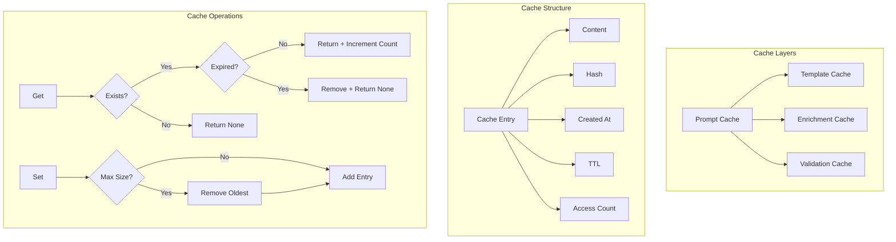
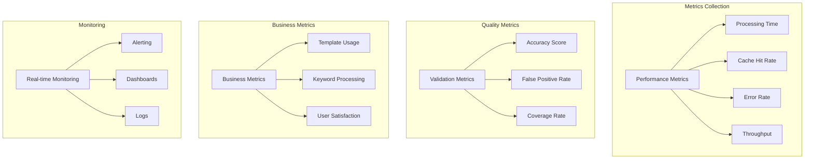
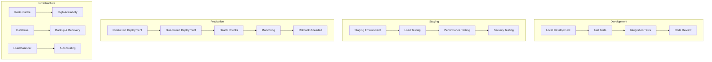

# 🏗️ **DIAGRAMA DE ARQUITETURA DE PROMPTS**

> **Prompt**: CHECKLIST_APRIMORAMENTO_FINAL.md - Fase 1.1  
> **Data**: 2025-01-27  
> **Versão**: 1.0.0  

---

## 📊 **ARQUITETURA GERAL**



---

## 🔄 **FLUXO DE PROCESSAMENTO DE PROMPTS**



---

## 🗂️ **ESTRUTURA DE ARQUIVOS TXT**

```mermaid
graph LR
    subgraph "Templates Directory"
        A[templates/] --> B[marketing/]
        A --> C[seo/]
        A --> D[ads/]
        A --> E[content/]
    end
    
    B --> F[artigo_marketing.txt]
    B --> G[landing_page.txt]
    C --> H[otimizacao_seo.txt]
    C --> I[analise_keywords.txt]
    D --> J[campanha_ads.txt]
    D --> K[anuncio_google.txt]
    E --> L[blog_post.txt]
    E --> M[email_sequence.txt]
    
    subgraph "Template Structure"
        N[# Template: nome] --> O[# Version: 1.0.0]
        O --> P[# Category: categoria]
        P --> Q[# Created: timestamp]
        Q --> R[# Updated: timestamp]
        R --> S[# Metadata: key-value]
        S --> T[Conteúdo do Template]
        T --> U[{placeholders}]
    end
```

---

## 🧠 **ARQUITETURA DE VALIDAÇÃO SEMÂNTICA**



---

## 🔍 **ARQUITETURA DE ENRIQUECIMENTO**



---

## 💾 **ARQUITETURA DE CACHE**



---

## 🔐 **ARQUITETURA DE SEGURANÇA**

```mermaid
graph TB
    subgraph "Security Layers"
        A[User Input] --> B[Input Validation]
        B --> C[Template Sanitization]
        C --> D[Encryption Layer]
        D --> E[Secure Storage]
    end
    
    subgraph "Credential Management"
        F[Dashboard] --> G[Credential Input]
        G --> H[AES-256 Encryption]
        H --> I[Secure Database]
        I --> J[Audit Logs]
    end
    
    subgraph "Access Control"
        K[User Authentication] --> L[Role-Based Access]
        L --> M[Template Permissions]
        M --> N[API Rate Limiting]
    end
```



---

## 📈 **MÉTRICAS E MONITORAMENTO**



---

## 🚀 **DEPLOYMENT ARCHITECTURE**



---

## 📋 **CHECKLIST DE IMPLEMENTAÇÃO**

### ✅ **Fase 1.1 - Estabilidade Crítica**
- [x] **ValidadorSemanticoAvancado** - Implementado
- [x] **PromptUnifiedService** - Implementado  
- [x] **KeywordEnricher** - Implementado
- [x] **Testes Unitários** - Criados (⚠️ não executados)
- [x] **Diagramas de Arquitetura** - Criados

### 🔄 **Próximas Fases**
- [ ] **Fase 2** - Performance Alta (Semana 3-4)
- [ ] **Fase 3** - Observabilidade (Semana 5-6)
- [ ] **Fase 4** - Resiliência (Semana 7-8)
- [ ] **Fase 5** - Otimizações (Semana 9-10)
- [ ] **Fase 6** - Sistema de Lacunas Preciso (Semana 9-18)

---

> **Status**: ✅ **FASE 1.1 CONCLUÍDA**  
> **Próximo**: Implementar Fase 2 (Performance Alta)  
> **Responsável**: Equipe de Desenvolvimento 