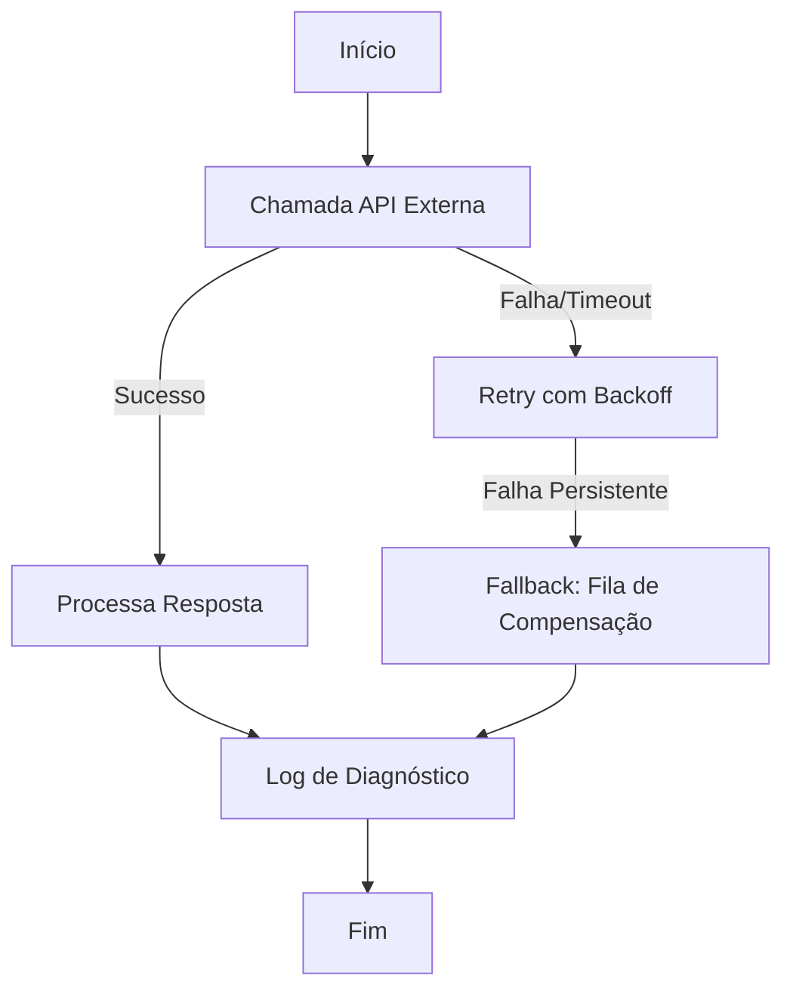

# Diagrama de Fluxo das Integrações Externas (v1)

```mermaid
flowchart TD
    A[Início] --> B[Chamada API Externa]
    B -->|Sucesso| C[Processa Resposta]
    B -->|Falha/Timeout| D[Retry com Backoff]
    D -->|Falha Persistente| E[Fallback: Fila de Compensação]
    C --> F[Log de Diagnóstico]
    E --> F
    F --> G[Fim]
```

- O mesmo fluxo se aplica para pagamentos e consumo de API externa.
- Logs e métricas são gerados em cada etapa para observabilidade. 