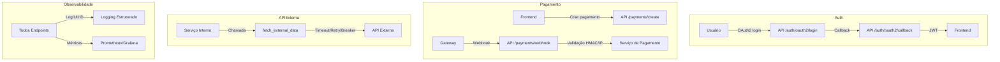

# Diagrama de Fluxo — Integrações Externas

```mermaid
flowchart TD
    subgraph Auth
        A1[Usuário] -->|OAuth2 login| A2[API /auth/oauth2/login]
        A2 -->|Callback| A3[API /auth/oauth2/callback]
        A3 -->|JWT| A4[Frontend]
    end
    subgraph Pagamento
        P1[Frontend] -->|Criar pagamento| P2[API /payments/create]
        P3[Gateway] -->|Webhook| P4[API /payments/webhook]
        P4 -->|Validação HMAC/IP| P5[Serviço de Pagamento]
    end
    subgraph APIExterna
        E1[Serviço Interno] -->|Chamada| E2[fetch_external_data]
        E2 -->|Timeout/Retry/Breaker| E3[API Externa]
    end
    subgraph Observabilidade
        O1[Todos Endpoints] -->|Log/UUID| O2[Logging Estruturado]
        O1 -->|Métricas| O3[Prometheus/Grafana]
    end
``` 