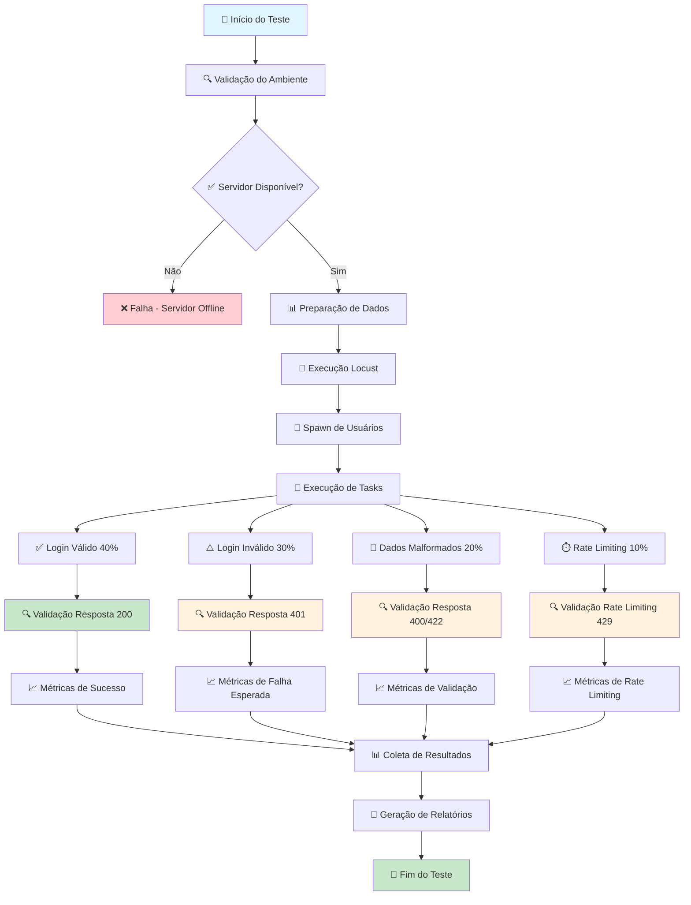
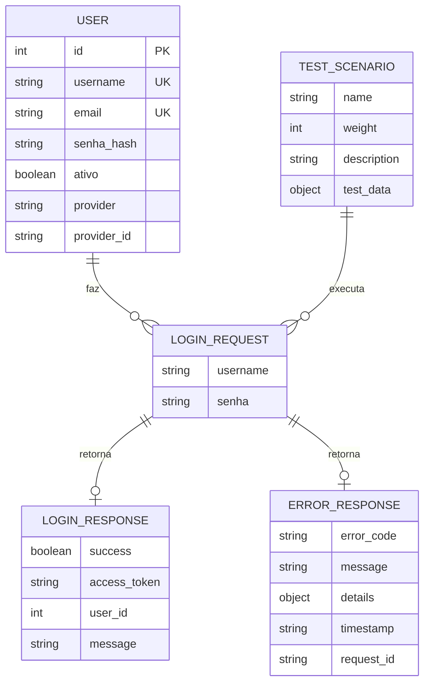
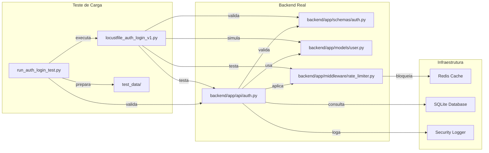

# 🖼️ **REPRESENTAÇÃO VISUAL - TESTE DE CARGA LOGIN**

**Tracing ID**: `VISUAL_AUTH_LOGIN_20250127_001`  
**Baseado em**: `locustfile_auth_login_v1.py`  
**Data/Hora**: 2025-01-27 18:30:00 UTC  
**Versão**: 1.0

---

## 📊 **FLUXOGRAMA DO TESTE DE CARGA**



---

## 🏗️ **DIAGRAMA DE ENTIDADES**



---

## 📁 **MAPA DE ESTRUTURA DE DIRETÓRIOS**

```
tests/load/
├── critical/
│   └── auth/
│       ├── locustfile_auth_login_v1.py          # 🧪 Teste principal
│       ├── run_auth_login_test.py               # 🚀 Script de execução
│       └── test_data/
│           └── auth_test_users.json             # 📊 Dados de teste
├── results/
│   └── auth_login/
│       ├── auth_login_report_20250127_183000.html
│       ├── auth_login_20250127_183000.csv
│       ├── auth_login_20250127_183000.json
│       └── execution_summary_20250127_183000.json
└── logs/
    └── auth_login_test.log                      # 📝 Logs de execução
```

---

## 🔗 **RELACIONAMENTOS ENTRE MÓDULOS**



---

## 📈 **MÉTRICAS DE PERFORMANCE**

### **Cenários de Teste**

| Cenário | Peso | Descrição | Status Code Esperado |
|---------|------|-----------|---------------------|
| Login Válido | 40% | Credenciais corretas | 200 |
| Login Inválido | 30% | Credenciais incorretas | 401 |
| Dados Malformados | 20% | Validação de entrada | 400/422 |
| Rate Limiting | 10% | Exceder limites | 429 |

### **Thresholds de Performance**

| Métrica | Valor Esperado | Limite Crítico |
|---------|----------------|----------------|
| Response Time (p95) | < 500ms | < 1000ms |
| Response Time (p99) | < 1000ms | < 2000ms |
| Error Rate | < 5% | < 10% |
| Throughput | > 100 req/s | > 50 req/s |

### **Métricas de Segurança**

| Métrica | Valor Esperado | Observação |
|---------|----------------|------------|
| Rate Limiting | Funcionando | Bloqueio após 5 tentativas |
| Logs de Segurança | Gerados | Para tentativas inválidas |
| Validação de Input | Ativa | Rejeita dados malformados |
| JWT Token | Válido | Estrutura correta |

---

## 🎯 **CRITÉRIOS DE SUCESSO**

### **Funcionais**
- ✅ Endpoint responde corretamente
- ✅ Validação de dados funciona
- ✅ Rate limiting ativo
- ✅ Logs de segurança gerados

### **Performance**
- ✅ Response time < 500ms (p95)
- ✅ Error rate < 5%
- ✅ Throughput > 100 req/s
- ✅ Sem memory leaks

### **Segurança**
- ✅ Credenciais inválidas rejeitadas
- ✅ Dados malformados validados
- ✅ Rate limiting funcionando
- ✅ Logs de auditoria gerados

---

## 📋 **COMANDOS DE EXECUÇÃO**

### **Execução Simples**
```bash
python tests/load/critical/auth/run_auth_login_test.py
```

### **Execução com Parâmetros**
```bash
python tests/load/critical/auth/run_auth_login_test.py \
  --host http://localhost:8000 \
  --users 20 \
  --spawn-rate 5 \
  --run-time 10m \
  --headless
```

### **Execução Locust Direta**
```bash
locust -f tests/load/critical/auth/locustfile_auth_login_v1.py \
  --host http://localhost:8000 \
  --users 10 \
  --spawn-rate 2 \
  --run-time 5m \
  --headless \
  --html tests/load/results/auth_login/report.html
```

---

## 🔍 **ANÁLISE DE RISCOS**

### **Riscos Identificados**
- ⚠️ **Sobrecarga do banco**: Múltiplas consultas simultâneas
- ⚠️ **Bloqueio de IPs**: Rate limiting pode afetar testes
- ⚠️ **Dados de teste**: Credenciais podem não existir
- ⚠️ **Logs excessivos**: Volume alto de logs de segurança

### **Mitigações Implementadas**
- ✅ **Dados de teste preparados**: Usuários criados antes do teste
- ✅ **Validação de ambiente**: Verificação prévia do servidor
- ✅ **Timeouts configurados**: Evita travamentos
- ✅ **Logs estruturados**: Filtros para evitar spam

---

**Responsável**: IA-Cursor  
**Data de Criação**: 2025-01-27  
**Última Atualização**: 2025-01-27  
**Status**: ✅ **IMPLEMENTADO** 