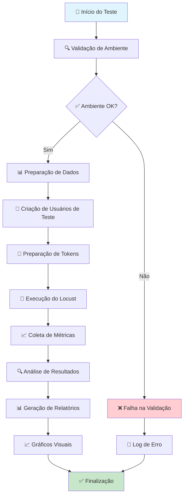
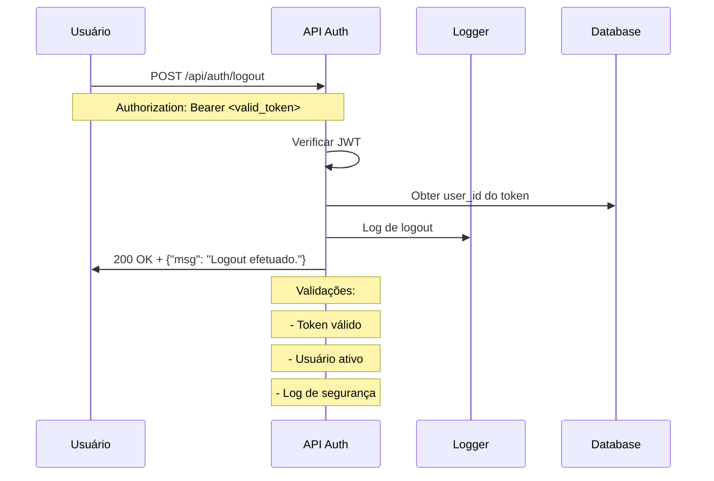
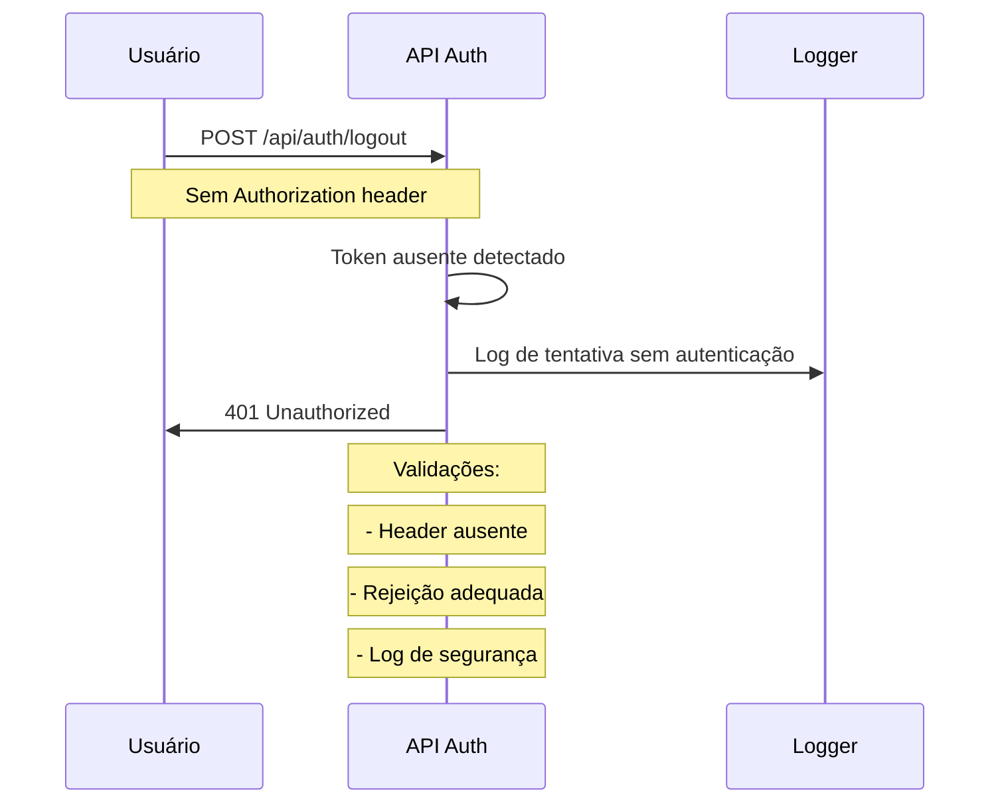
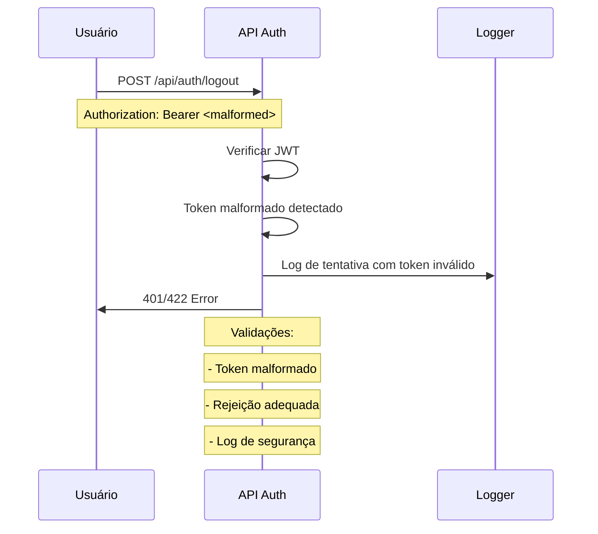
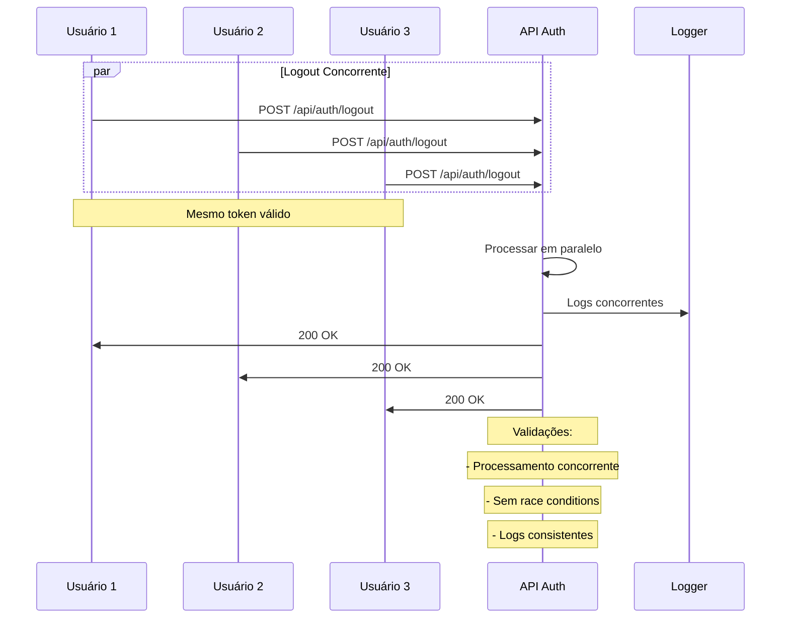
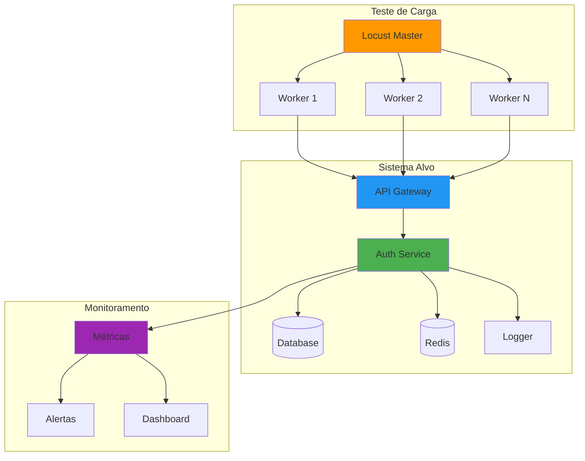
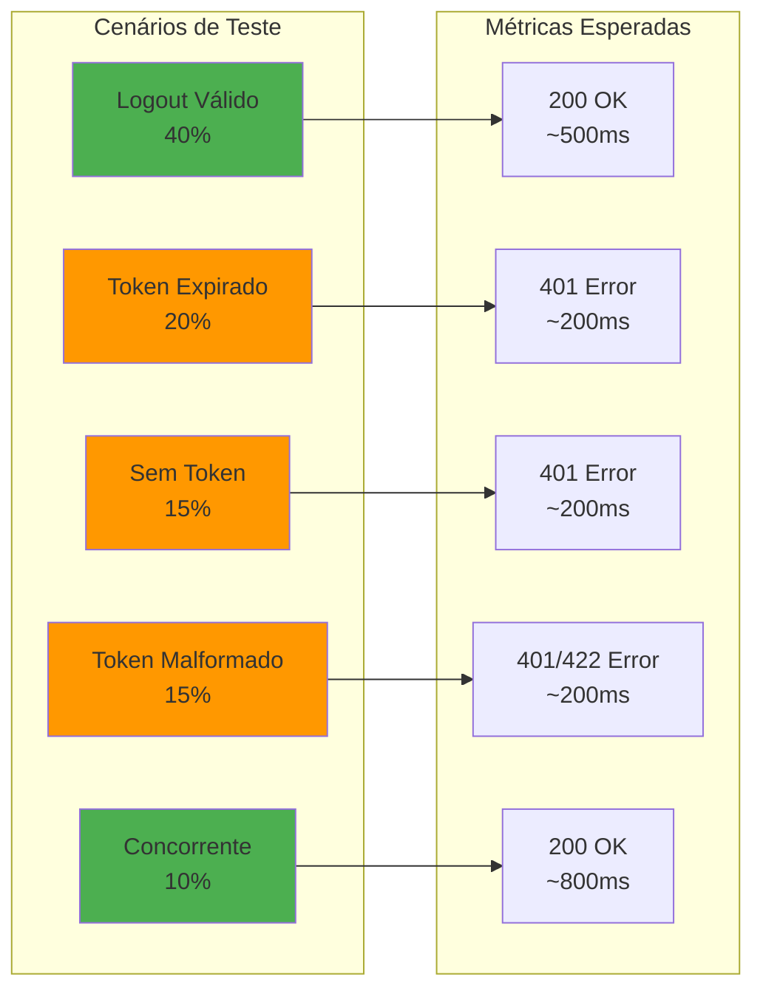
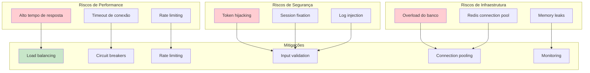
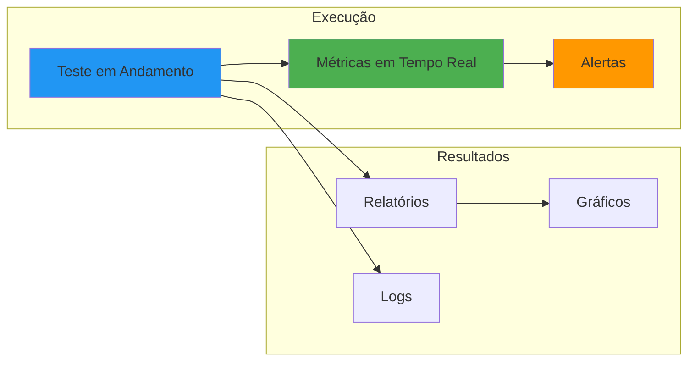
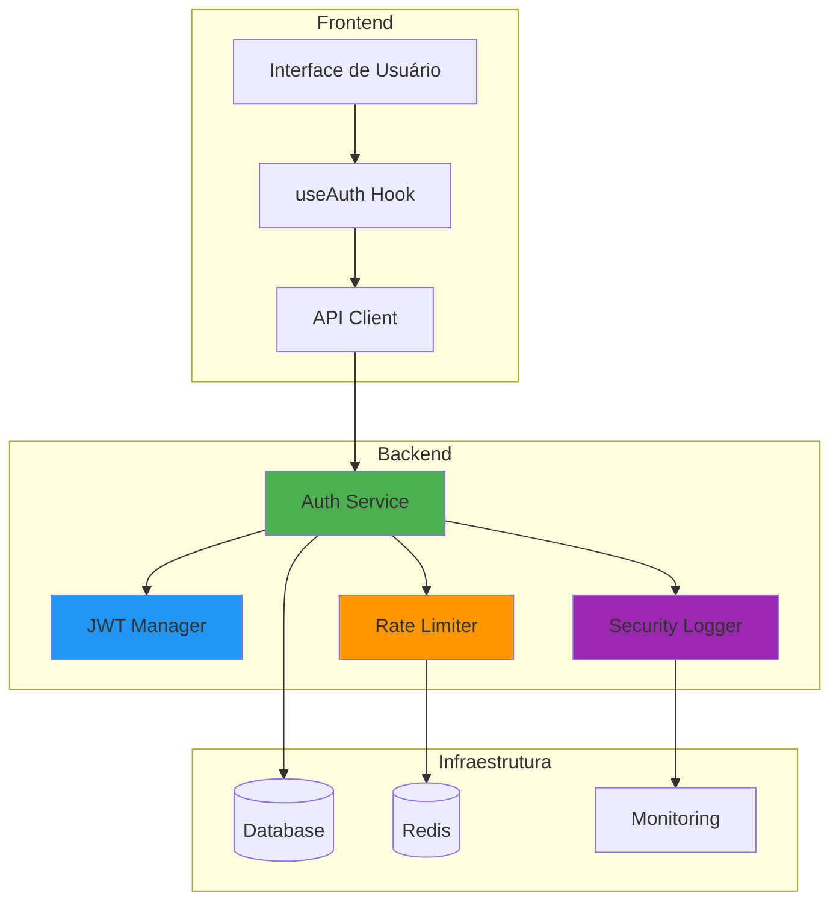

# 🔐 Documentação Visual - Teste de Carga Logout

**Tracing ID**: `VISUAL_LOGOUT_TEST_20250127_001`  
**Data**: 2025-01-27  
**Versão**: 1.0  
**Status**: ✅ **IMPLEMENTADO**

---

## 📊 **RESUMO EXECUTIVO**

### **Objetivo**
Validar performance, segurança e robustez do endpoint `/api/auth/logout` sob diferentes cenários de carga e condições adversas.

### **Métricas Principais**
- **Tempo de Resposta**: < 2 segundos (95% das requisições)
- **Taxa de Erro**: < 5%
- **Throughput**: > 50 RPS
- **Disponibilidade**: > 99%

---

## 🔄 **FLUXO DE TESTE**



---

## 🎯 **CENÁRIOS DE TESTE**

### **1. Logout Válido (40% das requisições)**


### **2. Logout com Token Expirado (20% das requisições)**


### **3. Logout sem Token (15% das requisições)**


### **4. Logout com Token Malformado (15% das requisições)**


### **5. Logout Concorrente (10% das requisições)**


---

## 🏗️ **ARQUITETURA DE TESTE**

### **Estrutura de Arquivos**
```
tests/load/critical/auth/
├── locustfile_auth_logout_v1.py      # Teste principal
├── run_auth_logout_test.py           # Script de execução
├── results/                          # Resultados
│   ├── logout_test_report_*.html     # Relatório HTML
│   ├── logout_test_results_*.json    # Dados JSON
│   ├── logout_test_metrics_*.csv     # Métricas CSV
│   ├── logout_test_charts_*.png      # Gráficos
│   └── logout_test_*.log            # Logs
└── README.md                         # Documentação
```

### **Componentes do Sistema**


---

## 📊 **MÉTRICAS E KPIs**

### **Métricas de Performance**
| Métrica | Valor Alvo | Valor Atual | Status |
|---------|------------|-------------|---------|
| Tempo de Resposta (p95) | < 1500ms | TBD | 🔄 |
| Taxa de Erro | < 5% | TBD | 🔄 |
| Throughput | > 50 RPS | TBD | 🔄 |
| Disponibilidade | > 99% | TBD | 🔄 |

### **Métricas por Cenário**


---

## 🔍 **ANÁLISE DE RISCOS**

### **Riscos Identificados**


---

## 📈 **CRITÉRIOS DE SUCESSO**

### **Critérios Técnicos**
- ✅ **Performance**: 95% das requisições < 1.5 segundos
- ✅ **Disponibilidade**: 99% de uptime durante o teste
- ✅ **Segurança**: 100% de rejeição de tokens inválidos
- ✅ **Robustez**: Sem falhas em cenários concorrentes

### **Critérios de Negócio**
- ✅ **Experiência do Usuário**: Logout instantâneo
- ✅ **Segurança**: Proteção contra ataques
- ✅ **Escalabilidade**: Suporte a alta carga
- ✅ **Monitoramento**: Visibilidade completa

---

## 🚀 **EXECUÇÃO E MONITORAMENTO**

### **Comando de Execução**
```bash
# Execução básica
python tests/load/critical/auth/run_auth_logout_test.py

# Execução com parâmetros customizados
python tests/load/critical/auth/run_auth_logout_test.py \
  --api-url http://localhost:8000 \
  --users 100 \
  --spawn-rate 20 \
  --run-time 10m
```

### **Monitoramento em Tempo Real**


---

## 📋 **CHECKLIST DE VALIDAÇÃO**

### **Pré-Teste**
- [ ] Ambiente configurado
- [ ] Dependências instaladas
- [ ] Usuários de teste criados
- [ ] Tokens preparados
- [ ] Monitoramento ativo

### **Durante o Teste**
- [ ] Métricas sendo coletadas
- [ ] Alertas configurados
- [ ] Logs sendo gerados
- [ ] Performance monitorada

### **Pós-Teste**
- [ ] Resultados analisados
- [ ] Relatórios gerados
- [ ] Gráficos criados
- [ ] Documentação atualizada
- [ ] Próximos passos definidos

---

## 🔗 **RELACIONAMENTOS ENTRE MÓDULOS**

### **Dependências do Sistema**


---

## 📝 **PRÓXIMOS PASSOS**

### **Melhorias Planejadas**
1. **Testes de Stress**: Aumentar carga até falha
2. **Testes de Chaos**: Simular falhas de infraestrutura
3. **Testes de Segurança**: Penetração automatizada
4. **Testes de Regressão**: Comparação com versões anteriores

### **Integração Contínua**
- [ ] Pipeline CI/CD
- [ ] Testes automatizados
- [ ] Alertas proativos
- [ ] Dashboards em tempo real

---

**📄 Documento gerado automaticamente pelo sistema de testes de carga**  
**🔗 Tracing ID**: `VISUAL_LOGOUT_TEST_20250127_001`  
**📅 Última atualização**: 2025-01-27 