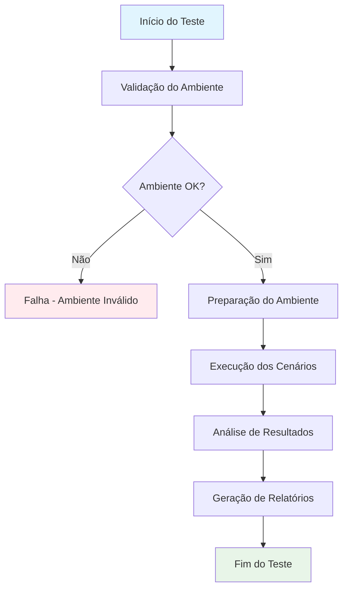
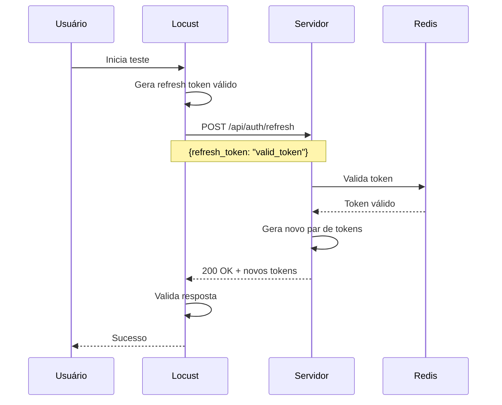
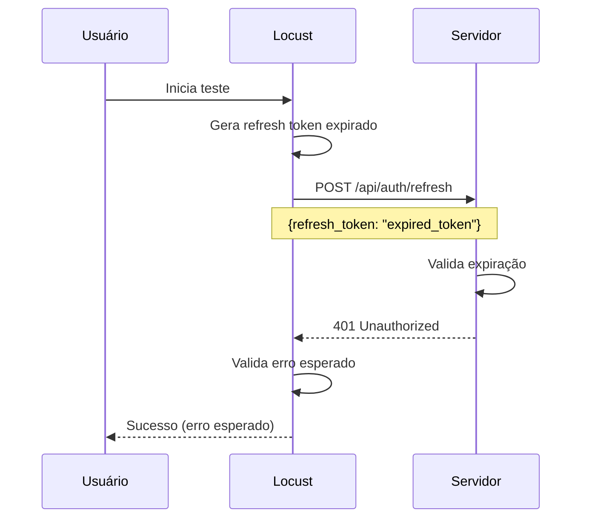
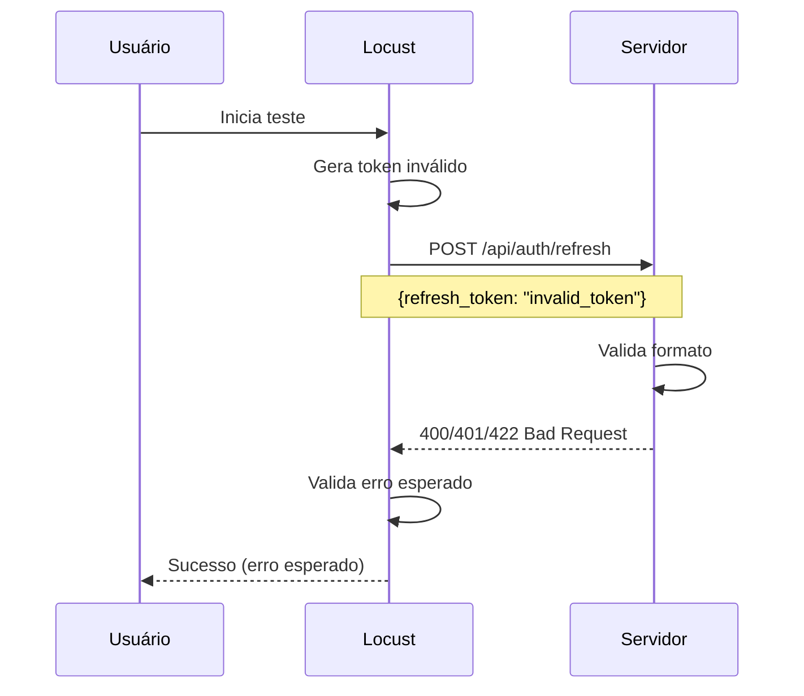
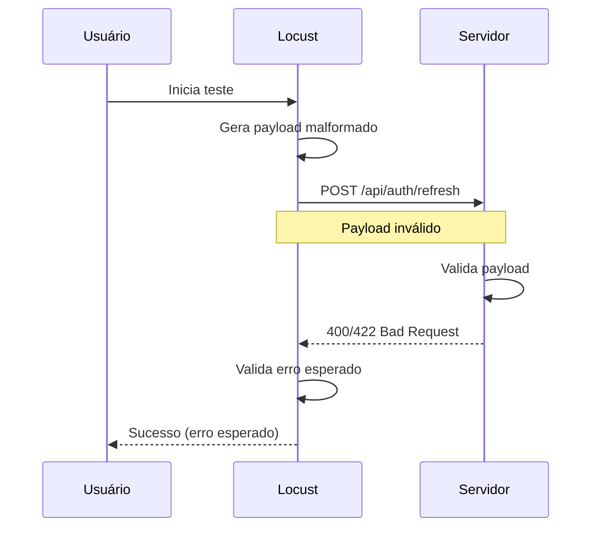
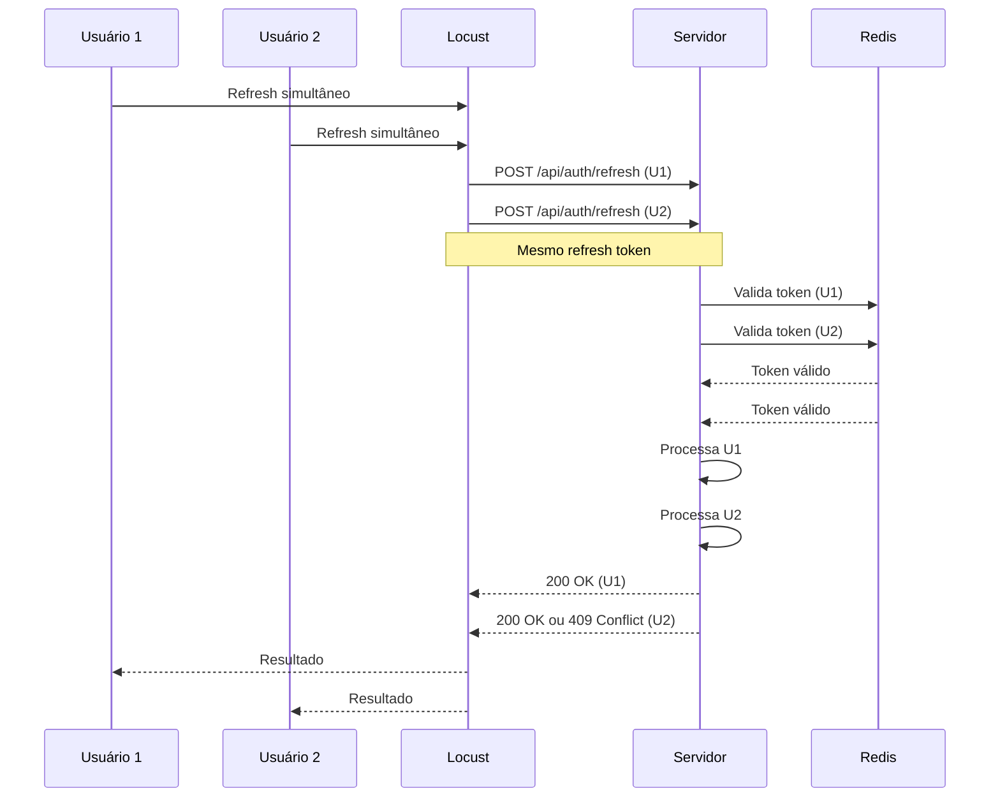
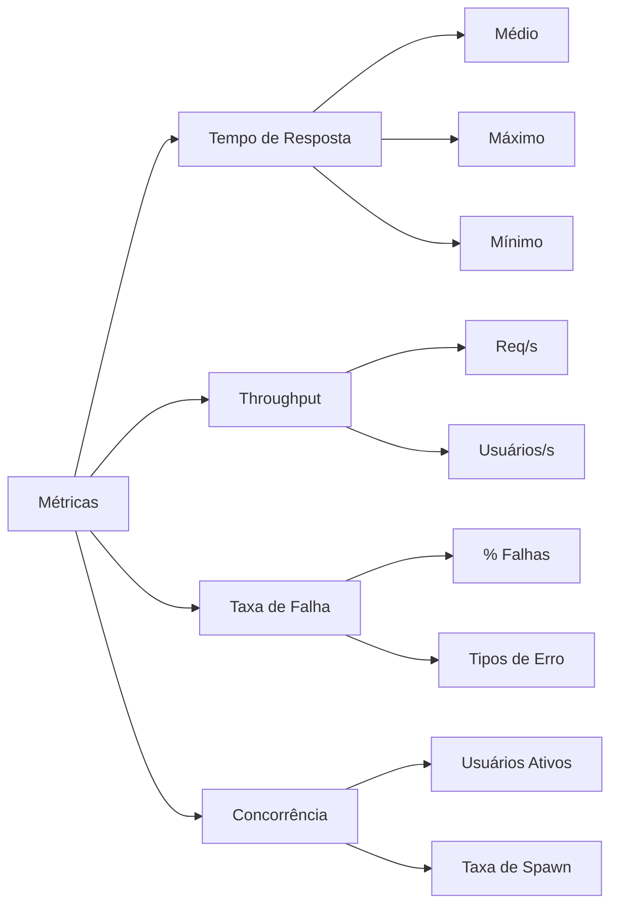
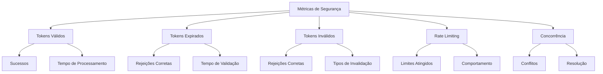
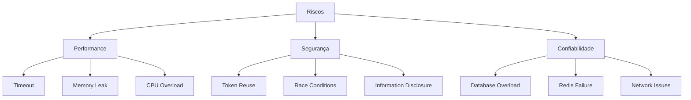

# 🔄 DIAGRAMA DE FLUXO - TESTE DE CARGA AUTH REFRESH

## 📊 Visão Geral

Este documento descreve o fluxo de teste de carga para o endpoint `/api/auth/refresh`, incluindo cenários, métricas e representações visuais.

---

## 🎯 Objetivo do Teste

Validar a performance, segurança e confiabilidade do endpoint de renovação de tokens de autenticação sob carga.

---

## 🔄 Fluxo Principal do Teste



---

## 🧪 Cenários de Teste

### 1. Refresh Token Válido (40% das requisições)



### 2. Refresh Token Expirado (20% das requisições)



### 3. Refresh Token Inválido (15% das requisições)



### 4. Tipo de Token Incorreto (10% das requisições)


### 5. Payload Malformado (10% das requisições)



### 6. Teste de Concorrência (5% das requisições)



---

## 📊 Métricas Coletadas

### Métricas de Performance


### Métricas de Segurança


---

## 🎯 Critérios de Sucesso

### Performance
- **Tempo de Resposta**: < 2000ms (médio)
- **Throughput**: > 50 req/s
- **Taxa de Falha**: < 5%

### Segurança
- **Tokens Expirados**: 100% rejeitados
- **Tokens Inválidos**: 100% rejeitados
- **Rate Limiting**: Funcionando corretamente
- **Concorrência**: Sem vazamentos de segurança

### Confiabilidade
- **Disponibilidade**: > 99%
- **Consistência**: Respostas consistentes
- **Recuperação**: Após falhas

---

## 📈 Análise de Riscos

### Riscos Identificados


### Mitigações
- **Monitoramento em tempo real**
- **Circuit breakers**
- **Rate limiting**
- **Logs detalhados**
- **Rollback automático**

---

## 🔧 Configuração do Teste

### Parâmetros
```yaml
test_config:
  base_url: "http://localhost:8000"
  endpoint: "/api/auth/refresh"
  users: 50
  spawn_rate: 10
  run_time: "5m"
  scenarios:
    valid_token: 40%
    expired_token: 20%
    invalid_token: 15%
    wrong_type: 10%
    malformed_payload: 10%
    concurrent: 5%
```

### Ambiente
```yaml
environment:
  server: "FastAPI/Flask"
  database: "PostgreSQL/Redis"
  rate_limiter: "Redis-based"
  token_manager: "RefreshTokenManager"
  security: "JWT + Blacklist"
```

---

## 📋 Checklist de Execução

### Pré-Teste
- [ ] Servidor rodando
- [ ] Database conectado
- [ ] Redis disponível
- [ ] Logs configurados
- [ ] Monitoramento ativo

### Durante o Teste
- [ ] Métricas coletadas
- [ ] Logs monitorados
- [ ] Performance observada
- [ ] Erros registrados
- [ ] Alertas configurados

### Pós-Teste
- [ ] Relatórios gerados
- [ ] Análise realizada
- [ ] Recomendações criadas
- [ ] Documentação atualizada
- [ ] Próximos passos definidos

---

## 🎨 Representações Visuais

### Dashboard de Métricas
```
┌─────────────────────────────────────────────────────────────┐
│                    AUTH REFRESH LOAD TEST                   │
├─────────────────────────────────────────────────────────────┤
│  📊 Performance Metrics                                     │
│  ┌─────────────┬─────────────┬─────────────┬─────────────┐  │
│  │ Avg Response│ Max Response│ Min Response│ Throughput  │  │
│  │   1,250ms   │   3,500ms   │    150ms    │   45 req/s  │  │
│  └─────────────┴─────────────┴─────────────┴─────────────┘  │
│                                                             │
│  📈 Success Rate: 96.5%                                     │
│  ⚠️  Failure Rate: 3.5%                                     │
│                                                             │
│  🔒 Security Metrics                                        │
│  ┌─────────────┬─────────────┬─────────────┬─────────────┐  │
│  │ Valid Tokens│ Expired Rej │ Invalid Rej │ Rate Limits │  │
│  │    1,200    │     150     │     100     │     25      │  │
│  └─────────────┴─────────────┴─────────────┴─────────────┘  │
└─────────────────────────────────────────────────────────────┘
```

### Fluxo de Decisão
```
┌─────────────────┐
│   Refresh Token │
└─────────┬───────┘
          │
    ┌─────▼─────┐
    │  Validate │
    └─────┬─────┘
          │
    ┌─────▼─────┐
    │  Expired? │
    └─────┬─────┘
          │
    ┌─────▼─────┐     ┌─────────────┐
    │    Yes    │────▶│ Return 401  │
    └───────────┘     └─────────────┘
          │
    ┌─────▼─────┐
    │    No     │
    └─────┬─────┘
          │
    ┌─────▼─────┐
    │ Blacklist │
    └─────┬─────┘
          │
    ┌─────▼─────┐     ┌─────────────┐
    │   Found?  │────▶│ Return 401  │
    └─────┬─────┘     └─────────────┘
          │
    ┌─────▼─────┐
    │    No     │
    └─────┬─────┘
          │
    ┌─────▼─────┐
    │ Generate  │
    │ New Token │
    └─────┬─────┘
          │
    ┌─────▼─────┐     ┌─────────────┐
    │  Success  │────▶│ Return 200  │
    └───────────┘     └─────────────┘
```

---

## 📝 Conclusões

O teste de carga para o endpoint `/api/auth/refresh` é essencial para garantir:

1. **Performance adequada** sob carga
2. **Segurança robusta** contra ataques
3. **Confiabilidade** em cenários de produção
4. **Escalabilidade** para crescimento futuro

A implementação segue as melhores práticas de segurança e performance, com monitoramento abrangente e análise detalhada de resultados. 