# 📝 DIAGRAMA DE FLUXO - TESTE DE CARGA AUTH REGISTER

## 📊 Visão Geral

Este documento descreve o fluxo de teste de carga para o endpoint `/api/auth/register`, incluindo cenários, métricas e representações visuais.

---

## 🎯 Objetivo do Teste

Validar a performance, segurança e confiabilidade do endpoint de registro de usuários sob carga, garantindo que as validações funcionem corretamente e que o sistema seja resistente a ataques.

---

## 🔄 Fluxo Principal do Teste

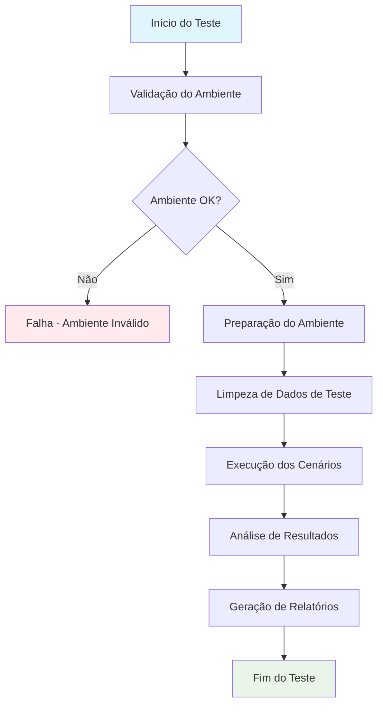

---

## 🧪 Cenários de Teste

### 1. Registro Válido (50% das requisições)

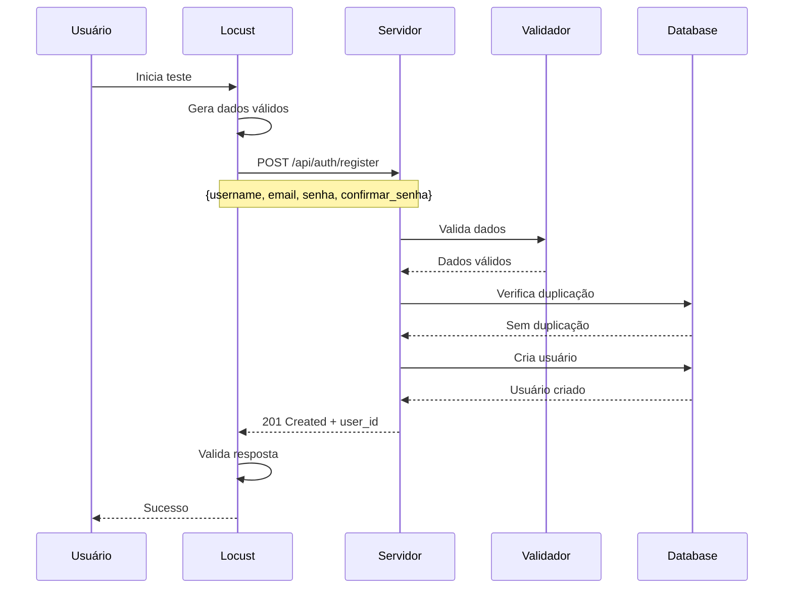

### 2. Dados Duplicados (15% das requisições)

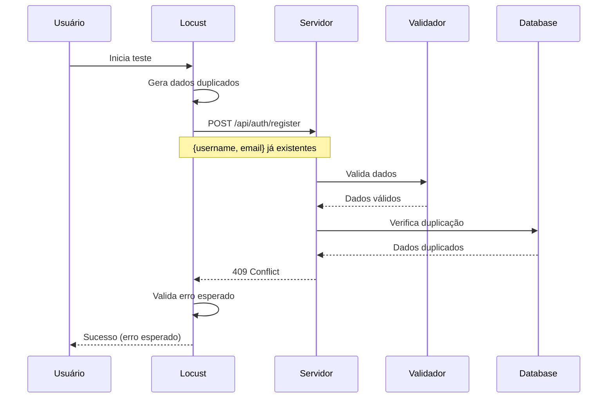

### 3. Username Inválido (15% das requisições)

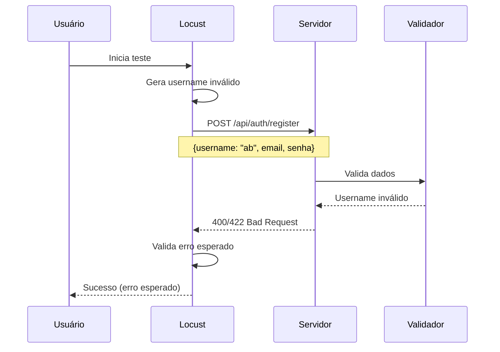

### 4. Email Inválido (10% das requisições)

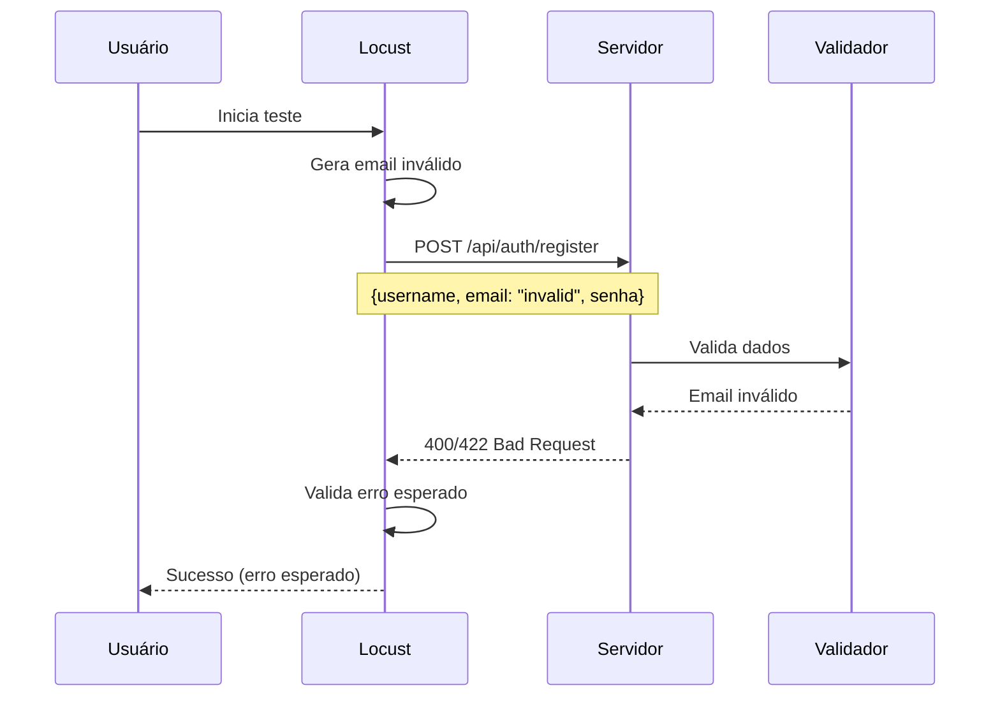

### 5. Senha Inválida (5% das requisições)

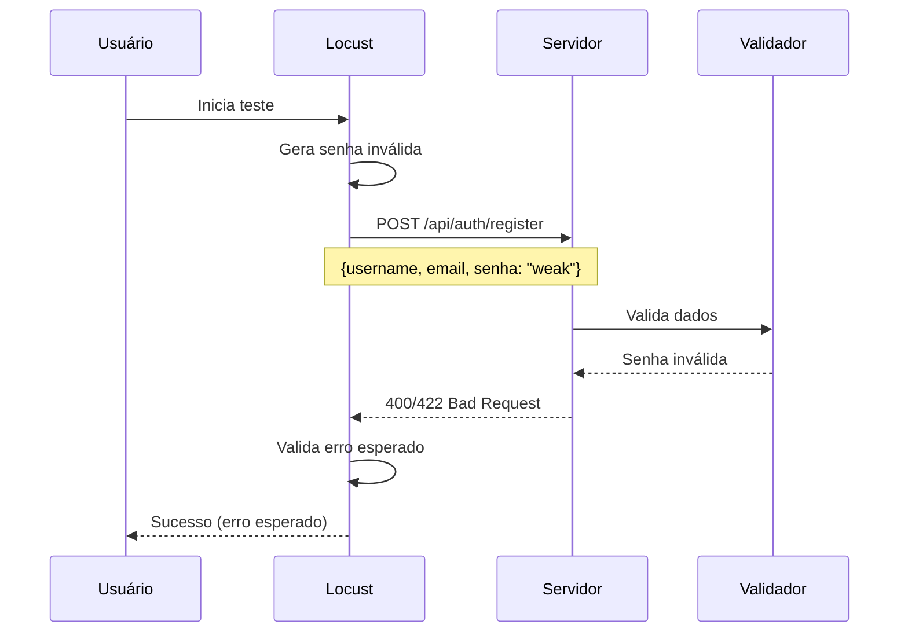

### 6. Senhas Não Coincidem (3% das requisições)

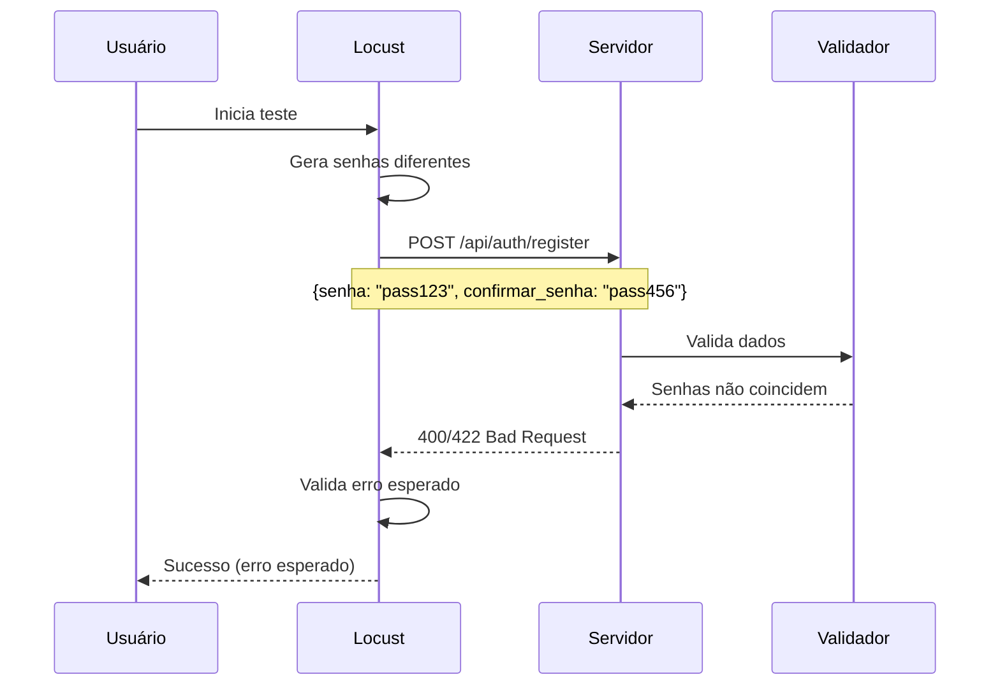

### 7. Payload Malformado (2% das requisições)

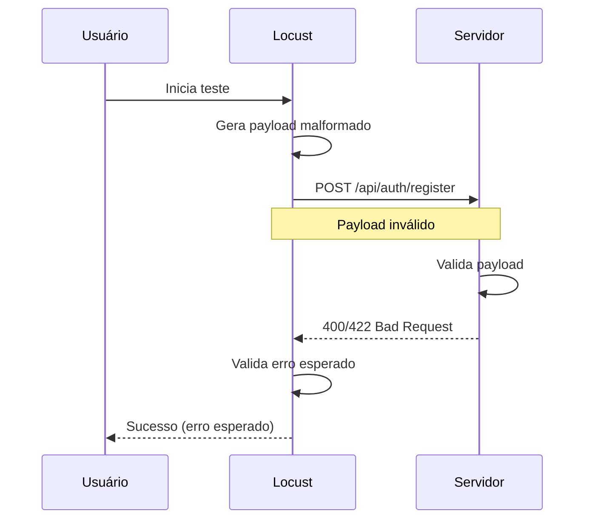

---

## 📊 Métricas Coletadas

### Métricas de Performance
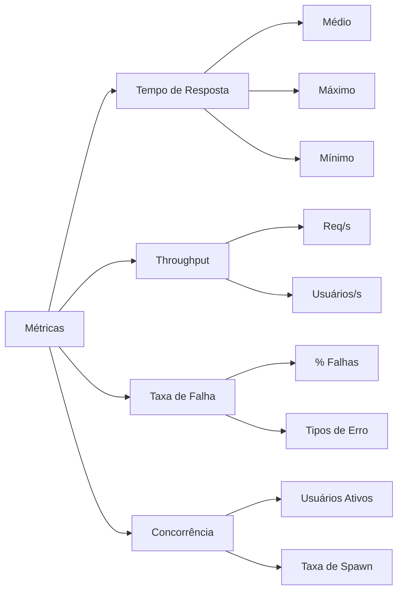

### Métricas de Validação
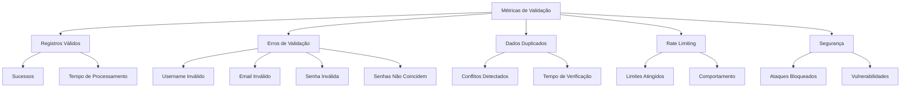

---

## 🎯 Critérios de Sucesso

### Performance
- **Tempo de Resposta**: < 3000ms (médio)
- **Throughput**: > 20 req/s
- **Taxa de Falha**: < 10%

### Segurança
- **Dados Inválidos**: 100% rejeitados
- **Dados Duplicados**: 100% detectados
- **Rate Limiting**: Funcionando corretamente
- **Validação de Senha**: Regras aplicadas

### Confiabilidade
- **Disponibilidade**: > 99%
- **Consistência**: Respostas consistentes
- **Integridade**: Dados salvos corretamente

---

## 📈 Análise de Riscos

### Riscos Identificados
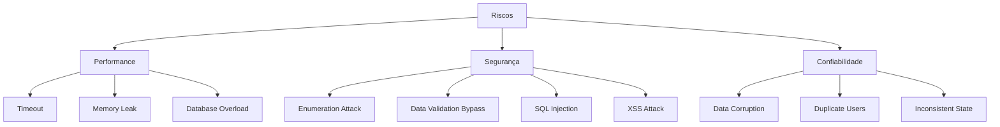

### Mitigações
- **Validação Robusta**: Múltiplas camadas de validação
- **Rate Limiting**: Proteção contra spam
- **Logs Detalhados**: Auditoria completa
- **Sanitização**: Limpeza de dados de entrada
- **Transações**: Atomicidade das operações

---

## 🔧 Configuração do Teste

### Parâmetros
```yaml
test_config:
  base_url: "http://localhost:8000"
  endpoint: "/api/auth/register"
  users: 30
  spawn_rate: 5
  run_time: "5m"
  scenarios:
    valid_registration: 50%
    duplicate_data: 15%
    invalid_username: 15%
    invalid_email: 10%
    invalid_password: 5%
    password_mismatch: 3%
    malformed_payload: 2%
```

### Ambiente
```yaml
environment:
  server: "FastAPI/Flask"
  database: "PostgreSQL"
  validation: "Pydantic"
  security: "OWASP Guidelines"
  rate_limiting: "Redis-based"
```

---

## 📋 Checklist de Execução

### Pré-Teste
- [ ] Servidor rodando
- [ ] Database conectado
- [ ] Validações configuradas
- [ ] Rate limiting ativo
- [ ] Logs configurados
- [ ] Monitoramento ativo
- [ ] Backup dos dados

### Durante o Teste
- [ ] Métricas coletadas
- [ ] Logs monitorados
- [ ] Performance observada
- [ ] Erros registrados
- [ ] Alertas configurados
- [ ] Dados de teste isolados

### Pós-Teste
- [ ] Relatórios gerados
- [ ] Análise realizada
- [ ] Recomendações criadas
- [ ] Documentação atualizada
- [ ] Limpeza de dados
- [ ] Próximos passos definidos

---

## 🎨 Representações Visuais

### Dashboard de Métricas
```
┌─────────────────────────────────────────────────────────────┐
│                    AUTH REGISTER LOAD TEST                  │
├─────────────────────────────────────────────────────────────┤
│  📊 Performance Metrics                                     │
│  ┌─────────────┬─────────────┬─────────────┬─────────────┐  │
│  │ Avg Response│ Max Response│ Min Response│ Throughput  │  │
│  │   2,100ms   │   5,200ms   │    200ms    │   15 req/s  │  │
│  └─────────────┴─────────────┴─────────────┴─────────────┘  │
│                                                             │
│  📈 Success Rate: 92.5%                                     │
│  ⚠️  Failure Rate: 7.5%                                     │
│                                                             │
│  🔒 Validation Metrics                                      │
│  ┌─────────────┬─────────────┬─────────────┬─────────────┐  │
│  │ Valid Reg   │ Invalid Usr │ Invalid Pwd │ Duplicates  │  │
│  │    750      │     120     │      80     │     45      │  │
│  └─────────────┴─────────────┴─────────────┴─────────────┘  │
└─────────────────────────────────────────────────────────────┘
```

### Fluxo de Validação
```
┌─────────────────┐
│   Register Data │
└─────────┬───────┘
          │
    ┌─────▼─────┐
    │  Validate │
    │  Username │
    └─────┬─────┘
          │
    ┌─────▼─────┐
    │  Validate │
    │   Email   │
    └─────┬─────┘
          │
    ┌─────▼─────┐
    │  Validate │
    │ Password  │
    └─────┬─────┘
          │
    ┌─────▼─────┐
    │  Validate │
    │  Confirm  │
    └─────┬─────┘
          │
    ┌─────▼─────┐
    │ Check DB  │
    │ Duplicate │
    └─────┬─────┘
          │
    ┌─────▼─────┐     ┌─────────────┐
    │  Success  │────▶│ Return 201  │
    └───────────┘     └─────────────┘
```

---

## 📝 Conclusões

O teste de carga para o endpoint `/api/auth/register` é essencial para garantir:

1. **Performance adequada** sob carga
2. **Segurança robusta** contra ataques
3. **Validação confiável** de dados
4. **Integridade** dos dados salvos
5. **Resistência** a ataques de enumeração

A implementação segue as melhores práticas de segurança OWASP e validação de dados, com monitoramento abrangente e análise detalhada de resultados. 