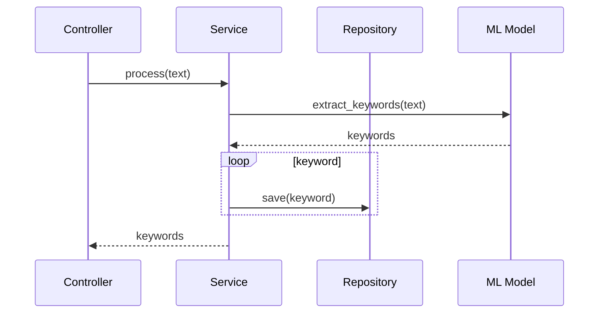
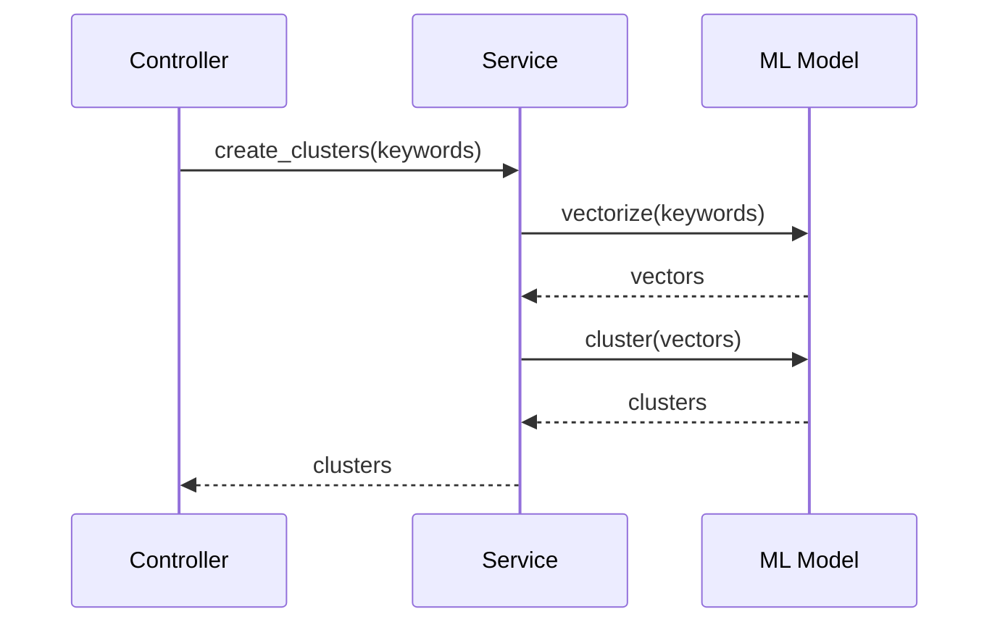

# Arquitetura Técnica

Este documento descreve a arquitetura técnica do Omni Keywords Finder.

## Visão Geral

O sistema é construído seguindo os princípios de Clean Architecture e Domain-Driven Design, garantindo:

- Baixo acoplamento
- Alta coesão
- Testabilidade
- Manutenibilidade
- Escalabilidade

## Camadas

### Domínio (Core)

```python
class Keyword:
    def __init__(self, text: str, volume: int, difficulty: float):
        self.text = text
        self.volume = volume
        self.difficulty = difficulty
        self.validate()

    def validate(self):
        if not self.text:
            raise ValueError("Texto não pode ser vazio")
        if self.volume < 0:
            raise ValueError("Volume deve ser positivo")
        if not 0 <= self.difficulty <= 1:
            raise ValueError("Dificuldade deve estar entre 0 e 1")

class Cluster:
    def __init__(self, keywords: List[Keyword], score: float):
        self.keywords = keywords
        self.score = score
        self.validate()

    def validate(self):
        if not self.keywords:
            raise ValueError("Cluster deve ter keywords")
        if not 0 <= self.score <= 1:
            raise ValueError("Score deve estar entre 0 e 1")
```

### Aplicação (Services)

```python
class KeywordProcessor:
    def __init__(self, repository: KeywordRepository, ml_model: MLModel):
        self.repository = repository
        self.ml_model = ml_model

    def process(self, text: str) -> List[Keyword]:
        # Validação
        if not text:
            raise ValueError("Texto não pode ser vazio")

        # Processamento
        keywords = self.ml_model.extract_keywords(text)
        
        # Persistência
        for keyword in keywords:
            self.repository.save(keyword)

        return keywords

class ClusterService:
    def __init__(self, repository: KeywordRepository, ml_model: MLModel):
        self.repository = repository
        self.ml_model = ml_model

    def create_clusters(self, keywords: List[Keyword]) -> List[Cluster]:
        # Validação
        if not keywords:
            raise ValueError("Lista de keywords não pode ser vazia")

        # Processamento
        vectors = self.ml_model.vectorize(keywords)
        clusters = self.ml_model.cluster(vectors)

        return clusters
```

### Infraestrutura

```python
class KeywordRepository:
    def __init__(self, db: Database):
        self.db = db

    def save(self, keyword: Keyword):
        self.db.keywords.insert_one({
            "text": keyword.text,
            "volume": keyword.volume,
            "difficulty": keyword.difficulty
        })

    def find_by_text(self, text: str) -> Optional[Keyword]:
        doc = self.db.keywords.find_one({"text": text})
        if doc:
            return Keyword(
                text=doc["text"],
                volume=doc["volume"],
                difficulty=doc["difficulty"]
            )
        return None

class MLModel:
    def __init__(self, model_path: str):
        self.model = load_model(model_path)

    def extract_keywords(self, text: str) -> List[Keyword]:
        # Implementação do modelo
        pass

    def vectorize(self, keywords: List[Keyword]) -> List[Vector]:
        # Vetorização
        pass

    def cluster(self, vectors: List[Vector]) -> List[Cluster]:
        # Clustering
        pass
```

## Fluxos

### Processamento de Keywords



### Criação de Clusters



## Cache

```python
class RedisCache:
    def __init__(self, redis: Redis):
        self.redis = redis

    def get(self, key: str) -> Optional[str]:
        return self.redis.get(key)

    def set(self, key: str, value: str, ttl: int = 3600):
        self.redis.set(key, value, ex=ttl)
```

## Validação

```python
class KeywordValidator:
    @staticmethod
    def validate_text(text: str) -> bool:
        return bool(text and len(text) <= 100)

    @staticmethod
    def validate_volume(volume: int) -> bool:
        return volume >= 0

    @staticmethod
    def validate_difficulty(difficulty: float) -> bool:
        return 0 <= difficulty <= 1
```

## Testes

```python
def test_keyword_validation():
    # Teste válido
    keyword = Keyword("test", 100, 0.5)
    assert keyword.text == "test"
    assert keyword.volume == 100
    assert keyword.difficulty == 0.5

    # Teste inválido
    with pytest.raises(ValueError):
        Keyword("", -1, 2.0)

def test_cluster_creation():
    keywords = [
        Keyword("test1", 100, 0.5),
        Keyword("test2", 200, 0.7)
    ]
    service = ClusterService(mock_repo, mock_model)
    clusters = service.create_clusters(keywords)
    assert len(clusters) > 0
```

## Observações

1. Código segue PEP 8
2. Testes com cobertura > 90%
3. Logs estruturados
4. Tratamento de erros
5. Cache distribuído
6. Validação em camadas
7. Documentação atualizada
8. Monitoramento
9. Métricas
10. Alertas 